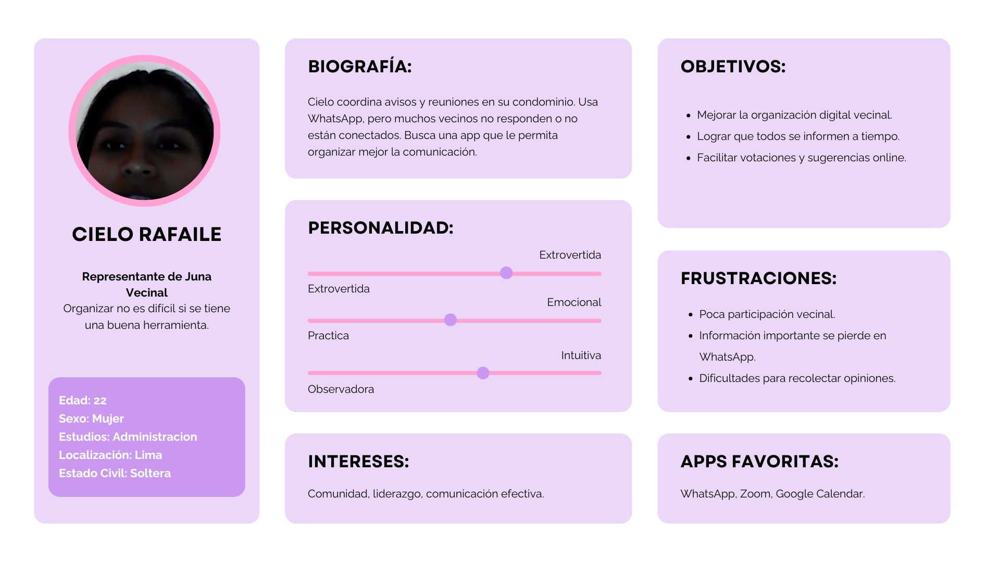
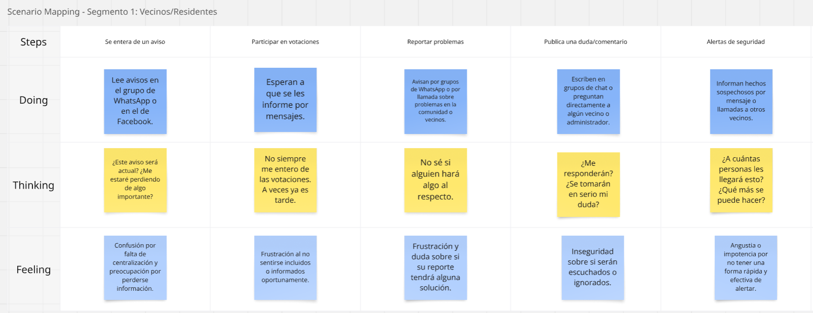
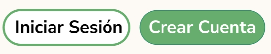
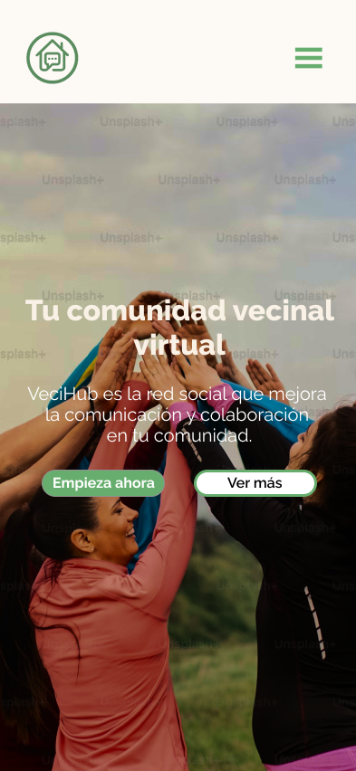
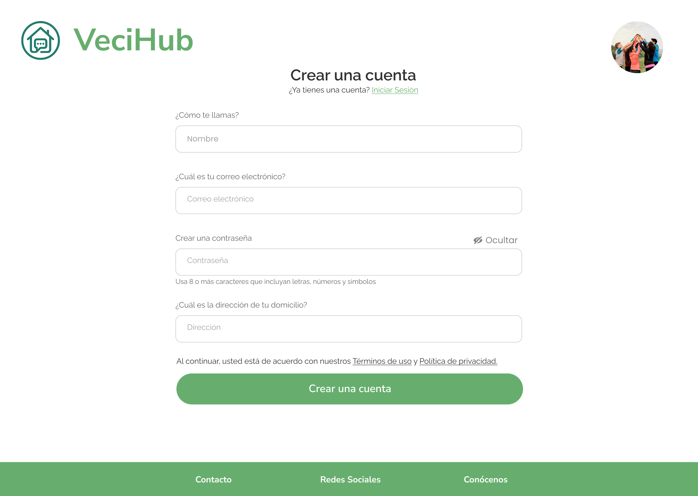
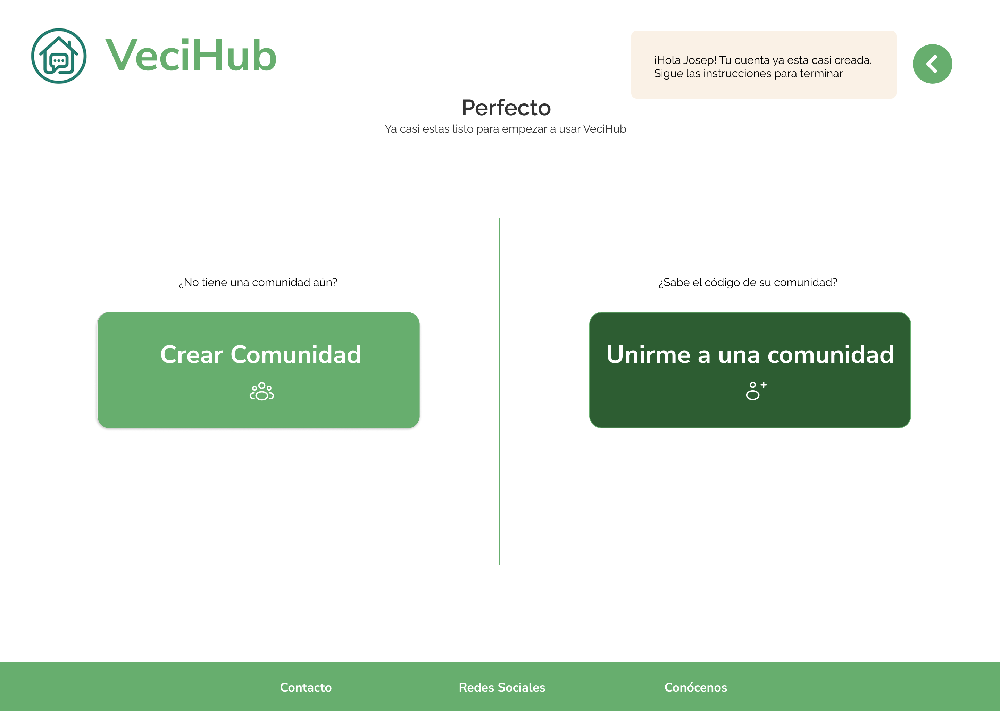
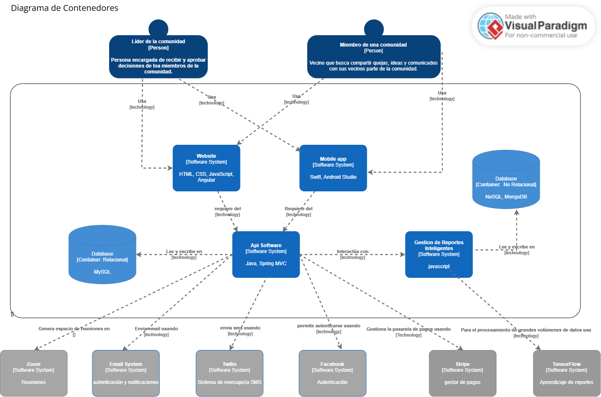
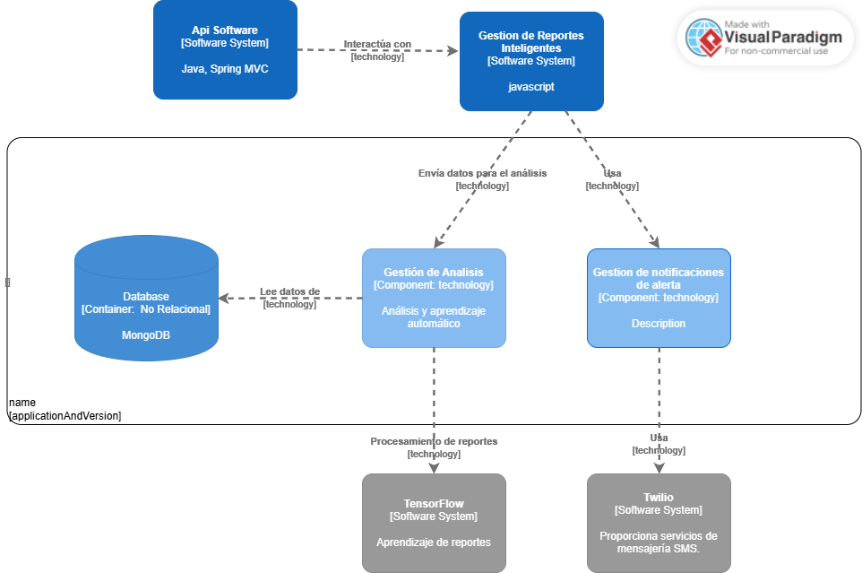

# **Informe del Trabajo Final**

<strong>Universidad Peruana de Ciencias Aplicadas</strong>

  

<strong>Ingeniería de Software</strong> 
Aplicaciones Web - 1ASI0730  
<strong>Profesor: Oscar Ivan Villafuerte Bazan</strong> 

<h2 align="center">INFORME</h2>

<h3 align="center">Startup: VeciHub </h3>

<strong>Producto: VeciApp</strong>

| **Team Members**                           | **Código**     |
|--------------------------------------|--------------|
|  Arias Segil, Marllely Anahi   | U202223984  |
|   Nikaido Vargas, Javier Masaru      |  U20221G099 |
|    Lagos Rivera, Kael Valentino       |  U202210104 |
|   Hernández Poma, Sebastián Eduardo   |  U20231C996 |
|   Sanchez Silva, Luciana Celeste   | U202215979   |
|   Diestra Zambrano, Adriana Maria | U202218110   |

<h5 style="text-align: center"> Ciclo 2025-010 </h5>

## Registro de versiones del informe

|Versión|Fecha|Autor|Descripción de modificación|
|:-:|:-:|:-:|-|
|1.0|10/04/2025|Arias, Sanchez|Creación del documento de trabajo en formato markdown|
|1.1|18/04/2025|Arias, Sanchez|Avance del capitulo 4 del informe|

## Project Report Collaboration Insights

URL del repositorio para el reporte del proyecto: 

**TB1**

Para el desarrollo del informe perteneciente a la entrega TB1, se dividió la implementación de secciones de la siguiente forma para cada integrante del equipo:

|Integrante|Tareas Asignadas|
|-|-|
|Marllely Arias|Desarrollo del capitulo 4|
|Javier Nikaido|Desarrollo del capítulo 3|
|Kael Lagos| Desarrollo de la introducción, planteamiento de las hipotesis, creación del logo del proyecto, desarrollo de conclusiones, inclusión de la bibliografía con links a paginas que se tomaron como referencia, inclusión de anexos a videos o información complementaria, entrevistas en el sector propietarios y modificación del documento para tener un mayor orden en la entrega.|
|Sebastián Hernández||
|Luciana Sanchez|Desarrollo del capitulo 4|
|Adriana Diestra||

El proceso de colaboración en el informe se realizó mediante commits constantes al repositorio de la organización GanTrace.

**Github Collaboration Insights**

Github también presenta un timeline de las ramas principales y los procesos de merge a los que se han sometido. Todas las ramas se crearon tomando en cuenta el diseño de GitFlow para una buena organización cuando se usa un software de control de versiones.

Los integrantes son:

* Marllely Arias (kuwuk0)
* Javier Nikaido ()
* Kael Lagos (Kaellagos)
* Sebastián Hernández (M1sterDG)
* Luciana Sanchez (Luccsss)
* Adriana Diestra ()

Se explican las ramas más prominentes:

**main**: Es representada por el color ---. Se trata de la rama principal del proyecto y se actualiza para cada entregable.
**develop**: Es representada por el color ---. Se trata de la rama principal para el proceso del desarrollo del proyecto.
**feature-product-design**: Es representado por el color ---. Incluye el contenido de user flows y wireframes.
**feature-sprint1**: Es representada por el color ---. Esta rama incluye los artefactos relacionados al sprint 1 en el informe.

Los siguientes gráficos representan analíticos de commits en el repositorio del informe. En los gráficos se incluye la cantidad de lineas de texto añadidas por cada integrante del equipo. 

**TB1**

## Student Outcomes
|Criterio especifico|Acciones realizadas|Conclusiones|
|-|:-|-|
|Comunica en forma escrita ideas y/o resultados con objetividad a público de diferentes especialidades y niveles jerarquicos, en el marco del desarrollo de un proyecto en ingeniería|**Marllely Arias**   TB1: Al definir los elementos del "Style Guidelines" de Veichub, comuniqué de manera clara las bases de diseño (assets, tipografías, colores y estilo de comunicación) para que todo el equipo entendiera cómo se mantendría una imagen coherente en los productos web y mobile.   **Javier Nikaido**   TB1: Realizó .   **Kael Lagos**   TB1: Para el trabajo se hizo la introducción, el planteamiento de la hipotesis, el diseño del logo del proyecto, desarrollo de la conclusión, la inclusión de links a paginas a modo de bibliografía, inclusión de anexos a videos o información complementaria, entrevistas en el sector propietarios y la modificación de ciertos elementos del doc como lo puede ser el cuadro de los integrantes o la estructura inicial del documento para hacerlo más presentable al momento de entregarlo.   **Sebastián Hernández**   TB1: En el informe comuniqué de forma clara y objetiva los hallazgos del análisis competitivo, las estrategias frente a competidores y los resultados obtenidos en entrevistas con usuarios y administradores. Además, estructuré el proceso de identificación de necesidades mediante herramientas como User Personas y Journey Mapping, permitiendo que distintos perfiles del equipo comprendan y tomen decisiones informadas en el contexto del proyecto de ingeniería .   **Luciana Sanchez**   TB1: Para el trabajo se comunicó de forma clara y organizada la arquitectura de la informacion de la aplicacion. De igual forma, el diseño y diagrama de la base de datos a usar.   **Adriana Diestra**   TB1: Para culminar la entrega de esta primera versión del trabajo final, resultó necesario .|**TB1:** En el desarrollo de VeciHub, se comunicaron de manera clara y objetiva los avances y resultados del proyecto a usuarios y stakeholders, asegurando que las funcionalidades de la plataforma cumplieran con las expectativas y necesidades de todos los involucrados.|
|Comunica oralmente sus ideas y/o resultados con objetividad a público de diferentes especialidades y niveles jerarquicos, en el marco del desarrollo de un proyecto en ingeniería.| **Marllely Arias**   TB1: En el documento del "Style Guidelines" de Veichub, detallé de forma organizada y comprensible los principios de branding, diseño web y mobile, permitiendo que cualquier miembro del equipo pueda seguir y aplicar las pautas de manera consistente.   **Javier Nikaido**   TB1: Encargado de realizar.   **Kael Lagos**   TB1: A lo hora de realizar el trabajo mostró compromiso por arreglar los errores iniciales del informe, brindo indicaciones a sus compañeros para el desarrollo del informe, diseño el logo del proyecto, arregló varios errores en la redacción de los distintos puntos del informe al respetar la enumeración asi como la estructura según las indicaciones dadas y mostró una gran preocupación en todo momento por el estado del informe.   **Sebastián Hernández**   TB1: Durante las presentaciones del proyecto, expuse con claridad los resultados del análisis competitivo, las entrevistas realizadas y el proceso de identificación de necesidades, adaptando el lenguaje según el público. Logré transmitir ideas clave a compañeros, docentes y posibles usuarios, facilitando la comprensión de los avances del proyecto VeciHub desde una perspectiva técnica y estratégica. .   **Luciana Sanchez**   TB1: Para la entrega de este trabajo fue necesario detallar la arquitectura de la información para la producción de los wireframes y mock-ups de la aplicación web.   **Adriana Diestra**   TB1: Para culminar la entrega de esta primera versión del trabajo final, resultó necesario . | **TB1:** Como equipo, establecimos canales de comunicación eficaces para entregar el proyecto en los plazos establecidos. Compartimos los resultados con la comunidad y administradores, quienes, a través de entrevistas y reuniones, expresaron su satisfacción con la plataforma. Estas interacciones nos permitieron mejorar el diseño y las funcionalidades de VeciHub, alineándolo con las necesidades de los usuarios.|

## Contenido
1. [**Capítulo I: Introducción.**](#1.)  
1.1. [Startup Profile.](#1.1.)  
1.1.1. [Descripción del startup.](#1.1.1.) 
1.1.2.[Perfiles de los integrantes del equipo.](#1.1.2.) 
1.2. [Solution Profile.](#1.2.) 
1.2.1. [Antecedentes y Problemática.](#1.2.1.) 
1.2.2. [Lean UX Process.](#1.2.2.) 
1.2.2.1. [Lean UX Problem Statements.](#1.2.2.1.) 
1.2.2.2. [Lean UX Assumptions.](#1.2.2.2.) 
1.2.2.3. [Lean UX Hypothesis Statements.](#1.2.2.3.) 
1.2.2.4. [Lean UX Canvas.](#1.2.2.4.) 
1.3. [Segmentos objetivo.](#1.3.) 
2. [**Capítulo II: Requirements Elicitation & Analysis.**](#2.) 
2.1. [Competidores.](#2.1.) 
2.1.1. [Análisis competitivo.](#2.1.1.) 
2.1.2. [Estrategias y tácticas frente a competidores.](#2.1.2.) 
2.2. [Entrevistas.](#2.2.) 
2.2.1. [Diseño de entrevistas.](#2.2.1.) 
2.2.2. [Registro de entrevistas.](#2.2.2.) 
2.2.3. [Análisis de entrevistas.](#2.2.3.) 
2.3. [Needfinding.](#2.3.) 
2.3.1. [User Personas.](#2.3.1.) 
2.3.2. [User Task Matrix.](#2.3.2.) 
2.3.3. [User Journey Mapping.](#2.3.3.) 
2.3.4. [Empathy Mapping.](#2.3.4.) 
2.3.5. [As-is Scenario Mapping.](#2.3.5.) 
3. [**Capítulo III: Requirements Specification.**](#3.) 
3.1. [To-Be Scenario Mapping.](#3.1.) 
3.2. [User Stories.](#3.2.) 
3.3. [Impact Mapping.](#3.3.) 
3.4. [Product Backlog.](#3.4.) 
4. [**Capítulo IV: Product Design.**](#4.) 
4.1. [Style Guidelines.](#4.1.) 
4.1.1. [General Style Guidelines.](#4.1.1.) 
4.1.2. [Web Style Guidelines.](#4.1.2.) 
4.2. [Information Architecture.](#4.2.) 
4.2.1. [Organization Systems.](#4.2.1.) 
4.2.2. [Labeling Systems.](#4.2.2.) 
4.2.3. [SEO Tags and Meta Tags](#4.2.3.) 
4.2.4. [Searching Systems.](#4.2.4.) 
4.2.5. [Navigation Systems.](#4.2.5.) 
4.3. [Landing Page UI Design.](#4.3.) 
4.3.1. [Landing Page Wireframe.](#4.3.1.) 
4.3.2. [Landing Page Mock-up.](#4.3.2.) 
4.4. [Web Applications UX/UI Design.](#4.4.) 
4.4.1. [Web Applications Wireframes.](#4.4.1.) 
4.4.2. [Web Applications Wireflow Diagrams.](#4.4.2.) 
4.4.3. [Web Applications Mock-ups.](#4.4.3.) 
4.4.4. [Web Applications User Flow Diagrams.](#4.4.4.) 
4.5. [Web Applications Prototyping.](#4.5.) 
4.6. [Domain-Driven Software Architecture.](#4.6.) 
4.6.1. [Software Architecture Context Diagram.](#4.6.1.) 
4.6.2. [Software Architecture Container Diagrams.](#4.6.2.) 
4.6.3. [Software Architecture Components Diagrams.](#4.6.3.) 
4.7. [Software Object-Oriented Design.](#4.7.) 
4.7.1. [Class Diagrams.](#4.7.1.) 
4.7.2. [Class Dictionary.](#4.7.2.) 
4.8. [Database Design.](#4.8.) 
4.8.1. [Database Diagram.](#4.8.1.) 
5. [**Capítulo V: Product Implementation, Validation & Deployment.**](#5.) 
5.1. [Software Configuration Management.](#5.1.) 
5.1.1. [Software Development Environment Configuration.](#5.1.1.) 
5.1.2. [Source Code Management.](#5.1.2.) 
5.1.3. [Source Code Style Guide & Conventions.](#5.1.3.) 
5.1.4. [Software Deployment Configuration.](#5.1.4.) 
5.2. [Landing Page, Services & Applications Implementation.](#5.2.) 
5.2.1. [Sprint 1.](#5.2.1.) 
5.2.1.1. [Sprint Planning 1.](#5.2.1.1.) 
5.2.1.2. [Sprint Backlog 1.](#5.2.1.2.) 
5.2.1.3. [Development Evidence for Sprint Review.](#5.2.1.3.) 
5.2.1.4. [Testing Suite Evidence for Sprint Review.](#5.2.1.4.) 
5.2.1.5. [Execution Evidence for Sprint Review.](#5.2.1.5.) 
5.2.1.6. [Services Documentation Evidence for Sprint Review.](#5.2.1.6.) 
5.2.1.7. [Software Deployment Evidence for Sprint Review.](#5.2.1.7.) 
5.2.1.8. [Team Collaboration Insights during Sprint.](#5.2.1.8.) 
6. [**Conclusiones.**](#6.) 
7. [**Bibliografía.**](#7.) 
8. [**Anexos.**](#8.) 

<h2>Capítulo I: Introducción</h2>

<h3> 1.1 Startup Profile.</h3>

En esta sección se presenta la descripción del startup y los perfiles de los miembros del equipo.

<h4> 1.1.1. Descripción del startup.</h4>

“VeciHub” es una aplicación diseñada para mejorar la comunicación entre los miembros de una comunidad permitiéndoles interactuar de manera virtual mediante foros abiertos, votaciones de ideas propuestas, creación de reuniones para la comunidad y esto permite que los vecinos estén al tanto de lo que sucede a tiempo real brindando confianza y seguridad. Además, con el uso del aplicativo se busca la prevención de robos y dar avisos importantes. Por ejemplo, puede ser usada para avisar o pedir permiso por si va a haber ruido, promover campañas locales que refuercen los lazos entre la comunidad, alerta por la presencia de una persona desconocida en el área, y contará con accesos directos a teléfonos de emergencia locales. 

**Misión:** Fortalecer la comunicación y organización dentro de las comunidades vecinales mediante una plataforma digital accesible, segura y participativa que facilite la interacción, prevención y colaboración entre los vecinos, promoviendo la confianza, el bienestar y la seguridad colectiva.

**Visión:** Ser la aplicación líder en integración vecinal a nivel nacional e internacional, transformando la manera en que las comunidades se conectan, resuelven sus problemas y construyen entornos más unidos, participativos y seguros a través de la tecnología.

##### Logotipo de la Startup:

##### Logotipo del servicio

<h4> 1.1.2. Perfiles de los integrantes del equipo.</h4>

| Foto                                 | Alumno            | Descripción                                                                                                                                                                                                                                                                                                                                                                  |
| ------------------------------------ | ----------------- | ---------------------------------------------------------------------------------------------------------------------------------------------------------------------------------------------------------------------------------------------------------------------------------------------------------------------------------------------------------------------------- |
| |  Javier Masaru Nikaido Vargas      |          Estudiante de Ingenieria de Software de 5to ciclo de la Universidad Peruana de Ciencias. Me gusta hacer las cosas con tiempo y ordenadamente, trabajar con tranquilidad y terminar mis deberes a tiempo.                                                                                                                                                                                                                                                                        |
|                                      |       Sebastian Eduardo Hernandez Poma| Estudiante de 5to ciclo en Ingenieria de Software en la Universidad Peruana de Ciencias Aplicadas. Soy una persona trabajadora, capaz de liderar y colaborar en equipos, incluso bajo presión, lo que me hace hábil para resolver problemas y enfrentar diversas situaciones. Destaco por mi proactividad, responsabilidad y mi constante deseo de aprender.                                                                                                                                                                                                                                                                                                                                                                       |
|  | Kael Lagos Rivera | Me llamo Kael Lagos, estudio en la UPC de Monterrico. Tengo muchas ganas de aprender, me considero una persona responsable que busca aprender de sus errores cada vez que puede y tambien me considero alguien que se centra en los detalles. Me comprometo a ayudar a mis compañeros para la elaboración de nuestro trabajo que nos pueda asegurar una buena nota al final. |
|  | Marllely Anahi Arias Segil |Hola, mi nombre es Marllely Arias Segil. Soy estudiante de Ingeniería de Software, una persona empática, responsable y comprometida con mi crecimiento profesional. Me gusta trabajar en equipo y siempre busco dar lo mejor de mí en cada proyecto. |
|  | Adriana Maria Diestra Zambrano | Estudiante de la carrera Ingeniería de Software con interés en el desarrollo web, sobre todo en el lado frontend. Me gusta crear interfaces ordenadas, intuitivas y visualmente atractivas. Proactiva, con gran interés por aprender cosas nuevas y con una actitud positiva que favorece el trabajo en equipo.|
|  | Luciana Sanchez Silva | ¡Hola! Tengo 19 años y vivo en Lima. En la actualidad, me encuentro estudiando el 5to ciclo de la carrera de ingeniería de software en la UPC debido a que desde pequeña tuve una fascinación relacionada con la tecnología y la programación. En mi tiempo libre trato de crecer y expandir mi conocimiento en todas las áreas posibles. De igual forma, me gusta nadar, escuchar música y tocar la guitarra. Mis habilidades son: responsabilidad, resolución de problemas, y disciplina.|

<h3> 1.2. Solution Profile.</h3>

<h4> 1.2.1. Antecedentes y Problemática.</h4>

### Antecedentes:

En los últimos años, muchas comunidades residenciales han evidenciado un debilitamiento en la cohesión social y en la organización vecinal debido a la falta de canales efectivos de comunicación. Según un estudio realizado por la consultora internacional Deloitte (2020), el 64% de los residentes en zonas urbanas considera que la falta de comunicación con sus vecinos dificulta la resolución de problemas comunes y genera desconfianza. Asimismo, iniciativas como Nextdoor en Estados Unidos han demostrado que las aplicaciones enfocadas en comunidades locales pueden mejorar significativamente la participación ciudadana, la prevención del delito y la convivencia.

### Problematica:

Sin embargo se detectado una gran desorganización y la escasa comunicación entre los vecinos de una comunidad que llega a impedir una respuesta rápida ante situaciones de riesgo, generando desinformación sobre eventos locales y dificultando la toma de decisiones colectivas. Esta desconexión puede llevar a conflictos innecesarios, aumento de la sensación de inseguridad y pérdida de sentido de pertenencia. Además, la ausencia de herramientas digitales diseñadas específicamente para facilitar la interacción vecinal limita la capacidad de respuesta ante emergencias o problemas cotidianos del entorno.

Estas problematicas resaltan la carencia de un servicio que permita a los habitantes de un mismo vecindario estar informados sobre distintos sucesos o eventos de la zona, además de el preocupante aumento en la desconfianza de las personas. Por lo cual nuestra aplicación busca solventar esas carencias y ofrecer un mejor servicio que sepa distinguirse del resto de propuestas.

Por otro lado, se utilizó la metodología ‘5W y 2H' para describir a detalle el problema que se busca solucionar y los puntos principales respondiendo estas 7 preguntas: ¿qué?, ¿por qué?, ¿a quiénes?, ¿dónde?, ¿cuándo?, ¿cómo?, y ¿cuánto?

###### What (Qué)
###### ¿Qué problemas hay?

Falta de comunicación y desorganización entre los vecinos de una comunidad, lo cual genera conflictos, desinformación y sensación de inseguridad.

###### When (Cuando)
###### ¿Cuándo ocurre el problema?

De forma constante, pero se agrava durante situaciones de emergencia (como robos, desastres naturales, cortes de servicios), épocas de campañas o actividades comunitarias, o cuando surgen conflictos entre vecinos que no pueden resolverse por falta de comunicación.

###### Where (Dónde)
###### ¿Dónde ocurre?

En comunidades urbanas y suburbanas de países latinoamericanos, especialmente en zonas donde no hay una cultura activa de participación vecinal ni sistemas formales de comunicación digital.

###### Who (Quiénes)
###### ¿A quiénes afecta?

Afecta directamente a los vecinos de comunidades residenciales (urbanizaciones, condominios, barrios cerrados) y también a las juntas vecinales o administradores, quienes necesitan medios eficaces para informar y organizar actividades o alertas.

###### Why (Por qué)
###### ¿Por qué persiste el problema?

Porque no existen canales adecuados, accesibles ni confiables para que los vecinos se mantengan informados, participen en decisiones comunitarias o reaccionen de forma oportuna ante situaciones de emergencia. Esto puede ser causado por la falta de herramientas tecnológicas adaptadas al contexto local, desinterés o desconocimiento.

##### ¿Cuáles son las 2H?
###### How (Cómo)
###### ¿Cómo ocurre el problema?

Se da por medio de la ausencia de herramientas digitales, desinterés en reuniones presenciales, y el uso informal de canales no oficiales (como grupos de WhatsApp desorganizados o sin moderación), lo cual lleva a una mala gestión de la información, exclusión de algunos vecinos, y confusión general.

###### ¿Cómo lograremos desarrollar una gestión eficiente dentro de la plataforma?

Lograremos una gestión eficiente dentro de la plataforma VeciHub implementando una serie de funciones clave que permitan a los usuarios (vecinos, administradores y juntas vecinales) interactuar de manera organizada, rápida y segura. Estas son algunas acciones concretas:

1. Roles y permisos diferenciados:
Se establecerán distintos niveles de acceso dentro de la app (administrador, vecino, moderador), permitiendo que solo ciertos usuarios puedan crear votaciones, aprobar publicaciones o gestionar eventos. Esto evitará la saturación de contenido irrelevante y mantendrá el orden.

2. Panel de administración intuitivo:
Se diseñará un panel de gestión para las juntas vecinales o líderes comunales, desde el cual puedan:
- Publicar anuncios urgentes.
- Programar reuniones o campañas.
- Modificar accesos o aprobar nuevas cuentas vecinales.
- Ver estadísticas de participación.

3. Canales de comunicación estructurados:

- Foros temáticos: Seguridad, actividades, reclamos, propuestas.
- Notificaciones inteligentes: Alertas por zonas, horarios o tipo de contenido.
- Votaciones y encuestas: Para tomar decisiones colectivas de forma democrática.

4. Seguridad y verificación:
Los usuarios deberán ser validados como miembros de la comunidad (por código de residencia, número de inmueble, o verificación manual), evitando accesos no autorizados y fomentando la confianza entre los usuarios.

5. Historial y trazabilidad:
Toda acción dentro de la app quedará registrada (con opción de revisarla en el historial), permitiendo resolver malentendidos o tomar decisiones basadas en datos reales.

6. Automatización de tareas repetitivas:
- Recordatorios de reuniones.
- Vencimiento de cuotas o servicios.
- Alertas recurrentes de seguridad o limpieza.

###### How much (Cuánto)
###### ¿Cuánto afecta?

Afecta significativamente el sentido de comunidad, la seguridad vecinal, la confianza entre residentes, y puede generar costos adicionales en seguridad o en solución de problemas que pudieron prevenirse con comunicación oportuna. Además, reduce la eficiencia de las juntas vecinales y deteriora la convivencia.

###### ¿Qué porcentaje del personal de la industria se verá beneficiado por el servicio?

En el contexto de VeciHub, si consideramos como "industria" el sector de gestión comunitaria, seguridad vecinal y administración de propiedades, estimamos que aproximadamente entre un 60% y 75% del personal vinculado a estos entornos podría beneficiarse directamente del servicio.
Esto incluye:

- Administradores de edificios y condominios.
- Miembros de juntas vecinales.
- Personal de seguridad y vigilancia.
- Freelancers que ofrecen servicios comunitarios (mantenimiento, limpieza, eventos).
- Miembros activos de comunidades digitales locales.

<h4> 1.2.2. Lean UX Process.</h4>

<h5> 1.2.2.1. Lean UX Problem Statements.</h5>

###### **Problem Statement:** 

1. Usuario objetivo:
Vecinos y administradores de comunidades residenciales (edificios, condominios o urbanizaciones cerradas) que enfrentan problemas de comunicación, organización y seguridad en su entorno.

2. Sus necesidades:
Necesitan una forma efectiva, rápida y segura de mantenerse informados, expresar sus opiniones, coordinar actividades comunitarias y reaccionar ante situaciones urgentes (robos, conflictos, mantenimiento, etc.).

3. Problemas que enfrentan:
Actualmente, la comunicación entre vecinos es desorganizada y dispersa (usando grupos de WhatsApp, correos o pizarras físicas), lo que provoca desinformación, desconfianza, desinterés en la participación y retraso en la toma de decisiones importantes.

4. Nuestra solución propuesta:
Una aplicación móvil/web llamada VeciHub que centralice la comunicación comunitaria mediante foros, votaciones, alertas, reuniones virtuales, campañas vecinales, y acceso rápido a servicios de emergencia. Esta herramienta promueve la transparencia, el compromiso vecinal y la seguridad colectiva.

<h5> 1.2.2.2. Lean UX Assumptions.</h5>

###### **Business Assumptions:**
1.  **Creemos que nuestros usuarios necesitan** una plataforma eficiente, segura y sencilla para comunicarse con sus vecinos, organizarse y mantenerse informados en tiempo real sobre lo que ocurre en su comunidad.
2.  **Estas necesidades se pueden satisfacer** a través de una aplicación móvil con foros, alertas, votaciones, eventos comunitarios y acceso directo a canales de emergencia.
3.  **Nuestros clientes iniciales serán** juntas vecinales, administradores de condominios y residentes de comunidades cerradas que buscan mejorar su organización interna.
4.  **El valor más importante que un cliente quiere de nuestros servicios es** la capacidad de mantener a toda la comunidad informada y conectada de forma ordenada y segura.
5.  **El cliente también va a obtener** herramientas para prevenir conflictos, mejorar la seguridad vecinal y fortalecer el sentido de comunidad.
6.  **Vamos a obtener la mayoría de los clientes mediante** alianzas con inmobiliarias, difusión en redes sociales, recomendaciones entre comunidades y presentaciones en ferias de vivienda o seguridad.
7.  **Vamos a obtener ingresos mediante** suscripciones mensuales o anuales, servicios premium dentro de la app y publicidad local segmentada.
8.  **Nuestra competencia en el mercado serán** grupos informales en redes sociales, apps como Nextdoor (en países anglosajones) y plataformas de gestión de condominios tradicionales.
9.  **Vamos a tener ventaja frente a nuestra competencia debido a** una interfaz amigable, enfoque en comunicación vecinal, funciones adaptadas al contexto latinoamericano y herramientas de seguridad integradas.
10.  **El mayor riesgo del servicio es** la baja adopción por parte de los vecinos o el desinterés por migrar desde canales informales como WhatsApp.
11.  **Lo resolveremos realizando** pruebas piloto en comunidades pequeñas, campañas de concientización sobre los beneficios del orden digital, soporte constante, y una experiencia de usuario atractiva y accesible para todos.

###### **User Assumptions:**
###### **¿Quién es el usuario?**   
Los usuarios principales son vecinos residentes en edificios, condominios o urbanizaciones cerradas, así como administradores de estas comunidades. También pueden ser miembros de juntas vecinales u organizaciones locales interesadas en mejorar la comunicación y seguridad de su entorno.

###### **¿Qué problemas tiene nuestro producto que resolver?**
- Falta de comunicación organizada entre vecinos.
- Desinformación sobre actividades comunitarias, reuniones o situaciones urgentes.
- Desconfianza o conflictos por mala gestión de decisiones vecinales.
- Ausencia de canales seguros y centralizados para alertas o anuncios.
- Dificultad para reaccionar ante emergencias o coordinar acciones vecinales.

###### **¿Qué características son importantes?**
- Foros vecinales organizados por temas.
- Votaciones y encuestas rápidas.
- Alertas de seguridad o emergencias.
- Calendario de actividades y reuniones.
- Accesos directos a contactos de emergencia.
- Notificaciones personalizadas.
- Registro de participación y trazabilidad de decisiones.

###### **¿Dónde encaja nuestro producto en su trabajo o vida?**
Encaja como una herramienta diaria de organización y conexión comunitaria. Puede ser parte de su rutina al revisar avisos, responder votaciones o reportar una situación. Para los administradores, es un instrumento de gestión operativa que mejora su eficiencia y transparencia.

###### **¿Cuándo y cómo es usado nuestro producto?**
- Cuándo: Diariamente o según eventos relevantes (reuniones, alertas, votaciones).
- Cómo: Desde el celular o tablet, por medio de notificaciones push o explorando la app activamente para informarse o participar.

###### **¿Cómo debe verse nuestro producto y cómo debe comportarse?**
- Debe verse limpio, moderno y amigable, con íconos intuitivos y colores suaves que generen confianza.
- Debe comportarse de forma rápida, fluida y confiable, permitiendo navegar entre foros, avisos y funciones sin complicaciones.
- La interfaz debe adaptarse a personas con poca experiencia digital, manteniendo la simplicidad sin perder funcionalidad.

###### **Feature Assumptions:**

**Creemos que** los usuarios necesitan una plataforma centralizada para enterarse de lo que ocurre en su comunidad sin depender de múltiples canales informales como grupos de WhatsApp, pizarras físicas o correos dispersos.

**Creemos que** a los vecinos les interesa participar más activamente en decisiones y actividades de su comunidad si se les brinda una herramienta accesible, transparente y ordenada para hacerlo.

**Creemos que** la plataforma debe ofrecer funcionalidades clave como foros, votaciones, alertas de seguridad, calendario de eventos y accesos rápidos a emergencias, ya que estas características cubren las principales necesidades de convivencia, organización y prevención.

**Creemos que** la experiencia de usuario debe ser simple, intuitiva y adaptada al contexto local latinoamericano, para garantizar la adopción por parte de todo tipo de usuarios, incluso aquellos con bajo dominio tecnológico.

<h5> 1.2.2.3. Lean UX Hypothesis Statements.</h5>

* **Hypothesis Statement 01:**
    
    **Creemos que** los vecinos desean una forma más rápida y organizada de enterarse sobre lo que ocurre en su comunidad.

    **Cuando** los vecinos ingresen a la aplicación desde su telefono, seleccionaran la pestaña de noticias más recientes.

    **Entonces** la aplicación los llevará a una nueva pestaña en la cual puedan enterarse de las noticias más importantes de la semana.
  
    **Sabremos** que hemos tenido exito cuando los vecinos estén mejor enterados de las cosas que pasan en su vecindario.
    
    
  
* **Hypothesis Statement 02:**
    
    **Creemos que** los vecinos desean una forma de comunicarse con los miembros de su comunidad.

    **Cuando** los vecinos quieran comunicarse entre sí, seleccionan la opción de chat grupal en el menú principal.

    **Entonces** la aplicación los llevará a una pestaña en forma de chat en el cual pueden comunicarse entre sí.
  
    **Sabremos** que hemos tenido exito cuando veamos a los vecinos entablar una conversación más organizada entre ellos. 

* **Hypothesis Statement 03:**
    
  **Creemos que** los jefes de vecindario necesitan una herramienta que les permita enviar comunicados de forma más rápida y que tengan un mayor alcane entre los vecinos.

  **Cuando** los jefes de vecindario ingresen al apartado de anuncios, seleccionaran la opción de "Escribir nuevo anuncio".

  **Entonces** la aplicación los llevará a una pestaña especial en la cual pueden ya sea modificar, borrar o agregar anuncios al tablero principal.
  
  **Sabremos** que hemos tenido exito cuando los comunicados o noticias lleguén a tener un mayor alcance entre los vecinos.

* **Hypothesis Statement 04:**
    
   **Creemos que** los jefes de vecindario necesitan una herramienta que les permita notificar a los miembros de su comunidad sobre alguna emergencia que este pasando en esos momentos para que tomen sus precausiones.

   **Cuando** los jefes de vecindario ingresen al apartado de anuncios, deben seleccionar la opción de "anuncios de emergencia".

   **Entonces** la aplicación los enviará a una pestaña exclusiva en la cual pueden enviar un anuncio de emergencia masivo a todos los vecinos en forma de notificación sonora.
  
   **Sabremos** que hemos tenido exito cuando al momento de una emergencia, los vecinos puedan estar organizados en el momento al tomar todas las precausiones necesarias.

<h5> 1.2.2.4. Lean UX Canvas.</h5>

El Lean UX Canvas es una herramienta empleada dentro del enfoque de diseño centrado en el usuario (UX) y la metodología Lean, destinada a facilitar la creación y evolución de productos de forma ágil y eficiente. Su finalidad es ofrecer una estructura organizada que promueva la colaboración entre equipos multidisciplinarios. A continuación, se muestra el Lean UX Canvas desarrollado por el equipo mediante el uso de la plataforma digital **Mural**:

<h2>Capítulo II: Requirements Elicitation & Analysis</h2>

<h3> 2.1. Competidores</h3>

<h4>Nextdoor</h4>

Es una de las plataformas de vecindario más conocidas a nivel global. Funciona como una red social privada que conecta a residentes de una misma zona para compartir información local, alertas de seguridad, recomendaciones y eventos. Opera en países como Estados Unidos, Reino Unido, Francia, Alemania, España y Australia, y se distingue por promover comunidades seguras y colaborativas, trabajando incluso en alianza con municipios para emitir comunicaciones oficiales. Su gran ventaja es la amplia base de usuarios y su enfoque en privacidad y confianza vecinal.

<h4>Neighbourly</h4>

Con base en el Reino Unido, conecta a empresas con comunidades locales para apoyar proyectos sociales y ambientales mediante donaciones, voluntariado y recursos. Aunque su enfoque no es exclusivo en vecinos como usuarios individuales, impacta directamente en la vida comunitaria, facilitando que organizaciones apoyen vecindarios en causas locales. Es una plataforma con fuerte enfoque en responsabilidad social y sostenibilidad, con gran tracción en el ámbito empresarial comunitario.

<h4>Front Porch Forum</h4>

Opera principalmente en Vermont, Estados Unidos, y se basa en boletines electrónicos comunitarios que fomentan la comunicación entre vecinos sobre temas locales como recomendaciones, objetos perdidos, alertas y eventos. Aunque su escala es más local, su fortaleza radica en una comunidad altamente participativa que promueve relaciones de confianza y convivencia vecinal a través de una herramienta simple y efectiva.

<h4>Patch</h4>

Es una plataforma de noticias hiperlocales activa en muchas ciudades de Estados Unidos. Aunque comenzó como un medio periodístico, ha evolucionado para permitir que los propios vecinos publiquen anuncios, discutan temas locales o difundan eventos. Esto la convierte en una fuente clave de comunicación comunitaria, integrando contenido generado por usuarios con actualizaciones relevantes para los vecindarios.

<h4>MyCoop</h4>

Está enfocada en edificios residenciales multifamiliares y condominios, principalmente en ciudades estadounidenses. Su propuesta permite a los residentes gestionar tareas, comunicarse con los vecinos y compartir información importante sobre su edificio. Está diseñada para mejorar la convivencia dentro de comunidades verticales, facilitando desde anuncios del administrador hasta la coordinación de eventos internos entre residentes.

<h4> 2.1.1. Análisis competitivo</h4>

<table border="1" cellpadding="6" cellspacing="0">
  <tr>
    <th colspan="7">Competitive Analysis Landscape</th>
  </tr>
  <tr>
    <td colspan="2" rowspan="2">¿Por qué llevar a cabo este análisis?</td>
    <td colspan="5">Identificar fortalezas, oportunidades y diferenciadores clave de VeciHub frente a plataformas internacionales de comunicación comunitaria y gestión vecinal.</td>
  </tr>
  <tr>
    <td colspan="5">Comparación por criterios estratégicos, funcionales y de mercado.</td>
  </tr>
  <tr>
    <td colspan="2">Productos</td>
    <td>VeciHub</td>
    <td>Nextdoor</td>
    <td>Neighbourly</td>
    <td>Front Porch Forum</td>
    <td>Patch</td>
    <td>MyCoop</td>
  </tr>
  <tr>
    <td rowspan="2">Perfil</td>
    <td>Overview</td>
    <td>Plataforma digital que mejora la comunicación entre vecinos con foros, alertas, votaciones, agendas y verificación por residencia.</td>
    <td>Red social privada de vecindarios para compartir noticias, eventos, recomendaciones y alertas.</td>
    <td>Plataforma británica que conecta empresas con comunidades para apoyar causas locales mediante voluntariado y donaciones.</td>
    <td>Boletín digital comunitario en Vermont que fomenta conversaciones vecinales simples y efectivas.</td>
    <td>Medio digital de noticias hiperlocales con foros y publicaciones comunitarias.</td>
    <td>App para edificios residenciales que gestiona tareas internas y comunicación entre residentes.</td>
  </tr>
  <tr>
    <td>Ventaja competitiva</td>
    <td>Participación local, verificación de vecinos, diseño intuitivo, enfoque comunitario adaptable a Latinoamérica.</td>
    <td>Gran base de usuarios, enfoque en privacidad, alianzas municipales.</td>
    <td>Fuerte enfoque en sostenibilidad y responsabilidad social empresarial.</td>
    <td>Alta participación comunitaria, simpleza y fuerte conexión local.</td>
    <td>Generación de contenido vecinal, noticias en tiempo real, comunicación pública.</td>
    <td>Eficiencia administrativa para residentes en edificios multifamiliares.</td>
  </tr>
  <tr>
    <td rowspan="2">Perfil de Marketing</td>
    <td>Mercado Objetivo</td>
    <td>Vecinos urbanos/suburbanos, juntas vecinales, administradores de comunidades.</td>
    <td>Residentes de barrios urbanos en países como EE.UU., Reino Unido y Alemania.</td>
    <td>Empresas socialmente responsables y comunidades locales receptoras.</td>
    <td>Vecinos de comunidades pequeñas o rurales.</td>
    <td>Usuarios que buscan información vecinal confiable y actualizada.</td>
    <td>Administradores y residentes de edificios residenciales verticales.</td>
  </tr>
  <tr>
    <td>Estrategias de Marketing</td>
    <td>Alianzas municipales, ferias comunitarias, campañas en redes sociales y referidos.</td>
    <td>Publicidad segmentada por vecindario, integración con autoridades locales.</td>
    <td>Campañas B2B con enfoque en impacto social, colaboración con ONGs.</td>
    <td>Difusión directa y referencias entre vecinos.</td>
    <td>Marketing de contenido local y monetización vía anuncios.</td>
    <td>Promoción directa en edificios y alianzas con inmobiliarias.</td>
  </tr>
  <tr>
    <td rowspan="3">Perfil de Producto</td>
    <td>Productos & Servicios</td>
    <td>Foros, votaciones, alertas, agendas comunitarias, validación de vecinos y panel para juntas.</td>
    <td>Publicaciones, alertas, eventos, marketplace local, comunicación municipal.</td>
    <td>Voluntariado, donaciones, recursos corporativos para proyectos comunitarios.</td>
    <td>Boletines por correo, foros, anuncios clasificados y eventos.</td>
    <td>Noticias locales, foros abiertos, alertas comunitarias.</td>
    <td>Mensajería, anuncios internos, gestión de tareas y eventos residenciales.</td>
  </tr>
  <tr>
    <td>Precios & Costos</td>
    <td>Gratis para vecinos; modelo freemium para juntas y patrocinadores.</td>
    <td>Gratuito para usuarios, ingresos por publicidad y servicios premium.</td>
    <td>Gratuito para comunidades, financiado por empresas patrocinadoras.</td>
    <td>Gratuito; financiado por donaciones y patrocinios locales.</td>
    <td>Financiado por medios patrocinados, modelo publicitario.</td>
    <td>Suscripciones según cantidad de usuarios o edificios registrados.</td>
  </tr>
  <tr>
    <td>Canales de distribución</td>
    <td>Web progresiva, app Android y versión iOS en desarrollo.</td>
    <td>Web y app Android/iOS con cobertura global.</td>
    <td>Sitio web con campañas digitales y alianzas.</td>
    <td>Correo electrónico y plataforma web minimalista.</td>
    <td>Sitio web y apps móviles para interacción rápida.</td>
    <td>App móvil y panel web para administradores.</td>
  </tr>
  <tr>
    <td rowspan="4">Análisis SWOT</td>
    <td>Fortalezas</td>
    <td>Diseño adaptado a cultura local, enfoque colaborativo, participación ciudadana real.</td>
    <td>Base de usuarios consolidada, confianza institucional, presencia global.</td>
    <td>Vínculo directo entre RSE empresarial y comunidades beneficiadas.</td>
    <td>Altísima conexión comunitaria, simplicidad, alta participación.</td>
    <td>Información útil y actualizada con enfoque hiperlocal.</td>
    <td>Optimización en edificios, integración sencilla y control de eventos internos.</td>
  </tr>
  <tr>
    <td>Debilidades</td>
    <td>Baja adopción inicial, requiere masa crítica y cultura digital participativa.</td>
    <td>Limitada localización cultural en Latinoamérica, posible desconfianza en privacidad.</td>
    <td>No centrado en vecinos individuales; limitado en personalización barrial.</td>
    <td>Escala local muy reducida; difícil aplicación en ciudades grandes.</td>
    <td>No centrado en cohesión vecinal ni gobernanza comunitaria.</td>
    <td>No aplicable fuera de residencias verticales; alcance restringido.</td>
  </tr>
  <tr>
    <td>Oportunidades</td>
    <td>Alianzas con municipios, ONGs y comunidades digitales post-pandemia.</td>
    <td>Expansión geográfica y servicios dirigidos a gobiernos.</td>
    <td>Aumento de exigencia social por prácticas ESG y sostenibilidad comunitaria.</td>
    <td>Replicación en zonas rurales; uso en comunidades descentralizadas.</td>
    <td>Mayor interés por periodismo ciudadano e información vecinal.</td>
    <td>Crecimiento de ciudades verticales y servicios integrados.</td>
  </tr>
  <tr>
    <td>Amenazas</td>
    <td>Competencia con apps globales, resistencia digital, baja interacción comunitaria en ciertos contextos.</td>
    <td>Saturación de apps similares y baja participación en comunidades desconectadas.</td>
    <td>Falta de escalabilidad en zonas informales o con poco acceso empresarial.</td>
    <td>Dependencia de la participación voluntaria sostenida en el tiempo.</td>
    <td>Desplazamiento por redes sociales más generalistas como Facebook o X (Twitter).</td>
    <td>Competencia de soluciones integradas más amplias en el sector inmobiliario.</td>
  </tr>
</table>

<h4> 2.1.2. Estrategias y tacticas frente a competidores</h4>

  

    Basándonos en el análisis competitivo frente a plataformas como Nextdoor, Neighbourly, Front Porch Forum, Patch y MyCoop, se proponen las siguientes estrategias y tácticas para posicionar a <strong>VeciHub</strong> como una solución diferenciada y adaptada al contexto latinoamericano:
  

  <h4>Estrategia 1: Enfoque hiperlocal con adaptabilidad cultural</h4>
  <ul>
    <li>Implementar lenguaje inclusivo y familiar para las comunidades locales.</li>
    <li>Adaptar el contenido y notificaciones al calendario cívico y eventos regionales.</li>
    <li>Incorporar íconos y elementos visuales representativos de la cultura vecinal.</li>
  </ul>

  <h4>Estrategia 2: Participación comunitaria real y transparente</h4>
  <ul>
    <li>Diseñar votaciones digitales abiertas con verificación de residencia.</li>
    <li>Permitir a los vecinos proponer y priorizar ideas comunitarias desde la app.</li>
    <li>Implementar foros temáticos moderados por representantes vecinales.</li>
  </ul>

  <h4>Estrategia 3: Integración con municipalidades y juntas vecinales</h4>
  <ul>
    <li>Crear módulos para que las municipalidades publiquen alertas y campañas.</li>
    <li>Ofrecer dashboards gratuitos a juntas vecinales para organizar actividades y comunicados.</li>
    <li>Incluir mapas comunitarios con zonas de riesgo, puntos de reunión y servicios locales.</li>
  </ul>

  <h4>Estrategia 4: Accesibilidad tecnológica y educación digital</h4>
  <ul>
    <li>Diseño de interfaz sencilla con pasos guiados y asistencia vía WhatsApp.</li>
    <li>Producción de tutoriales audiovisuales para facilitar el uso por todas las edades.</li>
    <li>Capacitaciones comunitarias en coordinación con gobiernos locales.</li>
  </ul>

  <h4>Estrategia 5: Modelo de sostenibilidad freemium local</h4>
  <ul>
    <li>Mantener acceso gratuito para usuarios vecinos.</li>
    <li>Ofrecer servicios premium para administradores o alianzas con pequeñas marcas locales.</li>
    <li>Incluir módulos opcionales como votaciones ilimitadas o herramientas de seguridad avanzadas.</li>
  </ul>

  <h4>Estrategia 6: Posicionamiento como solución ciudadana de impacto</h4>
  <ul>
    <li>Recoger y difundir testimonios reales de usuarios beneficiados.</li>
    <li>Participar en convocatorias de innovación ciudadana y eventos de gobierno abierto.</li>
    <li>Medir e informar impacto mediante estadísticas de participación y resolución de alertas.</li>
  </ul>

<h3> 2.2. Entrevistas</h3>

<h4> 2.2.1. Diseño de entrevistas</h4>

  

    Para identificar las necesidades reales de los usuarios de VeciHub, se han diseñado entrevistas semi-estructuradas divididas en dos segmentos clave: <strong>vecinos/residentes</strong> y <strong>administradores o miembros de juntas vecinales</strong>. Las entrevistas buscan entender sus hábitos de comunicación, problemáticas comunitarias y percepción sobre el uso de herramientas digitales para la gestión y participación comunitaria.
  

  <h4>Segmento 1: Vecinos / Residentes</h4>
  <ol>
    <li>¿Cómo sueles enterarte de noticias o situaciones que ocurren en tu vecindario?</li>
    <li>¿Qué canales usas para comunicarte con tus vecinos o la junta vecinal (WhatsApp, redes sociales, reuniones)?</li>
    <li>¿Has participado antes en alguna reunión vecinal o votación? ¿Cómo fue tu experiencia?</li>
    <li>¿Qué problemas frecuentes identificas en la convivencia o comunicación con tus vecinos?</li>
    <li>¿Te gustaría contar con una plataforma digital donde puedas ver alertas, eventos o proponer ideas vecinales?</li>
    <li>¿Qué funcionalidades considerarías útiles en una aplicación como VeciHub (por ejemplo: votaciones, alertas, reclamos, anuncios)?</li>
    <li>¿Qué tan probable sería que descargues y uses una app si esta te ayuda a estar más informado y conectado con tu comunidad?</li>
    <li>¿Tienes alguna preocupación sobre la privacidad o el uso de tus datos personales en este tipo de plataformas?</li>
  </ol>

  <h4>Segmento 2: Administradores / Juntas Vecinales</h4>
  <ol>
    <li>¿Cómo se comunican actualmente con los vecinos para transmitir información o convocatorias?</li>
    <li>¿Qué herramientas utilizan para organizar reuniones, votaciones o recibir sugerencias?</li>
    <li>¿Qué problemas enfrentan para lograr que los vecinos participen en las actividades comunitarias?</li>
    <li>¿Les resulta difícil organizar y mantener el orden en los canales actuales (como grupos de WhatsApp o llamadas)?</li>
    <li>¿Qué tipo de información es más importante comunicar con rapidez a los vecinos (ej: seguridad, eventos, mantenimiento)?</li>
    <li>¿Considerarían útil una plataforma digital que permita centralizar anuncios, votaciones, alertas y reclamos?</li>
    <li>¿Qué funcionalidades necesitaría una aplicación como VeciHub para que sea realmente útil para ustedes como líderes o administradores?</li>
    <li>¿Estarían dispuestos a implementar esta herramienta en su comunidad si se les brinda capacitación y soporte?</li>
  </ol>

<h4> 2.2.2. Registro de entrevistas</h4>

**Segmento objetivo 1: Vecino / Residente**

  <h4>Entrevista 1: Vecino / Residente</h4>
  <table border="1" cellpadding="6" cellspacing="0">
    <tr><td><strong>Nombre Entrevistado</strong></td><td>Sebastian Rubio</td></tr>
    <tr><td><strong>Edad</strong></td><td>20 años</td></tr>
    <tr><td><strong>Profesión</strong></td><td>Estudiante Universitario</td></tr>
    <tr><td><strong>Departamento</strong></td><td>Lima, Perú</td></tr>
    <tr><td><strong>Duración de la Entrevista</strong></td><td>13:45 min</td></tr>
  </table>

  Capturas:

Descripción: Para el desarrollo de esta entrevista contamos con el apoyo de Sebastian Rubio, quien nos comenta un poco sobre las dificultades que atravaiezan los vecinos al momento de organizar reuniones ya sea por llamadas grupales o al momento de recibir comunicados importantes por parte del lider de la comunidad vecinal via mensajes de texto. Con sus respuestas nos llegamos a hacer una idea sobre las cosas que deberiamos implementar en nuestro proyecto para satisfacer a este grupo de personas.

  Link de la entrevista: https://upcedupe-my.sharepoint.com/:v:/g/personal/u20231c996_upc_edu_pe/EYicFbIC0ehLqKKLTEiyWhABNnfdwshVb2NTb0PLQVqJ9w?e=iVov2c&nav=eyJyZWZlcnJhbEluZm8iOnsicmVmZXJyYWxBcHAiOiJTdHJlYW1XZWJBcHAiLCJyZWZlcnJhbFZpZXciOiJTaGFyZURpYWxvZy1MaW5rIiwicmVmZXJyYWxBcHBQbGF0Zm9ybSI6IldlYiIsInJlZmVycmFsTW9kZSI6InZpZXcifX0%3D

 <h4>Entrevista 2: Vecina / Residente</h4>
<table border="1" cellpadding="6" cellspacing="0">
  <tr><td><strong>Nombre Entrevistado</strong></td><td>Arnold Quispe</td></tr>
  <tr><td><strong>Edad</strong></td><td>22 años</td></tr>
  <tr><td><strong>Profesión</strong></td><td>Veterinario</td></tr>
  <tr><td><strong>Departamento</strong></td><td>Lima, Perú</td></tr>
  <tr><td><strong>Duración de la Entrevista</strong></td><td>2:47 min</td></tr>
</table>

Capturas:

Descripción: Para esta entrevista se contó con el apoyo de Arnold Quispe, quien nos brindó un poco de su tiempo para cuestionarle acerca de las dificultades que atraviezan los vecinos al momento de organizar reuniones para estar al tanto de eventos que se llevan a cabo esa semana o también la importancia de contar con un servicio que les permita estár informados acerca de posibles incidentes que pasen en ese mismo momento ya sea una persona herida o si acaso ocurrio un robo. A partir de sus respuestas, nos encargamos de tomar nota para luego implementarlas en nuestro proyecto con tal de satisfacer a este grupo de personas que son integrantes de una comunidad de vecinos.

Link de la entrevista: https://upcedupe-my.sharepoint.com/:v:/g/personal/u20231c996_upc_edu_pe/EXXuOCnYRv5DszBkkLFXH8EBBODemMApdKDYZpIV7YpSrA?e=9N0P3A&nav=eyJyZWZlcnJhbEluZm8iOnsicmVmZXJyYWxBcHAiOiJTdHJlYW1XZWJBcHAiLCJyZWZlcnJhbFZpZXciOiJTaGFyZURpYWxvZy1MaW5rIiwicmVmZXJyYWxBcHBQbGF0Zm9ybSI6IldlYiIsInJlZmVycmFsTW9kZSI6InZpZXcifX0%3D 

  <h4>Entrevista 3: Vecino / Residente</h4>
  <table border="1" cellpadding="6" cellspacing="0">
    <tr><td><strong>Nombre Entrevistado</strong></td><td>Carlos Gonzales</td></tr>
    <tr><td><strong>Edad</strong></td><td>20 años</td></tr>
    <tr><td><strong>Profesión</strong></td><td>Estudiante universitario</td></tr>
    <tr><td><strong>Departamento</strong></td><td>Trujillo, Perú</td></tr>
    <tr><td><strong>Duración de la Entrevista</strong></td><td>2:03 min</td></tr>
  </table>

Capturas:

Descripción: Para el desarrollo de esta entrevista se le cuestionó a Carlos Gonzales sobre las dificultades que atraviesan los miembros de una comunidad de vecinos con respecto a la falta de comunicación al momento de leer comunicados importantes enviados por el lider de la comunidad vecinal, la falta de una plataforma que sepa destacar mensajes importantes en vez de que estos se pierdan por culpa de los mensajes mundanos y la carencia de un servicio que pueda ser usados por todos incluyendo las personas de la tercera edad tomando en cuenta sus dificultades al momento de utilizar este tipo de servicios tecnológicos.

 Link de la entrevista: https://upcedupe-my.sharepoint.com/:v:/g/personal/u20231c996_upc_edu_pe/EXf-L8xPFddJqU3nn1sbcjYBXhlYlrTYxP2_w_k2CeWOcw?e=WFOmDZ&nav=eyJyZWZlcnJhbEluZm8iOnsicmVmZXJyYWxBcHAiOiJTdHJlYW1XZWJBcHAiLCJyZWZlcnJhbFZpZXciOiJTaGFyZURpYWxvZy1MaW5rIiwicmVmZXJyYWxBcHBQbGF0Zm9ybSI6IldlYiIsInJlZmVycmFsTW9kZSI6InZpZXcifX0%3D

-------

**Segmento objetivo 2: Administradores / Juntas Vecinales**
<h4>Entrevista 1: Administrador(a) / Junta Vecinal</h4>
<table border="1" cellpadding="6" cellspacing="0">
  <tr><td><strong>Nombre Entrevistado</strong></td><td>Cielo Rafaile</td></tr>
  <tr><td><strong>Edad</strong></td><td>22 años</td></tr>
  <tr><td><strong>Rol</strong></td><td>Representante de Junta Vecinal</td></tr>
  <tr><td><strong>Departamento</strong></td><td>No especificado</td></tr>
  <tr><td><strong>Duración de la Entrevista</strong></td><td>3:01 min</td></tr>
</table>

Capturas: 

Descripción: Se entrevistó a una administradora vecinal, quien compartió su experiencia gestionando la comunicación con los vecinos a través de juntas presenciales y grupos de WhatsApp. Comentó las dificultades para lograr la participación activa de la comunidad, el desorden en los canales actuales y la importancia de contar con una plataforma digital que centralice votaciones.

Link de la entrevista: https://goo.su/ZpGs

<h4>Entrevista 2: Administrador / Junta Vecinal</h4>
<table border="1" cellpadding="6" cellspacing="0">
  <tr><td><strong>Nombre Entrevistado</strong></td><td>Mario Augusto</td></tr>
  <tr><td><strong>Edad</strong></td><td>38 años</td></tr>
  <tr><td><strong>Profesión</strong></td><td>Ayudante en grupos de orientación psicológica</td></tr>
  <tr><td><strong>Departamento</strong></td><td>Lima</td></tr>
  <tr><td><strong>Duración de la Entrevista</strong></td><td>04:30 min</td></tr>
</table>

Capturas:

Descripción: En esta entrevista presentamos a Mario Augusto como lider de su vecindario o localidad en la que vive actualmente. Le cuestionamos acerca de las dificultades que atraviezan las personas como él al momento de organizar reuniones vecinales, informar acerca de incidentes que pasan en la localidad, el casi nulo alcance que tienen sus mensajes al momento de ser enviados y la falta de un canal de mensajes que sepa diferenciar entre los mensajes importantes con los mundanos. Fueron un total de 8 preguntas y sus respuestas fueron tomadas encuenta para el desarrollo del trabajo con tal de satisfacer las necesidades de este grupo de individuos como lo pueden ser los líderes de vecindario.

Link de la entrevista: https://upcedupe-my.sharepoint.com/:v:/g/personal/u202210104_upc_edu_pe/EX2SnDzyMdVFuxQx-5oUhaEBOxLP-PK1CD0BO0kcja7zpQ?nav=eyJyZWZlcnJhbEluZm8iOnsicmVmZXJyYWxBcHAiOiJTdHJlYW1XZWJBcHAiLCJyZWZlcnJhbFZpZXciOiJTaGFyZURpYWxvZy1MaW5rIiwicmVmZXJyYWxBcHBQbGF0Zm9ybSI6IldlYiIsInJlZmVycmFsTW9kZSI6InZpZXcifX0%3D&e=c1FJBm

<h4>Entrevista 3: Administrador / Junta Vecinal</h4>
<table border="1" cellpadding="6" cellspacing="0">
  <tr><td><strong>Nombre Entrevistado</strong></td><td>Roberto Carlos Figueroa</td></tr>
  <tr><td><strong>Edad</strong></td><td>56 años</td></tr>
  <tr><td><strong>Profesión</strong></td><td>Médico especialista</td></tr>
  <tr><td><strong>Departamento</strong></td><td>Lima</td></tr>
  <tr><td><strong>Duración de la Entrevista</strong></td><td>9:54 minutos</td></tr>
</table>

Capturas:

Descripción: En esta entrevista contamos con el apoyo de Roberto Carlos Figueroa como el lider de su vecindario o localidad en la que vive actualmente. Le preguntamos acerca de las muchas dificultades que llegan a atravezar los jefes de vecindario al momento de organizar reuniones vecinales, informar acerca de incidentes que pasan en la localidad, el casi nulo alcance que tienen sus mensajes al momento de ser enviados y la falta de un canal de mensajes que sepa diferenciar entre los mensajes importantes con los mundanos, lo cual aseguró ser un problema muy grave. Fueron un total de 8 preguntas y sus respuestas fueron tomadas encuenta para el desarrollo del trabajo con tal de satisfacer las necesidades de este sector de personas, pues el cargo que tienen es muy fundamental para el bienestar de una comunidad de vecinos.

Link de la entrevista: https://upcedupe-my.sharepoint.com/:v:/g/personal/u202210104_upc_edu_pe/EYLvhr-xL_dMmPldTvA2haUBpcfjjy_BJFFcGdioNMUAvA?nav=eyJyZWZlcnJhbEluZm8iOnsicmVmZXJyYWxBcHAiOiJTdHJlYW1XZWJBcHAiLCJyZWZlcnJhbFZpZXciOiJTaGFyZURpYWxvZy1MaW5rIiwicmVmZXJyYWxBcHBQbGF0Zm9ybSI6IldlYiIsInJlZmVycmFsTW9kZSI6InZpZXcifX0%3D&e=ViMrEG

<h4> 2.2.3. Análisis de entrevistas</h4>

<h5>Análisis de la Entrevista - Sebastian Rubio</h5>
  <table border="1" cellpadding="6" cellspacing="0">
    <tr><td><strong>Fuentes de Información</strong></td><td>WhatsApp y conversaciones vecinales; ocasionalmente Facebook.</td></tr>
    <tr><td><strong>Canales de Comunicación</strong></td><td>Usa principalmente WhatsApp para contactar a la junta vecinal.</td></tr>
    <tr><td><strong>Participación Comunitaria</strong></td><td>Ha asistido a reuniones, pero percibe desorganización.</td></tr>
    <tr><td><strong>Problemas en la Comunidad</strong></td><td>Falta de información oficial y comunicación clara.</td></tr>
    <tr><td><strong>Interés en Plataforma Digital</strong></td><td>Alta disposición a usar una app como VeciHub.</td></tr>
    <tr><td><strong>Funcionalidades Relevantes</strong></td><td>Alertas, votaciones, buzón de sugerencias.</td></tr>
    <tr><td><strong>Privacidad y Seguridad</strong></td><td>Preocupación por protección de datos personales.</td></tr>
  </table>
 
    <h5>Análisis de la Entrevista Arnold Quispe</h5>
<table border="1" cellpadding="6" cellspacing="0">
  <tr>
    <td><strong>Fuentes de Información</strong></td>
    <td>Se informa principalmente a través de WhatsApp y el grupo de Facebook del condominio, aunque nota que hay demasiados mensajes irrelevantes.</td>
  </tr>
  <tr>
    <td><strong>Canales de Comunicación</strong></td>
    <td>Usa WhatsApp para temas urgentes. No participa en reuniones presenciales por falta de tiempo, ya que trabaja desde casa.</td>
  </tr>
  <tr>
    <td><strong>Participación Comunitaria</strong></td>
    <td>Participación limitada. Tiene intención de involucrarse más si puede hacerlo mediante medios digitales.</td>
  </tr>
  <tr>
    <td><strong>Problemas en la Comunidad</strong></td>
    <td>Falta de comunicación clara y oportuna. A menudo se entera tarde de eventos o incidentes importantes.</td>
  </tr>
  <tr>
    <td><strong>Interés en Plataforma Digital</strong></td>
    <td>Muy interesada en contar con una plataforma como VeciHub para recibir alertas, participar en votaciones y estar más conectada con su comunidad.</td>
  </tr>
  <tr>
    <td><strong>Funcionalidades Relevantes</strong></td>
    <td>Votaciones digitales, notificaciones, buzón de sugerencias, alertas de seguridad y calendario de actividades.</td>
  </tr>
  <tr>
    <td><strong>Privacidad y Seguridad</strong></td>
    <td>Le preocupa que su información personal sea visible. Considera esencial que la app proteja su privacidad.</td>
  </tr>
</table>
 

  <h5>Análisis de la Entrevista - Carlos Gonzales</h5>
  <table border="1" cellpadding="6" cellspacing="0">
    <tr><td><strong>Fuentes de Información</strong></td><td>Redes sociales o comentarios familiares.</td></tr>
    <tr><td><strong>Canales de Comunicación</strong></td><td>WhatsApp, aunque considera desorganizado el grupo vecinal.</td></tr>
    <tr><td><strong>Participación Comunitaria</strong></td><td>Solo en reuniones virtuales, con problemas técnicos.</td></tr>
    <tr><td><strong>Problemas en la Comunidad</strong></td><td>Desorganización, ruido y mascotas sin control.</td></tr>
    <tr><td><strong>Interés en Plataforma Digital</strong></td><td>Alta. Considera urgente una solución como VeciHub.</td></tr>
    <tr><td><strong>Funcionalidades Relevantes</strong></td><td>Alertas geolocalizadas, votaciones, y visibilidad de líderes vecinales.</td></tr>
    <tr><td><strong>Privacidad y Seguridad</strong></td><td>No desea que su dirección o datos personales sean públicos.</td></tr>
  </table>
 
<h5>Análisis de la Entrevista - Cielo Rafaile</h5>
<table border="1" cellpadding="6" cellspacing="0">
  <tr>
    <td><strong>Medios de Comunicación</strong></td>
    <td>Reuniones presenciales en el patio del conjunto y avisos enviados por WhatsApp.</td>
  </tr>
  <tr>
    <td><strong>Herramientas Actuales</strong></td>
    <td>Utilizan WhatsApp y llamadas telefónicas para coordinar decisiones o contactar a vecinos que no están en el grupo.</td>
  </tr>
  <tr>
    <td><strong>Dificultades para la Participación</strong></td>
    <td>Algunos vecinos no revisan el grupo o no tienen conexión constante, lo que afecta su participación.</td>
  </tr>
  <tr>
    <td><strong>Problemas con los Canales Actuales</strong></td>
    <td>Los grupos de WhatsApp se llenan de mensajes irrelevantes, lo que dificulta encontrar información importante como las votaciones.</td>
  </tr>
  <tr>
    <td><strong>Información Crítica a Comunicar</strong></td>
    <td>Seguridad (robos, sospechosos), mantenimiento de áreas comunes y actividades comunitarias.</td>
  </tr>
  <tr>
    <td><strong>Interés en una Plataforma Digital</strong></td>
    <td>Alta disposición. Considera útil tener la información centralizada, organizada y con notificaciones claras.</td>
  </tr>
  <tr>
    <td><strong>Funcionalidades Deseadas</strong></td>
    <td>Votaciones, alertas, buzón de sugerencias/reclamos, calendario de actividades, publicación de avisos, reportes de incidencias y encuestas rápidas.</td>
  </tr>
  <tr>
    <td><strong>Disposición a Implementar la App</strong></td>
    <td>Estarían dispuestos si reciben capacitación y soporte. Resalta que debe ser fácil de usar para todos los vecinos.</td>
  </tr>
</table>
 
<h5>Análisis de la Entrevista - Mario Augusto</h5>
<table border="1" cellpadding="6" cellspacing="0">
  <tr>
    <td><strong>Medios de Comunicación</strong></td>
    <td>Usa principalmente WhatsApp para avisos generales, aunque nota que muchos vecinos no leen los mensajes. También emplea Zoom para reuniones virtuales.</td>
  </tr>
  <tr>
    <td><strong>Herramientas Actuales</strong></td>
    <td>Coordina actividades y comunicaciones mediante WhatsApp, correo electrónico o llamadas directas a vecinos en línea.</td>
  </tr>
  <tr>
    <td><strong>Dificultades para la Participación</strong></td>
    <td>Falta de respuesta o confirmación por parte de los vecinos. Se requiere insistencia para obtener participación activa. Poco alcance de los mensajes importantes</td>
  </tr>
  <tr>
    <td><strong>Problemas con los Canales Actuales</strong></td>
    <td>Existe desorganización al manejar múltiples canales. Se pierde información importante y hay confusión entre anuncios oficiales y mensajes personales o mundanos que distraen a los vecinos.</td>
  </tr>
  <tr>
    <td><strong>Información Crítica a Comunicar</strong></td>
    <td>Pagos, mantenimientos, fechas de reuniones, temas de seguridad. Requiere medios que garanticen visibilidad y lectura de estos avisos, asi como un filtro que diferencie estos 2 tipos de mensajes.</td>
  </tr>
  <tr>
    <td><strong>Interés en Plataforma Digital</strong></td>
    <td>Muy interesado sobre la propuesta. Busca centralizar avisos, votaciones, quejas y actividades en una sola herramienta digital.</td>
  </tr>
  <tr>
    <td><strong>Funcionalidades Deseadas</strong></td>
    <td>Confirmación de lectura de anuncios, votaciones en línea, calendario integrado, filtro para mensajes importantes, buzón de sugerencias, control de asistencia y reportes.</td>
  </tr>
  <tr>
    <td><strong>Disposición a Implementar la App</strong></td>
    <td>Totalmente dispuesto, siempre que sea sencilla de utilizar, facíl de entender y le permita reducir una gran carga operativa.</td>
  </tr>
</table>

 
<h5>Análisis de la Entrevista - Roberto Carlos Figueroa</h5>
<table border="1" cellpadding="6" cellspacing="0">
  <tr>
    <td><strong>Medios de Comunicación</strong></td>
    <td>Usa principalmente WhatsApp para avisos generales, aunque nota que muchos vecinos no leen los mensajes. También emplea fichas para comunicar anuncios importantes por la zona.</td>
  </tr>
  <tr>
    <td><strong>Herramientas Actuales</strong></td>
    <td>Coordina actividades y comunicaciones mediante WhatsApp, correo electrónico o llamadas via Zoom.</td>
  </tr>
  <tr>
    <td><strong>Dificultades para la Participación</strong></td>
    <td>Falta de respuesta o confirmación por parte de los vecinos. Se requiere insistencia para obtener participación activa. Poco alcance de los mensajes importantes. Saturación de mensajes irrelevantes o poco importantes en los chats</td>
  </tr>
  <tr>
    <td><strong>Problemas con los Canales Actuales</strong></td>
    <td>Existe desorganización al manejar múltiples canales. Se pierde información importante y hay confusión entre anuncios oficiales y mensajes personales o mundanos que distraen a los vecinos sobre los temas más relevantes.</td>
  </tr>
  <tr>
    <td><strong>Información Crítica a Comunicar</strong></td>
    <td>Pagos, mantenimientos, fechas de reuniones, temas de seguridad. Requiere medios que garanticen visibilidad y lectura de estos avisos, asi como un filtro que diferencie estos 2 tipos de mensajes para un mayor orden.</td>
  </tr>
  <tr>
    <td><strong>Interés en Plataforma Digital</strong></td>
    <td>Muy interesado sobre la propuesta. Busca centralizar avisos, votaciones, quejas y actividades en una sola herramienta digital que no presente complicaciones administrativas.</td>
  </tr>
  <tr>
    <td><strong>Funcionalidades Deseadas</strong></td>
    <td>Confirmación de lectura de anuncios, votaciones en línea, calendario integrado, filtro para mensajes importantes, buzón de sugerencias, control de asistencia, reportes diarios y alertas.</td>
  </tr>
  <tr>
    <td><strong>Disposición a Implementar la App</strong></td>
    <td>Totalmente dispuesto, siempre que sea sencilla de utilizar, facíl de entender y le permita reducir una gran carga operativa entre los vecinos.</td>
  </tr>
</table>

<h3> 2.3. Needfinding</h3>

<h4> 2.3.1. User Personas</h4>

**Segmento 1: Vecinos / Residentes**

**Segmento 2: Administradores / Juntas Vecinales**

<h4> 2.3.2. User Task Matrix</h4>

En esta sección se presenta el User Task Matrix para la plataforma VeciHub, considerando dos segmentos objetivos (Vecinos y Administradores). Las tareas están ordenadas de manera que cada segmento pueda entender sus prioridades y necesidades.

<table>
  <thead>
    <tr>
      <th>Tareas</th>
      <th colspan="2">Vecinos / Residentes </th>
      <th colspan="2">Administradores / Juntas Vecinales </th>
    </tr>
    <tr>
      <th></th>
      <th>Frecuencia</th>
      <th>Importancia</th>
      <th>Frecuencia</th>
      <th>Importancia</th>
    </tr>
  </thead>
  <tbody>
    <tr>
      <td>Leer avisos importantes de la comunidad</td>
      <td>Siempre</td>
      <td>Alta</td>
      <td>Siempre</td>
      <td>Alta</td>
    </tr>
    <tr>
      <td>Participar en votaciones vecinales</td>
      <td>A veces</td>
      <td>Alta</td>
      <td>Casi siempre</td>
      <td>Alta</td>
    </tr>
    <tr>
      <td>Publicar comentarios o dudas en foros</td>
      <td>A veces</td>
      <td>Media</td>
      <td>A veces</td>
      <td>Alta</td>
    </tr>
    <tr>
      <td>Crear alertas de seguridad</td>
      <td>A veces</td>
      <td>Alta</td>
      <td>A veces</td>
      <td>Alta</td>
    </tr>
    <tr>
      <td>Promover campañas vecinales</td>
      <td>A veces</td>
      <td>Media</td>
      <td>A veces</td>
      <td>Alta</td>
    </tr>
    <tr>
      <td>Reportar problemas o usuarios</td>
      <td>A veces</td>
      <td>Alta</td>
      <td>Casi siempre</td>
      <td>Alta</td>
    </tr>
  </tbody>
</table>

**Tareas con mayor frecuencia e importancia para los vecinos:**

- Leer avisos importantes, esencial para mantenerse informados.

- Crear alertas y reportar problemas son acciones de alta importancia, aunque se realizan solo a veces, especialmente ante situaciones puntuales.

**Tareas clave para administradores / juntas vecinales:**

- Leer avisos, reportar problemas y participar en votaciones son tareas de alta frecuencia e importancia, pues permiten una gestión activa.

- Promover campañas y responder en foros también son importantes para fortalecer la participación vecinal.

**Diferencias:**

- Vecinos reaccionan ante situaciones y se informan.

- Administradores se enfocan en la gestión y coordinación constante.

**Coincidencias:**

- Ambos consideran importante la comunicación, seguridad y participación en la comunidad.

<h4> 2.3.3. User Journey Mapping</h4>

Este gráfico ilustra cómo los usuarios interactúan con nuestra solución a lo largo del tiempo, resaltando tanto las experiencias clave como las oportunidades de mejora. Este análisis detallado permite asegurar que la solución esté perfectamente alineada con los flujos de trabajo de los usuarios y responda de manera efectiva a sus necesidades, mejorando así su experiencia general.

<h4> 2.3.4. Empathy Mapping</h4>

Mediante este gráfico de Empathy Mapping, se reflejan las percepciones, pensamientos y sentimientos de los usuarios al interactuar con nuestra plataforma. Este análisis nos permite comprender de manera más profunda sus experiencias, expectativas y desafíos, lo cual es fundamental para diseñar una solución más alineada con sus necesidades y que ofrezca una experiencia de usuario mejorada y centrada en el cliente.

**Segmento 1: Vecinos / Residentes**

**Segmento 2: Administradores / Juntas Vecinales**

<h4> 2.3.5. As-is Scenario Mapping</h4>

Se describen los procesos actuales de los usuarios antes de la implementación de nuestra solución. Esto nos permite identificar ineficiencias y oportunidades para mejorar la comunicación comunitaria, la seguridad vecinal y la participación activa de los residentes mediante el uso de herramientas digitales eficientes y accesibles.

**Segmento 1: Vecinos / Residentes**

**Segmento 2: Administradores / Juntas Vecinales**

<h3> 2.4. Ubiquitous Language</h3>

En esta sección, se definen los términos clave utilizados en el dominio de negocio de VeciHub, una plataforma digital orientada a fortalecer la comunicación y colaboración entre vecinos. Siguiendo el enfoque de Ubiquitous Language propuesto por Eric Evans en Domain-Driven Design, estas definiciones buscan establecer un lenguaje común, claro y coherente entre todos los involucrados en el proyecto: equipo de desarrollo, diseñadores, stakeholders y usuarios finales. Este lenguaje compartido permite alinear la visión del producto con las necesidades reales de la comunidad, facilitando la toma de decisiones, el diseño funcional y el desarrollo de soluciones efectivas y centradas en el usuario.

1. **Vecino:** Usuario registrado de la comunidad. Puede participar en foros, votaciones, reuniones y reportes.
2. **Administrador:** Usuario con permisos especiales para gestionar contenidos, moderar foros, aprobar reuniones o verificar alertas.
3. **Formularios:** Herramientas interactivas para recoger opiniones, registrar encuestas o propuestas dentro de la comunidad.
4. **Reporte:** Registro de un evento (por ejemplo, un robo, acto sospechoso o accidente) enviado por un vecino.
5. **Botón de pánico:** Funcionalidad de emergencia que permite al usuario enviar una alerta inmediata a contactos y autoridades locales.
6. **Agendamiento de reuniones:** Funcionalidad que permite crear, programar y gestionar reuniones comunitarias desde la app.
7. **Asignación de cargos:** Módulo para establecer roles comunitarios (como presidente, tesorero, etc.)

<h2>Capítulo III: Requirements Specification</h2>

<h3>3.1. To-Be Scenario Mapping</h3>

<h3>3.2. User Stories</h3>

Las siguientes historias de usuario fueron elaboradas tomando como referencia las entrevistas, los mapeos de usuario y las hipótesis propuestas.

<h2>Epic ID: EP001 - Registro e Inicio de Sesión</h2>

<strong>Descripción:</strong> Como usuario o residente, quiero registrarme e iniciar sesión en la plataforma para tener acceso personalizado a las funcionalidades de VeciHub.

<table>
  <tr><th>Story ID</th><th>Título</th><th>Descripción</th><th>Criterios de Aceptación</th></tr>
  <tr><td>US001</td><td>Registro de usuario</td><td>Como nuevo usuario, quiero crear una cuenta para acceder a la comunidad.</td><td>E01: Registro exitoso tras completar datos. E02: Error por datos incompletos.</td></tr>
  <tr><td>US002</td><td>Inicio de sesión</td><td>Como usuario registrado, quiero acceder con mis credenciales para entrar a la app.</td><td>E01: Acceso exitoso. E02: Mensaje por credenciales erradas.</td></tr>
  <tr><td>US003</td><td>Recuperar contraseña</td><td>Como usuario, quiero recuperar mi contraseña si la olvido.</td><td>E01: Correo de recuperación enviado. E02: Error por correo no registrado.</td></tr>
</table>

<h2>Epic ID: EP002 - Comunicación Comunitaria</h2>

<strong>Descripción:</strong> Como residente o administrador, quiero acceder a canales de comunicación comunitaria para estar informado en tiempo real.

<table>
  <tr><th>Story ID</th><th>Título</th><th>Descripción</th><th>Criterios de Aceptación</th></tr>
  <tr><td>US004</td><td>Publicar anuncios</td><td>Como administrador, quiero publicar anuncios para informar a los vecinos.</td><td>E01: Anuncio visible para todos. E02: Error al publicar.</td></tr>
  <tr><td>US005</td><td>Ver alertas comunitarias</td><td>Como vecino, quiero recibir alertas para reaccionar ante emergencias.</td><td>E01: Notificación en tiempo real.</td></tr>
  <tr><td>US006</td><td>Acceder a foro vecinal</td><td>Como usuario, quiero participar en foros para debatir temas vecinales.</td><td>E01: Publicación exitosa. E02: Moderación de contenido inapropiado.</td></tr>
</table>

<h2>Epic ID: EP003 - Organización Vecinal</h2>

<strong>Descripción:</strong> Como administrador, quiero crear y gestionar reuniones vecinales para coordinar eventos o decisiones.

<table>
  <tr><th>Story ID</th><th>Título</th><th>Descripción</th><th>Criterios de Aceptación</th></tr>
  <tr><td>US007</td><td>Crear reuniones</td><td>Como administrador, quiero agendar reuniones vecinales.</td><td>E01: Notificación enviada. E02: Fecha registrada en el calendario.</td></tr>
  <tr><td>US008</td><td>Confirmar asistencia</td><td>Como vecino, quiero confirmar mi asistencia a eventos o reuniones.</td><td>E01: Asistencia marcada.</td></tr>
</table>

<h2>Epic ID: EP004 - Votaciones y Participación</h2>

<strong>Descripción:</strong> Como vecino, quiero participar en votaciones vecinales desde mi celular para tomar decisiones comunitarias.

<table>
  <tr><th>Story ID</th><th>Título</th><th>Descripción</th><th>Criterios de Aceptación</th></tr>
  <tr><td>US009</td><td>Crear votación</td><td>Como administrador, quiero crear votaciones digitales.</td><td>E01: Opciones visibles y votación abierta.</td></tr>
  <tr><td>US010</td><td>Votar en encuestas</td><td>Como residente, quiero emitir mi voto desde la app.</td><td>E01: Voto registrado. E02: Solo se permite 1 voto.</td></tr>
</table>

<h2>Epic ID: EP005 - Seguridad y Emergencias</h2>

<strong>Descripción:</strong> Como usuario, quiero contar con funciones de seguridad para comunicar incidentes y emergencias vecinales.

<table>
  <tr><th>Story ID</th><th>Título</th><th>Descripción</th><th>Criterios de Aceptación</th></tr>
  <tr><td>US011</td><td>Reportar incidente</td><td>Como residente, quiero reportar situaciones sospechosas.</td><td>E01: Reporte enviado a administradores.</td></tr>
  <tr><td>US012</td><td>Acceso a teléfonos de emergencia</td><td>Como usuario, quiero tener acceso rápido a números de emergencia.</td><td>E01: Lista visible y clickeable.</td></tr>
</table>

<h2>Epic ID: EP006 - Perfil del Usuario y Configuraciones</h2>

<strong>Descripción:</strong> Como usuario o administrador, quiero poder editar mi perfil y configuraciones para personalizar la experiencia.

<table>
  <tr><th>Story ID</th><th>Título</th><th>Descripción</th><th>Criterios de Aceptación</th></tr>
  <tr><td>US013</td><td>Editar perfil</td><td>Como usuario, quiero modificar mi información personal.</td><td>E01: Cambios guardados correctamente.</td></tr>
  <tr><td>US014</td><td>Configurar notificaciones</td><td>Como usuario, quiero ajustar mis preferencias de notificación.</td><td>E01: Configuración guardada.</td></tr>
</table>

<h2>Epic ID: EP007 - Accesibilidad para adultos mayores</h2>

<strong>Descripción:</strong> Como adulto mayor, quiero usar una interfaz sencilla para no tener dificultades al usar VeciHub.

<table>
  <tr><th>Story ID</th><th>Título</th><th>Descripción</th><th>Criterios de Aceptación</th></tr>
  <tr><td>US015</td><td>Activar modo simplificado</td><td>Como usuario mayor, quiero ver opciones con texto grande y pocos botones.</td><td>E01: Activación del modo desde ajustes.</td></tr>
  <tr><td>US016</td><td>Guías paso a paso</td><td>Como usuario, quiero ver tutoriales sencillos para aprender a usar la app.</td><td>E01: Acceso a guía desde el inicio.</td></tr>
</table>

<h2>Epic ID: EP008 - Colaboración Comunitaria</h2>

<strong>Descripción:</strong> Como vecino, quiero colaborar con propuestas e ideas para mejorar mi comunidad.

<table>
  <tr><th>Story ID</th><th>Título</th><th>Descripción</th><th>Criterios de Aceptación</th></tr>
  <tr><td>US017</td><td>Proponer idea vecinal</td><td>Como usuario, quiero publicar ideas de mejora para mi comunidad.</td><td>E01: Propuesta publicada y comentada.</td></tr>
  <tr><td>US018</td><td>Comentar ideas de otros</td><td>Como vecino, quiero opinar sobre ideas de otros residentes.</td><td>E01: Comentario visible en la propuesta.</td></tr>
</table>

<h2>Epic ID: EP009 - Soporte y Ayuda Técnica</h2>

<strong>Descripción:</strong> Como usuario, quiero tener soporte en caso de dudas o errores dentro de la app.

<table>
  <tr><th>Story ID</th><th>Título</th><th>Descripción</th><th>Criterios de Aceptación</th></tr>
  <tr><td>US019</td><td>Contactar soporte</td><td>Como usuario, quiero contactar al soporte técnico.</td><td>E01: Ticket creado correctamente.</td></tr>
  <tr><td>US020</td><td>Reportar bug</td><td>Como usuario, quiero notificar errores en la app.</td><td>E01: Bug registrado para revisión.</td></tr>
</table>

<h2>Epic ID: EP010 - Valoraciones y Feedback</h2>

<strong>Descripción:</strong> Como vecino, quiero valorar las publicaciones o decisiones para dar retroalimentación constructiva.

<table>
  <tr><th>Story ID</th><th>Título</th><th>Descripción</th><th>Criterios de Aceptación</th></tr>
  <tr><td>US021</td><td>Valorar anuncios o decisiones</td><td>Como residente, quiero dar feedback a anuncios importantes.</td><td>E01: Valoración registrada.</td></tr>
  <tr><td>US022</td><td>Sugerir mejoras</td><td>Como usuario, quiero dejar sugerencias a los administradores.</td><td>E01: Sugerencia enviada y guardada.</td></tr>
  <tr><td>US023</td><td>Ver estadísticas de participación</td><td>Como administrador, quiero ver el nivel de participación vecinal.</td><td>E01: Métricas visibles en panel de gestión.</td></tr>
  <tr><td>US024</td><td>Encuesta de satisfacción</td><td>Como usuario, quiero completar encuestas para mejorar la app.</td><td>E01: Respuesta almacenada.</td></tr>
  <tr><td>US025</td><td>Evaluar reuniones</td><td>Como asistente, quiero calificar reuniones vecinales.</td><td>E01: Evaluación registrada.</td></tr>
</table>

</body>
</html>

---

<h3>3.3. Impact Mapping</h3>

---

<h3>3.4. Product Backlog</h3>

A partir de lo hecho en las User Stories se ha establecido un orden de importancia según el valor obtenido tras el análisis. Para ello utilizaremos la herramienta Pivotal Tracker para realizar un Backlog, en el cual priorizaremos el producto ordenando las User Stories usando la escala de Fibonacci 

 

<a href=" https://www.pivotaltracker.com/projects/2740488" target="_blank">Link del PivotalTracker </a>
 -------------------------------------------------
https://www.pivotaltracker.com/projects/2740488
<h2>Capítulo IV: Product Design </h2>

<h3> 4.1 Style Guidelines.</h3>

En esta sección, el equipo de Vecihub establece un repositorio centralizado y organizado que incluye recursos comunes como assets, tipografías y otros elementos visuales. El objetivo es asegurar una presentación consistente y alineada en todas las plataformas, siguiendo las General Style Guidelines y Web Style Guidelines, para mantener un diseño enfocado y profesional a lo largo del proyecto.

<h4> 4.1.1. General Style Guidelines.</h4>

Esta sección presenta las bases visuales y comunicacionales de VeciHub, alineadas con su propósito de fortalecer la conexión y seguridad en comunidades vecinales. Se definen lineamientos sobre branding, tipografía, colores, espaciado y tono de comunicación, buscando un estilo claro, cercano y confiable. Las decisiones se inspiran en principios de diseño centrado en el usuario, adaptados a las necesidades de la app.

<h4> Colores </h4>

Se muestra la paleta de colores definida para VeciHub, la cual guía el diseño visual de la aplicación. 

| Hex Code  | Uso                                                          |
|-----------|--------------------------------------------------------------|
| #328E6E   | Color principal                                              |
| #FDFAF6   | Fondo de encabezado                                           |
| #000000   | Texto principal                                               |
| #67AE6E   | Botones                                                      |
| #90C67C   | Fondo de secciones secundarias                                |
| #FFFFFF   | Texto sobre botones o fondos oscuros y Fondo de campos de entrada |
| #FAF1E6   | Fondo Principal                                               |
| #D9D9D9   | Fondo de campos de entrada                                    |

<h4> Tipografía </h4>

En VeciHub, la selección tipográfica cumple un rol fundamental para transmitir cercanía, confianza y orden en la comunicación visual. Se emplean dos fuentes principales: 

<h4>1. Raleway</h4>

Moderna y elegante, se utiliza en los elementos de texto más representativos:

<ul>
  <li><strong>Pantalla de inicio</strong>: 96px – para captar la atención con mensajes destacados.</li>
  <li><strong>Títulos principales</strong>: 48px – usados en secciones claves como encabezados de secciones.</li>
  <li><strong>Subtítulos</strong>: 32px – aportan estructura visual en bloques de contenido.</li>
  <li><strong>Textos descriptivos o informativos</strong>: 20px – utilizados para párrafos, instrucciones o llamados a la acción.</li>
</ul>

<h4>2. Nunito Sans</h4>

Amigable y de fácil lectura, ideal para mostrar información clara:

<ul>
  <li><strong>Precios o datos numéricos</strong>: 36px – usados en secciones como planes, estadísticas o métricas.</li>
  <li><strong>Datos de contacto (ej. teléfono)</strong>: 20px – para mostrar información personal o formularios con legibilidad.</li>
</ul>

<h4> 4.1.2. Web Style Guiddelines.</h4>

<h4>Marca</h4>

VeciHub es una combinación de las palabras "vecino" y "hub", que representa una plataforma central para la comunicación y colaboración entre vecinos. El logo incluye un ícono de una casa con un mensaje, simbolizando la comunicación directa entre vecinos en un entorno seguro y cercano. El diseño utiliza el color verde (#67AE6E), el cual transmite armonía, confianza y un estilo de vida saludable.

  

    <h4>Background</h4>

La interfaz de VeciHub utiliza una paleta de colores suaves y armónicos para crear una experiencia visual clara, amigable y organizada. Los fondos han sido seleccionados estratégicamente para diferenciar secciones, mejorar la legibilidad y aportar una sensación de cercanía.

<table style="margin: 0 auto; border-collapse: collapse; width: 60%; text-align: left; border: 1px solid #ddd;">
    <tr>
        <th style="padding: 12px; background-color: #f2f2f2;">Color</th>
        <th style="padding: 12px; background-color: #f2f2f2;">Hex</th>
        <th style="padding: 12px; background-color: #f2f2f2;">Uso específico</th>
    </tr>
    <tr>
        <td style="padding: 8px;">Crema Claro</td>
        <td style="padding: 8px;">#FDFAF6</td>
        <td style="padding: 8px;">Fondo de encabezado: aporta claridad y distinción en la parte superior.</td>
    </tr>
    <tr>
        <td style="padding: 8px;">Blanco</td>
        <td style="padding: 8px;">#FFFFFF</td>
        <td style="padding: 8px;">Fondo de secciones secundarias: mantiene la limpieza y organización visual.</td>
    </tr>
    <tr>
        <td style="padding: 8px;">Gris Claro</td>
        <td style="padding: 8px;">#D9D9D9</td>
        <td style="padding: 8px;">Fondo principal: base neutra para toda la interfaz.</td>
    </tr>
    <tr>
        <td style="padding: 8px;">Crema Suave</td>
        <td style="padding: 8px;">#FAF1E6</td>
        <td style="padding: 8px;">Fondo de campos de entrada y textos sobre fondos oscuros: mejora contraste.</td>
    </tr>
</table>

    <h4>Text Styles</h4>

La identidad tipográfica de VeciHub está pensada para transmitir cercanía, orden y modernidad. Se utilizan dos fuentes principales que permiten jerarquizar el contenido y adaptarse a diferentes contextos visuales dentro de la aplicación.

<table style="margin: 0 auto; border-collapse: collapse; width: 60%; text-align: left; border: 1px solid #ddd;">
    <tr>
        <th style="padding: 12px; background-color: #f2f2f2;">Elemento</th>
        <th style="padding: 12px; background-color: #f2f2f2;">Fuente</th>
        <th style="padding: 12px; background-color: #f2f2f2;">Tamaño</th>
        <th style="padding: 12px; background-color: #f2f2f2;">Peso</th>
    </tr>
    <tr>
        <td style="padding: 8px;">Mensajes de pantalla inicio</td>
        <td style="padding: 8px;">Raleway</td>
        <td style="padding: 8px;">96px</td>
        <td style="padding: 8px;">ExtraBold</td>
    </tr>
    <tr>
        <td style="padding: 8px;">Títulos principales</td>
        <td style="padding: 8px;">Raleway</td>
        <td style="padding: 8px;">48px</td>
        <td style="padding: 8px;">ExtraBold</td>
    </tr>
    <tr>
        <td style="padding: 8px;">Subtítulos</td>
        <td style="padding: 8px;">Raleway</td>
        <td style="padding: 8px;">32px</td>
        <td style="padding: 8px;">Bold</td>
    </tr>
    <tr>
        <td style="padding: 8px;">Textos descriptivos e informativos</td>
        <td style="padding: 8px;">Raleway</td>
        <td style="padding: 8px;">20px</td>
        <td style="padding: 8px;">Medium</td>
    </tr>
    <tr>
        <td style="padding: 8px;">Precios</td>
        <td style="padding: 8px;">Nunito Sans</td>
        <td style="padding: 8px;">36px</td>
        <td style="padding: 8px;">Bold</td>
    </tr>
    <tr>
        <td style="padding: 8px;">Datos de contacto / Formularios</td>
        <td style="padding: 8px;">Nunito Sans</td>
        <td style="padding: 8px;">20px</td>
        <td style="padding: 8px;">SemiBold</td>
    </tr>
</table>

    <h4>Button Styles</h4>

Los botones de VeciHub están diseñados para ser consistentes, accesibles y reflejar el tono amigable y confiable de la marca. Cada uno tiene un propósito claro dentro de la navegación y experiencia del usuario.

<table style="margin: 0 auto; border-collapse: collapse; width: 80%; text-align: left; border: 1px solid #ddd;">
    <tr>
        <th style="padding: 12px; background-color: #f2f2f2;">Botón</th>
        <th style="padding: 12px; background-color: #f2f2f2;">Color de fondo</th>
        <th style="padding: 12px; background-color: #f2f2f2;">Color de texto</th>
        <th style="padding: 12px; background-color: #f2f2f2;">Fuente</th>
        <th style="padding: 12px; background-color: #f2f2f2;">Uso</th>
    </tr>
    <tr>
        <td style="padding: 8px;">Crear cuenta</td>
        <td style="padding: 8px;">#FFFFFF</td>
        <td style="padding: 8px;">#000000</td>
        <td style="padding: 8px;">Raleway Medium</td>
        <td style="padding: 8px;">Registro de nuevos usuarios.</td>
    </tr>
    <tr>
        <td style="padding: 8px;">Iniciar sesión</td>
        <td style="padding: 8px;">#67AE6E</td>
        <td style="padding: 8px;">#FFFFFF</td>
        <td style="padding: 8px;">Raleway Bold</td>
        <td style="padding: 8px;">Acceso de usuarios existentes.</td>
    </tr>
    <tr>
        <td style="padding: 8px;">Empieza ahora</td>
        <td style="padding: 8px;">#67AE6E</td>
        <td style="padding: 8px;">#FFFFFF</td>
        <td style="padding: 8px;">Raleway Bold</td>
        <td style="padding: 8px;">Página de Inicio.</td>
    </tr>
    <tr>
        <td style="padding: 8px;">Ver más</td>
        <td style="padding: 8px;">#FFFFFF</td>
        <td style="padding: 8px;">#000000</td>
        <td style="padding: 8px;">Nunito Sans</td>
        <td style="padding: 8px;">Expansión de contenido.</td>
    </tr>
    <tr>
        <td style="padding: 8px;">Aplicar – Básico/Profesional</td>
        <td style="padding: 8px;">#67AE6E</td>
        <td style="padding: 8px;">#FFFFFF</td>
        <td style="padding: 8px;">Raleway Bold</td>
        <td style="padding: 8px;">Aplicar a los planes Básico o Profesional.</td>
    </tr>
    <tr>
        <td style="padding: 8px;">Aplicar – Premium</td>
        <td style="padding: 8px;">#FFFFFF</td>
        <td style="padding: 8px;">#000000</td>
        <td style="padding: 8px;">Raleway Bold</td>
        <td style="padding: 8px;">Aplicar al plan Premium.</td>
    </tr>
    <tr>
        <td style="padding: 8px;">Enviar a VeciHub</td>
        <td style="padding: 8px;">#67AE6E</td>
        <td style="padding: 8px;">#FFFFFF</td>
        <td style="padding: 8px;">Raleway Bold</td>
        <td style="padding: 8px;">Envío de formulario de contacto.</td>
    </tr>
    <tr>
        <td style="padding: 8px;">Suscribirse (Footer)</td>
        <td style="padding: 8px;">#67AE6E</td>
        <td style="padding: 8px;">#FFFFFF</td>
        <td style="padding: 8px;">Raleway Bold</td>
        <td style="padding: 8px;">Suscripción.</td>
    </tr>
</table>

  

  

  

  

  

    <h4>Icons</h4>

Los íconos utilizados en VeciHub tienen un diseño limpio y coherente con la identidad visual de la marca. Siguen un estilo minimalista y se presentan en un único color: blanco (#FFFFFF).

    <h4> Misc</h4>

Barra de navegación:  
La barra de navegación de VeciHub mantiene la coherencia visual de la marca. Utiliza como fondo el color #FDFAF6 (fondo de encabezado) y presenta las secciones de Inicio, Sobre VeciHub, Planes, Testimonios, Contacto. Además, incluye los botones Crear cuenta e Iniciar sesión, facilitando el acceso a los usuarios para iniciar su experiencia en la VeciHub.

<h3> 4.2 Information Architecture</h3>

<h4> 4.2.1 Organization Systems</h4>

En esta sección, se han implementado sistemas de organización adaptados a las necesidades de las comunidades vecinales, facilitando el acceso y la comprensión de la información relevante para los usuarios. La estructura visual del contenido ha sido organizada de la siguiente manera:

- **Jerárquica (visual hierarchy):** Para resaltar módulos clave como alertas comunitarias, votaciones y eventos importantes, asegurando que los usuarios puedan identificar rápidamente las funciones más relevantes para su participación activa.

- **Organización secuencial (step-by-step):** Se ha aplicado en procesos que requieren seguimiento, como la organización de reuniones o la gestión de alertas, permitiendo que los usuarios mantengan un registro claro y lógico de los eventos y acciones tomadas en su comunidad.

Además, se ha categorizado el contenido según las funcionalidades de la plataforma: módulos de comunicación (alertas, votaciones, noticias), tipo de usuario (vecino, administrador, moderador), y acceso a recursos informativos (videos educativos, guías, mensajes de seguridad). Estas estructuras aseguran una navegación intuitiva y adaptada a las necesidades de las comunidades urbanas y suburbanas.

<h4> 4.2.2 Labeling Systems</h4>

Se han definido sistemas de etiquetado claros para asegurar que los usuarios naveguen de forma eficiente en la plataforma, implementando lo siguiente:

- **Jerarquía visual:** Aplicada en la estructura de módulos clave como "Seguridad", "Reuniones" y "Votaciones", destacando la información más relevante (por ejemplo, alertas de seguridad o convocatorias urgentes). Esto permite que los usuarios tomen decisiones informadas de manera rápida.

- **Organización secuencial:** Utilizada en procesos como la organización de eventos comunitarios o la gestión de votaciones, donde los pasos siguen una lógica temporal clara y guiada. Esto evita confusiones y mejora la experiencia del usuario.

- **Organización matricial:** Empleada en paneles de reportes y análisis, donde los usuarios pueden comparar datos sobre la participación comunitaria, la seguridad en diversas zonas o el historial de reuniones, con etiquetas claras que facilitan la interpretación visual.

Estos esquemas de etiquetado se han diseñado utilizando un lenguaje sencillo y accesible para todos los usuarios, empleando términos familiares como "Reunión Comunitaria", "Alerta de Seguridad" o "Propuesta Vecinal", para que cualquier usuario pueda comprender y utilizar la plataforma sin dificultades, sin importar su nivel de conocimiento tecnológico.

<h4> 4.2.3 SEO Tags and Meta Tags</h4>

<h5 style="text-align:center;">Landing Page</h5>

- **Title:** VeciHub - Plataforma Digital para la Gestión y Comunicación Vecinal

- **Description:** VeciHub es una plataforma accesible que facilita la comunicación y organización dentro de las comunidades, permitiendo a los vecinos estar informados, votar, organizar reuniones y recibir alertas de seguridad en tiempo real.

- **Keywords:** comunicación vecinal, plataforma comunitaria, VeciHub, organización vecinal, seguridad vecinal, participación comunitaria, aplicaciones vecinales, tecnología comunitaria, gestión de vecindarios.

- **Author:** VeciHub Team

<h5 style="text-align:center;">Aplicación Web</h5>

- **Title:** VeciHub - Gestión Completa para la Comunicación Vecinal

- **Description:** Accede a VeciHub, la plataforma web que digitaliza la gestión y comunicación vecinal, con módulos de seguridad, votaciones, reuniones y alertas comunitarias para mejorar la interacción entre vecinos.

- **Keywords:** plataforma vecinal, software para comunidades, VeciHub, gestión de vecindarios, seguridad comunitaria, participación vecinal, gestión de reuniones, aplicaciones para vecinos, comunicación digital, tecnología comunitaria, vecinos, comunidad.

- **Author:** VeciHub Team

<h4> 4.2.4 Searching Systems</h4>

El sistema de búsqueda en VeciHub debe ser intuitivo y eficiente para que los usuarios encuentren rápidamente la información relevante para su comunidad. Las opciones de búsqueda y los filtros disponibles incluyen:

- **Barra de búsqueda por eventos:** Los usuarios podrán buscar información sobre eventos específicos, como reuniones, votaciones o alertas, con filtros como tipo de evento, fecha, o ubicación.
- **Barra de búsqueda por usuario:** Los administradores podrán buscar información sobre vecinos específicos, como historial de participación, registros de votaciones, o reportes de seguridad.
- **Filtro por categorías:** Los usuarios podrán filtrar por diferentes módulos como "Seguridad", "Reuniones" o "Votaciones", mejorando la accesibilidad a la información más relevante.
- **Opciones de ordenación:** Los resultados de búsqueda se pueden ordenar por criterios como relevancia, fecha o tipo de evento, para facilitar la localización de la información.

<h4> 4.2.5 Navigation Systems</h4>

Los sistemas de navegación en VeciHub deben estar diseñados para ser fáciles de usar y adaptados al contexto de los usuarios, incluso para aquellos con poca experiencia en tecnología. Los aspectos a considerar incluyen:

<h5 style="text-align:center;">Menú Principal:</h5>

- **Inicio:** Acceso rápido a la página principal donde se visualizan las últimas noticias y alertas de la comunidad.
- **Reuniones:** Sección para consultar y organizar reuniones comunitarias, con opciones para confirmar asistencia y ver detalles.
- **Votaciones:** Consulta de votaciones en curso o pasadas, con la posibilidad de emitir votos directamente desde la app.
- **Alertas de Seguridad:** Acceso a las alertas de seguridad emitidas por los vecinos o administradores.
- **Academia Vecinal:** Recursos educativos sobre seguridad, participación comunitaria y el uso de la plataforma.

<h5 style="text-align:center;">Menú Secundario:</h5>

- **Notificaciones:** Visualización de todas las notificaciones recientes relacionadas con la comunidad (alertas, reuniones, votos).
- **Soporte:** Acceso a preguntas frecuentes, tutoriales y asistencia técnica.

<h5 style="text-align:center;">Menú para Iniciar Sesión (Sign In):</h5>

- El diseño del menú debe ser limpio y directo, permitiendo a los usuarios acceder rápidamente a sus funciones sin complicaciones.
- Opción para nuevos usuarios que aún no tienen cuenta en VeciHub.
- Página de ayuda y preguntas frecuentes.

<h5 style="text-align:center;">Menú para Crear Cuenta (Sign Up):</h5>

- El diseño del menú debe estar diseñado para ser accesible y fácil de usar.
- El menú debe basarse en la idea de una navegación intuitiva.

<h3> 4.3 Landing Page UI Design.</h3>

En esta sección se muestra la propuesta de interfaz de usuario (UI) para la Landing Page de VeciHub.

<h4> 4.3.1 Landing Page Wireframe </h4>

Esta sección presenta los wireframes del Landing Page de VeciHub para Desktop Web Browser.

    <h4>Wireframe - Seccion Hero </h4>

Representa la primera impresión del usuario al ingresar a la plataforma. En esta sección principal se buscó destacar el mensaje clave del proyecto y facilitar el acceso inmediato a las funcionalidades más relevantes. El encabezado incluye un menú de navegación con los siguientes enlaces: Inicio, Sobre VeciHub, Testimonios, Contacto, Crear Cuenta e Iniciar Sesion permitiendo una exploración rápida y ordenada del sitio web.

    <h4>Wireframe - Seccion "Acerca de VeciHub"</h4>

Luego de hacer clic en el botón "Ver más" en la sección Hero, el usuario es dirigido a una sección interna del mismo Landing Page donde se presenta VeciHub. Esta sección tiene como objetivo brindar una introducción clara sobre la plataforma y explicar su propósito principal.

    <h4>Wireframe - Seccion "Sobre VeciHub"</h4>

La sección "Sobre VeciHub" del Landing Page está diseñada para brindar al usuario una explicación más detallada sobre las funcionalidades principales que ofrece la plataforma.

    <h4>Wireframe – Sección "Planes de Pago"</h4>

La sección "Planes de Pago" del Landing Page está pensada para presentar de manera clara y atractiva las distintas opciones que VeciHub ofrece a sus usuarios. Este bloque del diseño permite comparar fácilmente los beneficios de cada plan.

    <h4>Wireframe – Sección "Testimonios"</h4>

La sección "Testimonios" tiene como objetivo reforzar la confiabilidad de VeciHub a través de experiencias reales de usuarios. Este bloque presenta reseñas breves que destacan el impacto positivo que ha tenido la plataforma en distintas comunidades.

    <h4>Wireframe – Sección "Contacto"</h4>

La sección "Contacto" está diseñada para que los usuarios puedan comunicarse fácilmente con el equipo de VeciHub, ya sea para resolver dudas, enviar sugerencias o solicitar soporte.

    <h4>Wireframe – Sección "Footer"</h4>

La sección "Footer" es el cierre informativo del sitio web de VeciHub diseñada para ofrecer acceso rápido a información relevante y enlaces clave.

Esta sección presenta los wireframes del Landing Page de VeciHub para Mobile Web Browser.

   
   
   
   
   
   
   

<h4> 4.3.2 Landing Page Mock-up </h4>

Esta sección presenta los Mock-up del Landing Page de VeciHub para Desktop Web Browser.

    <h4>Mock-up - Seccion Hero </h4>

    <h4>Mock-up - Seccion "Acerca de VeciHub"</h4>

    <h4>Mock-up - Seccion "Sobre VeciHub"</h4>

    <h4>Mock-up – Sección "Planes de Pago"</h4>

    <h4>Mock-up – Sección "Testimonios"</h4>

    <h4>Mock-up – Sección "Contacto"</h4>

    <h4>Mock-up – Sección "Footer"</h4>

Esta sección presenta los Mock-up del Landing Page de VeciHub para Mobile Web Browser.

   
   
   
   
   
   
   

<h3> 4.4 Web Applications UX/UI Design</h3>

En esta sección se muestra la propuesta de interfaz de usuario (UI) para la aplicación web de VeciHub.

<h4> 4.4.1 Web Applications Wireframes </h4>

Los wireframes de la aplicación web de VeciHub representan la estructura y organización de las pantallas clave orientadas a la gestión y comunicación vecinal. Estos esquemas visuales muestran la disposición de los elementos de la interfaz y la navegación entre secciones, brindando una guía clara para el diseño final. De esta manera, se asegura una experiencia de usuario intuitiva, eficiente y adaptada a las necesidades reales de las comunidades vecinales. Los wireframes fueron desarrollados utilizando Figma. Enlace para acceder al diseño final: [Figma Link](https://www.figma.com/design/XTyJhfQqXY1GsnkyTzIla1/VeciHub-Web-Application?node-id=0-1&t=C4Jopi282sxpxBBL-1)

<h4> 4.4.2 Web Applications Wireflow Diagrams </h4>

En esta sección se presentan los Wireflows para cada objetivo del usuario. Para ello se consideró los User Persona correspondientes. Cada diagrama muestra el flujo de interacción.

- **Gestionar cuenta: Inicio de Sesión / Crear Cuenta**: El usuario desea registrarse o iniciar sesión en la plataforma para acceder a sus funcionalidades. El usuario ve opciones para "Iniciar sesión" o "Crear cuenta". Si selecciona "Crear cuenta", el usuario completa un formulario con su nombre, correo electrónico, teléfono, etc. Si ya tiene una cuenta, el usuario ingresa su correo electrónico y contraseña. Finalmente, el sistema valida los datos ingresados y es redirigido al Dashboard.

- **Consultar Foros y Participar**: El usuario desea participar en la comunicación de la comunidad mediante foros temáticos. El usuario ve los foros disponibles (por ejemplo, "Seguridad", "Actividades", "Propuestas"), selecciona un foro de interés y el sistema muestra los mensajes o publicaciones en ese foro. Además, podrá agregar un nuevo mensaje o comentar en un mensaje existente.

- **Realizar Votación Comunitaria**:  El usuario (administrador o moderador) desea crear y gestionar una votación comunitaria. Los vecinos votan de manera digital en la plataforma. 

- **Alertas de Seguridad**: El usuario (cualquier miembro de la comunidad) desea recibir alertas sobre incidentes de seguridad en la comunidad. El usuario ve alertas de seguridad destacadas en la página de "Alertas". El usuario hace clic en una alerta para ver más detalles sobre el incidente. El sistema envía notificaciones en tiempo real sobre nuevas alertas de seguridad.

- **Ver Actividades Programadas**: El usuario (vecino o administrador) desea consultar las actividades programadas en la comunidad, como inauguraciones, campañas de donación, eventos sociales, entre otros. El usuario en el apartado de "Actividades" podrá ver un resumen de las actividades programadas o eventos destacados de la comunidad.

<h4> 4.4.3 Web Applications Mock-ups </h4>

En esta sección se presentan y explican los mock-ups de la aplicación web de VeciHub, orientada a la mejora de la comunicación y organización dentro de las comunidades vecinales. Se destacan los principios clave de diseño visual, accesibilidad, arquitectura de la información y el Design System desarrollado para este producto digital. Cada mock-up refleja cómo estos conceptos se integran en una interfaz pensada para facilitar la participación comunitaria, la gestión de alertas de seguridad y la organización de eventos dentro de la comunidad. Enlace para acceder al Diseño: [ Figma Link](https://www.figma.com/design/XTyJhfQqXY1GsnkyTzIla1/VeciHub-Web-Application?node-id=5-755&t=C4Jopi282sxpxBBL-1) 

<h4> 4.4.4 Web Applications User Flow Diagrams </h4>

En esta sección se presentan los diagramas de flujo de usuario para las aplicaciones web de VeciHub, los cuales ilustran el recorrido que sigue un usuario dentro de la plataforma. 

<h3> 4.5 Web Applications Prototyping </h3>

Link del video: [Video](https://upcedupe-my.sharepoint.com/:v:/g/personal/u202223984_upc_edu_pe/ERqfBPh_4LRKiRTRvm8BWMgBZhf6xIZ24XxcMre-5hxieA?nav=eyJyZWZlcnJhbEluZm8iOnsicmVmZXJyYWxBcHAiOiJPbmVEcml2ZUZvckJ1c2luZXNzIiwicmVmZXJyYWxBcHBQbGF0Zm9ybSI6IldlYiIsInJlZmVycmFsTW9kZSI6InZpZXciLCJyZWZlcnJhbFZpZXciOiJNeUZpbGVzTGlua0NvcHkifX0&e=Ggk1AP)

<h3> 4.6 Domain-Driven Software Architecture </h3>

Se presentan los tres niveles del modelo C4 trabajado con Visual Paradigm para el proyecto con el que veremos un mejor enfoque de lo que se está desarrollando

<h4> 4.6.1 Software Architecture Context Diagram </h4>

<h4> 4.6.2 Software Architecture Container Diagrams </h4>

<h4> 4.6.3 Software Architecture Components Diagrams </h4>

- Diagrama de componentes de la aplicación API:

- Diagrama de componentes del gestor de reportes inteligentes:

<h3> 4.7 Software Object-Oriented Design.</h3>

<h4> 4.7.1 Class Diagrams </h4>

En esta sección se podrá visualizar el diagrama de clases del sistema VeciHub, el cual representa la estructura principal del sistema mediante clases, sus atributos, métodos y las relaciones entre ellas. 

<h4> 4.7.2 Class Dictionary </h4>

A continuación, se presenta una descripción de las 12 entidades principales que forman parte del sistema VeciHub:

Usuario: 
Entidad que representa a cualquier persona que utiliza la aplicación. Contiene los atributos y métodos generales que comparten todos los usuarios registrados, ya sea vecino o administrador.

Vecino:
Subclase de Usuario. Representa a los residentes del vecindario. Su rol en la aplicación es principalmente participativo: pueden votar, enviar reportes, visualizar eventos y alertas, recibir notificaciones y participar en chats grupales.

Administrador:
Subclase de Usuario. Representa a los encargados o líderes vecinales. Tienen funciones adicionales como crear y gestionar votaciones, eventos, alertas y notificaciones, así como moderar los chats grupales.

Suscripción:
Define el plan activo que tiene un usuario en la plataforma (gratuito o de pago). Contiene información sobre el tipo de plan, duración y estado. Cada usuario puede tener una única suscripción activa.

Pago:
Registra los pagos realizados por los usuarios para adquirir o renovar una suscripción. Incluye detalles como el monto, fecha, medio de pago y el ID de la suscripción asociada.

Votación:
Permite a los usuarios participar en encuestas comunitarias sobre temas relevantes del vecindario. Los administradores pueden crear votaciones y los vecinos emitir su voto.

Alerta:
Clase que representa un canal de comunicación utilizado para notificar rápidamente situaciones importantes, como emergencias, robos o avisos urgentes. Puede ser utilizada tanto por administradores como por vecinos, dependiendo del contexto y los permisos asignados.

Evento:
Representa actividades o reuniones comunitarias organizadas en el vecindario. Los administradores pueden crear eventos y los vecinos pueden visualizarlos y participar.

Reporte:
Permite a los vecinos comunicar problemas o incidencias dentro de la comunidad (como luminarias malogradas, ruidos molestos, entre otros). Los administradores gestionan los reportes recibidos.

Notificación:
Mecanismo que informa a los usuarios sobre nuevas alertas, eventos, mensajes, o cambios importantes. Las notificaciones se generan automáticamente o pueden ser enviadas por los administradores.

Chat Grupal:
Espacio común de conversación entre vecinos y administradores. Permite la comunicación en tiempo real sobre temas comunitarios. Puede estar moderado por un administrador.

Mensaje:
Cada mensaje enviado dentro de un chat grupal. Contiene el contenido, fecha, hora y el usuario que lo envió. Es parte esencial de la interacción social dentro de la plataforma.

<h3>4.8. Database Design.</h3>

<h4> 4.8.1. Database Diagram.</h4>

<h2>Capítulo V: Profuct Implementation Validation & Deployment</h2>

<h3> 5.1. Software Configuration Management.</h3>

En esta sección se detallan todas las reglas y procesos que hemos seguido en el proyecto al momento de crear y desplegar la aplicación web de VeciHub. El objetivo de estas reglas y procesos es garantizar la integridad y consistencia del software, desde el inicio hasta el despliegue y mantenimiento.

<h4> 5.1.1. Software Development Environment Configuration. </h4>

##### Project Management

Para la organización del proyecto utilizamos herramientas de asignación de tareas, plataformas y puntos de reunión, y un repositorio donde trabajaremos en conjunto cada avance del proyecto.

- Centro de organización de trabajo: GitHub  
- Planificación de tareas: Pivotal Tracker  
- Reuniones con el equipo: Google Meet  
- Comunicación grupal: WhatsApp

##### Requirements Management

Utilizamos Pivotal Tracker para diseñar las tareas y actividades de cada integrante del grupo en caso de revisión o cambios.

| Herramienta       | Descripción                                                                 | Enlace                                         |
|-------------------|-----------------------------------------------------------------------------|-----------------------------------------------|
| Pivotal Tracker   | Para asignar tareas y actividades del equipo.                               | https://www.pivotaltracker.com/               |

##### Product UX/UI Design

Para el diseño de los wireframes y mockups, además de la realización del prototipo de la Web App, utilizamos Figma.

| Herramienta | Descripción                                                    | Enlace                      |
|-------------|----------------------------------------------------------------|-----------------------------|
| Figma       | Para el diseño de wireframes, mockups y prototipos interactivos | https://www.figma.com/      |

##### Software Development

Usamos HTML y CSS como lenguajes principales en el desarrollo del frontend de la aplicación.

| Herramienta | Descripción                                                      | Enlace                                      |
|-------------|------------------------------------------------------------------|---------------------------------------------|
| HTML        | Lenguaje base de etiquetado para aplicaciones web.               | https://www.w3schools.com/html/default.asp  |
| CSS         | Lenguaje de estilos utilizado para la apariencia visual.         | https://www.w3schools.com/css/default.asp   |

##### Software Deployment

Para el despliegue utilizamos las siguientes plataformas:

| Herramienta     | Descripción                                           | Enlace                                |
|-----------------|-------------------------------------------------------|---------------------------------------|
| GitHub Pages    | Para el despliegue de la landing page.                | https://pages.github.com              |

##### Software Documentation

La documentación del proyecto fue elaborada usando GitHub y Markdown.

| Herramienta | Descripción                                     | Enlace                                  |
|-------------|-------------------------------------------------|-----------------------------------------|
| GitHub      | Para gestionar la documentación del proyecto.  | https://github.com/VeciHub              |
| Markdown    | Para documentar procesos y funcionalidades.    | https://markdown.es/                    |

<h4> 5.1.2. Source Code Management. </h4>

Para el control del código fuente, utilizamos los siguientes repositorios:

| Producto         | Repositorio           | URL                                                           |
|------------------|------------------------|----------------------------------------------------------------|
| Landing Page     | VeciHub-Landing-Page   | https://github.com/VeciHub/Landing-Page                       |
| Frontend App     | VeciHub-Frontend       | https://github.com/VeciHub/Frontend                           |
| Backend Simulado | VeciHub-Backend        | https://github.com/VeciHub/Backend                            |

<h4> 5.1.3. Source Code Style Guide & Conventions. </h4>

Para asegurar calidad, coherencia y mantenibilidad del código, seguimos las siguientes convenciones:

**HTML:**
- Uso de etiquetas semánticas (`<header>`, `<nav>`, `<main>`, `<footer>`, etc.).
- Nombres de clases e identificadores en inglés y usando kebab-case.
- Todas las etiquetas correctamente cerradas.
- Codificación en UTF-8.
- Inclusión explícita de extensiones en archivos referenciados (`.css`).
- 
**Etiquetas utilizadas:**
- `<header>`, `<nav>`, `
`, ``, `<ul>`, `<li>`, `<a>`, `
`, `<button>`, `<h1>` a `<h4>`.

**CSS:**
- Clases nombradas según su propósito (`.main-title`, `.user-card`, etc.).
- Separación de palabras por guiones (`-`).
- Imágenes adaptadas al contenedor (`width: 100%` o `max-width`).
- Estilo base: `* { margin: 0; padding: 0; box-sizing: border-box; }`

<h4> 5.1.4. Software Deployment Configuration. </h4>

Para el despliegue del producto, se siguieron estrategias específicas según el componente:
----------------
**Landing Page (GitHub Pages):**
- Todos los archivos están construidos únicamente con HTML y CSS.
- Subidos al repositorio público de GitHub.
- Configuración del despliegue a través de `Settings > Pages`, eligiendo la rama `main` y la carpeta raíz (`/root`).
- La página se publica automáticamente en la URL proporcionada por GitHub Pages.
  --------------
**Requisitos para el despliegue:**
- Código fuente estático en HTML y CSS.
- Repositorio público en GitHub.
- Permisos de edición y colaboración para todo el equipo.
- Navegador moderno compatible para pruebas.
------------
**Pasos realizados:**
1. Subida del código fuente al repositorio `VeciHub/Landing-Page`.
2. Acceso a la configuración del repositorio en GitHub.
3. Activación de GitHub Pages desde la rama `main`.
4. Verificación del despliegue accediendo a la URL generada.
5. Pruebas funcionales básicas (links, imágenes, responsividad).

<h3> 5.2. Landing Page, Services & Applications Implementation.</h3>

<h4> 5.2.1. Sprint 1. </h4>

<h4> 5.2.1.1. Sprint Planning 1. </h4>

<h4> 5.2.1.2. Sprint Backlog 1. </h4>

<h4> 5.2.1.3. Development Evidence for Sprint Review. </h4>

En esta sección se presentan las evidencias del desarrollo de la <strong>Landing Page de VeciHub</strong> durante el primer sprint de desarrollo.

A continuación se muestra una recopilación de los commits realizados en el repositorio de GitHub que demuestran el progreso en la implementación de la interfaz inicial:

<table border="1" cellspacing="0" cellpadding="5">
  <thead>
    <tr>
      <th>Repository</th>
      <th>Branch</th>
      <th>Commit Id</th>
      <th>Commit Message</th>
      <th>Commit Message Body</th>
      <th>Commited on (Date)</th>
    </tr>
  </thead>
  <tbody>
    <tr>
      <td><a href="https://github.com/NRG3-appweb/Landing-Page">Repositorio</a></td>
      <td>main</td>
      <td>eef4365</td>
      <td>Initial commit</td>
      <td>Initial commit</td>
      <td>18/08/2024</td>
    </tr>
    <tr>
      <td><a href="https://github.com/NRG3-appweb/Landing-Page">Repositorio</a></td>
      <td>develop</td>
      <td>359e599</td>
      <td>feat(landing): add html file</td>
      <td>feat(landing): add html file</td>
      <td>04/09/2024</td>
    </tr>
    <tr>
      <td colspan="6" align="center"><em>(...otros commits resumidos para brevedad...)</em></td>
    </tr>
  </tbody>
</table>

<h4> 5.2.1.4. Testing Suite Evidence for Sprint Review. </h4>

Durante este primer sprint no se realizaron pruebas automatizadas, ya que el objetivo principal fue el desarrollo visual de la landing page.

<h4> 5.2.1.5. Execution Evidence for Sprint Review. </h4>

La ejecución del proyecto puede visualizarse a través del siguiente despliegue de la Landing Page de VeciHub: https://vecihub.github.io/landing-page/

<section id="secciones-clave" style="font-family: Arial, sans-serif; padding: 2rem;">
  <h2>🔑 Secciones Clave Presentes en VeciHub</h2>
  
  <article>
    <h3>1. Encabezado (Hero Section)</h3>
    
Título poderoso: <strong>“Tu comunidad vecinal virtual”</strong>. Subtítulo con propuesta de valor y botones de acción como <em>“Empieza ahora”</em> y <em>“Ver más”</em>. Incluye imagen de fondo representando unión comunitaria.

  </article>

  <article>
    <h3>2. Beneficios principales (3 columnas)</h3>
    
Íconos con textos breves que destacan:

    <ul>
      <li>Notificaciones comunitarias.</li>
      <li>Comunicación vecinal eficiente.</li>
      <li>Organización de eventos comunitarios.</li>
    </ul>
  </article>

  <article>
    <h3>3. Sección de funcionalidades destacadas</h3>
    
Lista de funciones útiles como votaciones, reportes, botón de pánico, formularios. Acompañado de imagen humana que genera conexión emocional.

  </article>

  <article>
    <h3>4. Planes de pago</h3>
    
Comparativa visual entre <strong>Básico, Premium y Profesional</strong>. Cada tarjeta incluye precio, características y botón de “Aplicar”.

  </article>

  <article>
    <h3>5. Testimonios de usuarios reales</h3>
    
Reseñas breves con nombre, cargo y comentario positivo que refuerzan la confianza en la plataforma.

  </article>

  <article>
    <h3>6. Formulario de contacto</h3>
    
Formulario claro con campos esenciales: nombre, email, mensaje. Acompañado de frase motivadora: <strong>“Tu comunidad necesita tu voz. ¡Escríbenos!”</strong>.

  </article>

  <article>
    <h3>7. Footer (pie de página)</h3>
    
Incluye datos de contacto, enlaces secundarios de navegación y acceso a redes sociales oficiales de VeciHub.

  </article>
</section>
<section id="capturas-landing" style="font-family: Arial, sans-serif; padding: 2rem;">
  <h2>📸 Capturas de la Landing Page de VeciHub</h2>
  
A continuación se presentan capturas de pantalla que documentan cada una de las secciones clave de la landing page del proyecto <strong>VeciHub</strong>.

  

    <h3>1. Hero - Encabezado Principal</h3>
    
    
Sección de introducción con eslogan "Tu comunidad vecinal virtual" y botones de acción: “Empieza ahora” y “Ver más”.

  

  

    <h3>2. Beneficios Clave</h3>
    
    
Destaca las principales ventajas: notificaciones, comunicación vecinal y organización de eventos.

  

  

    <h3>3. Funcionalidades de la Plataforma</h3>
    
    
Lista de herramientas como agendado de reuniones, votaciones, botón de pánico y asignación de cargos.

  

  

    <h3>4. Planes de Pago</h3>
    
    
Comparativa entre los planes Básico, Premium y Profesional con beneficios y precios mensuales.

  

  

    <h3>5. Testimonios Reales</h3>
    
    
Reseñas de usuarios que usan VeciHub en sus comunidades con diferentes roles: vecinos, presidentes, coordinadores.

  

  

    <h3>6. Formulario de Contacto</h3>
    
    
Formulario con campos para nombre, correo, teléfono y mensaje. Incluye CTA “Enviar a VeciHub”.

  

  

    <h3>7. Footer Informativo</h3>
    
    
Contiene información de contacto, enlaces rápidos y redes sociales oficiales de VeciHub.

  

  

    <h3>8. Barra de Navegación General</h3>
    
    
Menú de navegación con logo, secciones principales y botones de “Iniciar sesión” y “Crear cuenta”.

  

</section>

<h4> 5.2.1.6. Services Documentation Evidence for Sprint Review. </h4>

No se hizo uso de servicios externos en este primer sprint. Todas las funcionalidades implementadas corresponden al desarrollo front-end básico de la landing page.

<h4> 5.2.1.7. Software Deployment Evidence for Sprint Review. </h4>

Para el diseño y despliegue del prototipo visual, se utilizó <strong>Figma</strong> como herramienta de diseño colaborativo.

<ul>
  <li>Se creó un archivo compartido para la elaboración de los <em>mock-ups</em> y <em>wireframes</em> de las secciones de la landing.</li>
  <li>Se definió el sistema de estilos, botones y distribución de contenido en base a los lineamientos de identidad de VeciHub.</li>
  <li>Enlace a Figma: https://www.figma.com/design/XTyJhfQqXY1GsnkyTzIla1/VeciHub-Web-Application?node-id=5-755 </li>
</ul>

Esta herramienta fue clave para alinear los esfuerzos del equipo en cuanto a estructura visual y coherencia en la experiencia del usuario final.

<h3>Despliegue</h3>
  

    Para ejecutar los procesos correspondientes a este sprint enfocados en el desarrollo de la <strong>landing page de VeciHub</strong>, se creó una <strong>organización en GitHub</strong> con el nombre <strong>VeciHub</strong>, y dentro de ella, un repositorio específico llamado <strong>"landing-page"</strong>.
  

  <h4>Detalles del proceso:</h4>
  <ul>
    <li>Se registró una cuenta en <a href="https://github.com/" target="_blank">GitHub</a> y se configuró la organización <strong>VeciHub</strong>.</li>
    <li>Se creó el repositorio <strong>landing-page</strong>, destinado exclusivamente al desarrollo de la interfaz inicial.</li>
    <li>Se trabajó en la <strong>rama <code>23042025</code></strong>, donde se estructuró la landing page.</li>
    <li>Durante este sprint, el desarrollo se centró en la maquetación utilizando <strong>HTML y CSS</strong>, sin integrar JavaScript aún.</li>
  </ul>
  

    La landing page está disponible para su visualización pública en el siguiente enlace:
  

  

    🔗 <a href="https://vecihub.github.io/landing-page/" target="_blank"><strong>https://vecihub.github.io/landing-page/</strong></a>
  

<h4> 5.2.1.8. Team Collaboration Insights during Sprint. </h4>

<h2>Conclusiones</h2>

Tras indigar en la información de distintos sitios web y analizar todas las entrevistas realizadas, hemos llegado a la conclusión de que una plataforma para vecinos o lideres de vecindario es muy importante hoy en día. Hoy en día vivimos en la epoca de la modernidad tecnologica, vivimos rodeados de internet, dispositivos inteligentes como celulares, computadoras de escritorio o portatiles y canales de comunicación como lo pueden ser las redes sociales.

Pero a pesar de la epoca actual aún hay una gran mayoria de personas a las cuales se les complica adaptarse a las tecnologías actuales ya sea porque quieren ser más practicos o porque no ven necesario aprender ese tipo de cosas. 
Para este tipo de problematicas llega la propuesta de VeciHub que surge como una solución tecnológica innovadora frente a los problemas de comunicación, desorganización e inseguridad que afectan a muchas comunidades vecinales. 
Al ofrecer una plataforma digital que integra foros, alertas en tiempo real, votaciones y herramientas de organización, el proyecto busca fortalecer el tejido social de las comunidades, fomentando la participación activa, la confianza mutua y la prevención de conflictos.

El diseño de VeciHub no solo responde a una necesidad creciente en entornos urbanos y residenciales, sino que también representa una oportunidad para impulsar el uso de tecnología con propósito social para aquellas personas que todavía no llegan a darle la importancia necesaria por considerarlo algo innecesario para ellos. Gracias a su enfoque intuitivo y funcional, la aplicación puede adaptarse tanto a jóvenes vecinos como a adultos mayores o administradores que no están familiarizados con herramientas digitales complejas.

Algunas recomendaciones a tomar en consideración serian:

- Fomentar el onboarding y la educación digital

Es clave ofrecer tutoriales simples o sesiones informativas para que todos los vecinos, independientemente de su nivel digital, puedan usar la app con facilidad.

- Mantener una interfaz simple y accesible
  
La experiencia de usuario debe priorizar la claridad visual, el lenguaje sencillo y la facilidad de navegación para maximizar la adopción.

- Garantizar la privacidad y seguridad de los datos
  
Al tratarse de una comunidad cerrada, es fundamental implementar mecanismos de verificación y encriptación que protejan la identidad y ubicación de los usuarios.

- Escuchar continuamente a la comunidad usuaria
  
Abrir canales para recibir retroalimentación permitirá mejorar la app constantemente y adaptarla a las necesidades reales de cada vecindario.

- Establecer alianzas con municipalidades o asociaciones vecinales
  
Esto facilitará su implementación a gran escala y dará mayor legitimidad a la plataforma dentro de los barrios.

<h2>Bibliografia</h2>

<h4> eAgora. (2025, 18 enero). ¿Principales problemas de las comunidades de vecinos? Problemas en comunidades. https://blog.eagora.app/problemas-comunidades-vecinos </h4>

<h4> Contenido. (2025, 5 febrero). ¿Qué problemas son más comunes en una comunidad de vecinos? Grup Solfinc. https://www.solfinc.com/es/blog/problemas-mas-comunes-comunidad-de-vecinos/ </h4>

<h4> Pentralgo. (2024, 2 octubre). Cómo organizar las juntas de vecinos y facilitar la participación. Aon Comunidades. https://www.aon.es/site/segurocomunidades/como-organizar-juntas-vecinos-facilitar-participacion/ </h4>

<h4> Jaime. (2024, 11 diciembre). Cómo organizar juntas de propietarios de manera eficiente. Grupo Ocean. https://www.grupocean.com/como-organizar-juntas-de-propietarios-de-manera-eficiente/ </h4>

<h2>Anexos</h2>

<h4> Anexo A </h4>

- Video (Mediación: Los problemas más comunes entre vecinos):
https://youtu.be/k_hTu9tiZBQ?si=KUy4RykzvdKO9Yx6

<h4> Anexo B </h4>

- Sitio Web (10 Ejemplos de Conflictos en la Comunidad: Conflicto Vecinal
):
https://blog.neivor.com/10-ejemplos-conflictos-comunidad-conflicto-vecinal

<h4> Anexo C </h4>

- Sitio Web (¿Cómo resolver conflictos con vecinos y mejorar la convivencia?):
https://grupolar.pe/blog/resolver-conflictos-vecinos-convivencia/

<h4> Anexo D </h4>

- Video (¿Vecinos conflictivos? Recursos psicológicos para el manejo eficiente):
https://www.youtube.com/live/IwGcWpS7KsM?si=77cy_HdVa836ewxT
