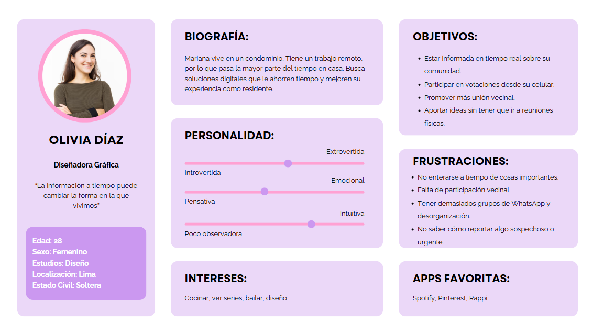
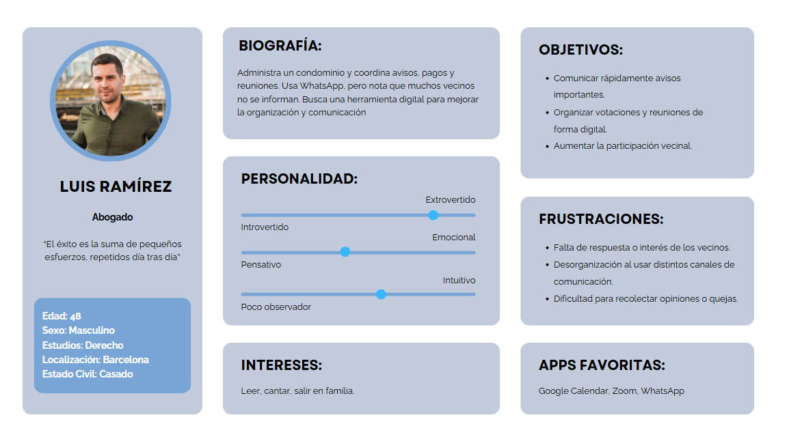
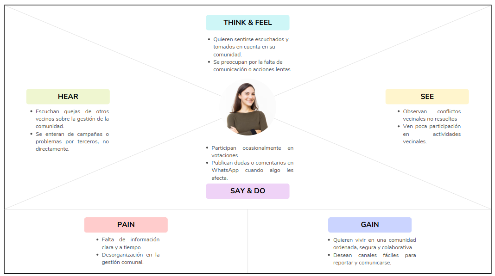
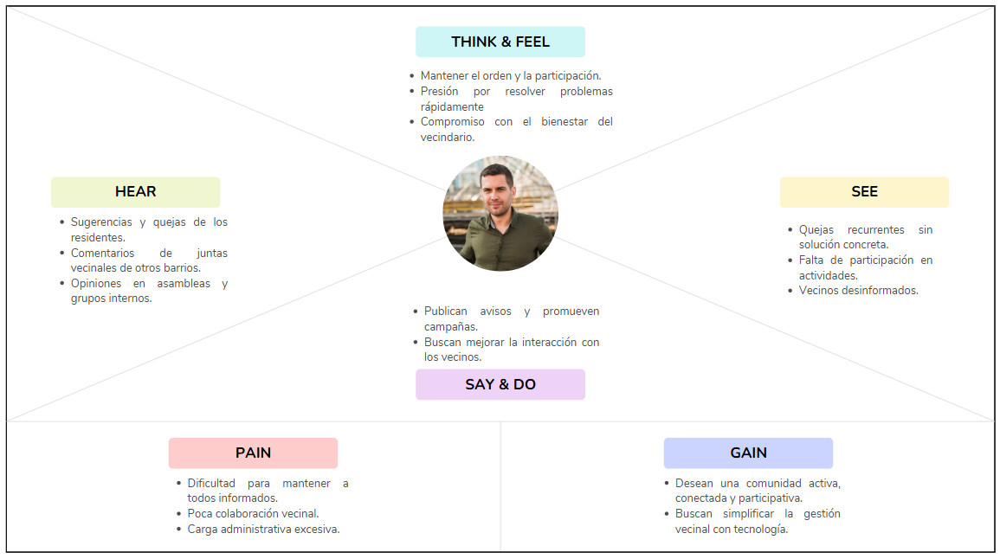
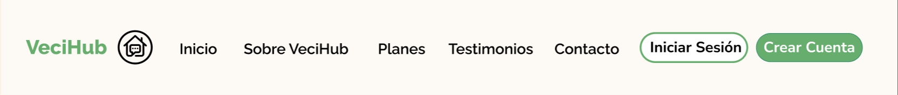

# **Informe del Trabajo Final**

<strong>Universidad Peruana de Ciencias Aplicadas</strong>

  

<strong>Ingeniería de Software</strong> 
Aplicaciones Web - 1ASI0730  
<strong>Profesor: Oscar Ivan Villafuerte Bazan</strong> 

<h2 align="center">INFORME</h2>

<h3 align="center">Startup: VeciHub </h3>

<strong>Producto: VeciApp</strong>

| **Team Members**                           | **Código**     |
|--------------------------------------|--------------|
|  Arias Segil, Marllely Anahi   | U202223984  |
|   Nikaido Vargas, Javier Masaru      |  U20221G099 |
|    Lagos Rivera, Kael Valentino       |  U202210104 |
|   Hernández Poma, Sebastián Eduardo   |  U20231C996 |
|   Sanchez Silva, Luciana Celeste   | U202215979   |
|   Diestra Zambrano, Adriana Maria | U202218110   |

<h5 style="text-align: center"> Ciclo 2025-010 </h5>

## Registro de versiones del informe

|Versión|Fecha|Autor|Descripción de modificación|
|:-:|:-:|:-:|-|
|1.0|10/04/2025|Arias, Sanchez|Creación del documento de trabajo en formato markdown|

## Project Report Collaboration Insights

URL del repositorio para el reporte del proyecto: 

**TB1**

Para el desarrollo del informe perteneciente a la entrega TB1, se dividió la implementación de secciones de la siguiente forma para cada integrante del equipo:

|Integrante|Tareas Asignadas|
|-|-|
|Marllely Arias||
|Javier Nikaido||
|Kael Lagos| Desarrollo de la introducción, planteamiento de las hipotesis y modificación del documento para un mayor orden|
|Sebastián Hernández||
|Luciana Sanchez||
|Adriana Diestra||

El proceso de colaboración en el informe se realizó mediante commits constantes al repositorio de la organización GanTrace.

**Github Collaboration Insights**

Github también presenta un timeline de las ramas principales y los procesos de merge a los que se han sometido. Todas las ramas se crearon tomando en cuenta el diseño de GitFlow para una buena organización cuando se usa un software de control de versiones.

Los integrantes son:

* Marllely Arias (kuwuk0)
* Javier Nikaido ()
* Kael Lagos ()
* Sebastián Hernández (M1sterDG)
* Luciana Sanchez (Luccsss)
* Adriana Diestra ()

Se explican las ramas más prominentes:

**main**: Es representada por el color ---. Se trata de la rama principal del proyecto y se actualiza para cada entregable.
**develop**: Es representada por el color ---. Se trata de la rama principal para el proceso del desarrollo del proyecto.
**feature-product-design**: Es representado por el color ---. Incluye el contenido de user flows y wireframes.
**feature-sprint1**: Es representada por el color ---. Esta rama incluye los artefactos relacionados al sprint 1 en el informe.

Los siguientes gráficos representan analíticos de commits en el repositorio del informe. En los gráficos se incluye la cantidad de lineas de texto añadidas por cada integrante del equipo. 

**TB1**

## Student Outcomes
|Criterio especifico|Acciones realizadas|Conclusiones|
|-|:-|-|
|Comunica en forma escrita ideas y/o resultados con objetividad a público de diferentes especialidades y niveles jerarquicos, en el marco del desarrollo de un proyecto en ingeniería|**Marllely Arias**   TB1: En esta entrega se realizaron .   **Javier Nikaido**   TB1: Realizó .   **Kael Lagos**   TB1: Para el trabajo se hizo la introducción y la modificación de ciertos elementos del doc como lo puede ser el cuadro de los integrantes.   **Sebastián Hernández**   TB1: En el informe comuniqué de forma clara y objetiva los hallazgos del análisis competitivo, las estrategias frente a competidores y los resultados obtenidos en entrevistas con usuarios y administradores. Además, estructuré el proceso de identificación de necesidades mediante herramientas como User Personas y Journey Mapping, permitiendo que distintos perfiles del equipo comprendan y tomen decisiones informadas en el contexto del proyecto de ingeniería .   **Luciana Sanchez**   TB1: Para el trabajo se hizo .   **Adriana Diestra**   TB1: Para culminar la entrega de esta primera versión del trabajo final, resultó necesario .|El documento redactado...|
|Comunica oralmente sus ideas y/o resultados con objetividad a público de diferentes especialidades y niveles jerarquicos, en el marco del desarrollo de un proyecto en ingeniería.| **Marllely Arias**   TB1: Se llevó a cabo .   **Javier Nikaido**   TB1: Encargado de realizar.   **Kael Lagos**   TB1: A lo hora de realizar el trabajo mostró compromiso por arreglar los errores iniciales del informe, brindo indicaciones para sus compañeros y aportó la idea de arreglar el estado del informe inicial.   **Sebastián Hernández**   TB1: Durante las presentaciones del proyecto, expuse con claridad los resultados del análisis competitivo, las entrevistas realizadas y el proceso de identificación de necesidades, adaptando el lenguaje según el público. Logré transmitir ideas clave a compañeros, docentes y posibles usuarios, facilitando la comprensión de los avances del proyecto VeciHub desde una perspectiva técnica y estratégica. .   **Luciana Sanchez**   TB1: Para  .   **Adriana Diestra**   TB1: Para culminar la entrega de esta primera versión del trabajo final, resultó necesario . |Como equipo pudimos establecer... |

## Contenido
1. [**Capítulo I: Introducción.**](#1.)  
1.1. [Startup Profile.](#1.1.)  
1.1.1. [Descripción del startup.](#1.1.1.) 
1.1.2.[Perfiles de los integrantes del equipo.](#1.1.2.) 
1.2. [Solution Profile.](#1.2.) 
1.2.1. [Antecedentes y Problemática.](#1.2.1.) 
1.2.2. [Lean UX Process.](#1.2.2.) 
1.2.2.1. [Lean UX Problem Statements.](#1.2.2.1.) 
1.2.2.2. [Lean UX Assumptions.](#1.2.2.2.) 
1.2.2.3. [Lean UX Hypothesis Statements.](#1.2.2.3.) 
1.2.2.4. [Lean UX Canvas.](#1.2.2.4.) 
1.3. [Segmentos objetivo.](#1.3.) 
2. [**Capítulo II: Requirements Elicitation & Analysis.**](#2.) 
2.1. [Competidores.](#2.1.) 
2.1.1. [Análisis competitivo.](#2.1.1.) 
2.1.2. [Estrategias y tácticas frente a competidores.](#2.1.2.) 
2.2. [Entrevistas.](#2.2.) 
2.2.1. [Diseño de entrevistas.](#2.2.1.) 
2.2.2. [Registro de entrevistas.](#2.2.2.) 
2.2.3. [Análisis de entrevistas.](#2.2.3.) 
2.3. [Needfinding.](#2.3.) 
2.3.1. [User Personas.](#2.3.1.) 
2.3.2. [User Task Matrix.](#2.3.2.) 
2.3.3. [User Journey Mapping.](#2.3.3.) 
2.3.4. [Empathy Mapping.](#2.3.4.) 
2.3.5. [As-is Scenario Mapping.](#2.3.5.) 
3. [**Capítulo III: Requirements Specification.**](#3.) 
3.1. [To-Be Scenario Mapping.](#3.1.) 
3.2. [User Stories.](#3.2.) 
3.3. [Impact Mapping.](#3.3.) 
3.4. [Product Backlog.](#3.4.) 
4. [**Capítulo IV: Product Design.**](#4.) 
4.1. [Style Guidelines.](#4.1.) 
4.1.1. [General Style Guidelines.](#4.1.1.) 
4.1.2. [Web Style Guidelines.](#4.1.2.) 
4.2. [Information Architecture.](#4.2.) 
4.2.1. [Organization Systems.](#4.2.1.) 
4.2.2. [Labeling Systems.](#4.2.2.) 
4.2.3. [SEO Tags and Meta Tags](#4.2.3.) 
4.2.4. [Searching Systems.](#4.2.4.) 
4.2.5. [Navigation Systems.](#4.2.5.) 
4.3. [Landing Page UI Design.](#4.3.) 
4.3.1. [Landing Page Wireframe.](#4.3.1.) 
4.3.2. [Landing Page Mock-up.](#4.3.2.) 
4.4. [Web Applications UX/UI Design.](#4.4.) 
4.4.1. [Web Applications Wireframes.](#4.4.1.) 
4.4.2. [Web Applications Wireflow Diagrams.](#4.4.2.) 
4.4.3. [Web Applications Mock-ups.](#4.4.3.) 
4.4.4. [Web Applications User Flow Diagrams.](#4.4.4.) 
4.5. [Web Applications Prototyping.](#4.5.) 
4.6. [Domain-Driven Software Architecture.](#4.6.) 
4.6.1. [Software Architecture Context Diagram.](#4.6.1.) 
4.6.2. [Software Architecture Container Diagrams.](#4.6.2.) 
4.6.3. [Software Architecture Components Diagrams.](#4.6.3.) 
4.7. [Software Object-Oriented Design.](#4.7.) 
4.7.1. [Class Diagrams.](#4.7.1.) 
4.7.2. [Class Dictionary.](#4.7.2.) 
4.8. [Database Design.](#4.8.) 
4.8.1. [Database Diagram.](#4.8.1.) 
5. [**Capítulo V: Product Implementation, Validation & Deployment.**](#5.) 
5.1. [Software Configuration Management.](#5.1.) 
5.1.1. [Software Development Environment Configuration.](#5.1.1.) 
5.1.2. [Source Code Management.](#5.1.2.) 
5.1.3. [Source Code Style Guide & Conventions.](#5.1.3.) 
5.1.4. [Software Deployment Configuration.](#5.1.4.) 
5.2. [Landing Page, Services & Applications Implementation.](#5.2.) 
5.2.1. [Sprint 1.](#5.2.1.) 
5.2.1.1. [Sprint Planning 1.](#5.2.1.1.) 
5.2.1.2. [Sprint Backlog 1.](#5.2.1.2.) 
5.2.1.3. [Development Evidence for Sprint Review.](#5.2.1.3.) 
5.2.1.4. [Testing Suite Evidence for Sprint Review.](#5.2.1.4.) 
5.2.1.5. [Execution Evidence for Sprint Review.](#5.2.1.5.) 
5.2.1.6. [Services Documentation Evidence for Sprint Review.](#5.2.1.6.) 
5.2.1.7. [Software Deployment Evidence for Sprint Review.](#5.2.1.7.) 
5.2.1.8. [Team Collaboration Insights during Sprint.](#5.2.1.8.) 
6. [**Conclusiones.**](#6.) 
7. [**Bibliografía.**](#7.) 
8. [**Anexos.**](#8.) 

<h2>Capítulo I: Introducción</h2>

<h3> 1.1 Startup Profile.</h3>

En esta sección se presenta la descripción del startup y los perfiles de los miembros del equipo.

<h4> 1.1.1. Descripción del startup.</h4>

“VeciHub” es una aplicación diseñada para mejorar la comunicación entre los miembros de una comunidad permitiéndoles interactuar de manera virtual mediante foros abiertos, votaciones de ideas propuestas, creación de reuniones para la comunidad y esto permite que los vecinos estén al tanto de lo que sucede a tiempo real brindando confianza y seguridad. Además, con el uso del aplicativo se busca la prevención de robos y dar avisos importantes. Por ejemplo, puede ser usada para avisar o pedir permiso por si va a haber ruido, promover campañas locales que refuercen los lazos entre la comunidad, alerta por la presencia de una persona desconocida en el área, y contará con accesos directos a teléfonos de emergencia locales. 

**Misión:** Fortalecer la comunicación y organización dentro de las comunidades vecinales mediante una plataforma digital accesible, segura y participativa que facilite la interacción, prevención y colaboración entre los vecinos, promoviendo la confianza, el bienestar y la seguridad colectiva.

**Visión:** Ser la aplicación líder en integración vecinal a nivel nacional e internacional, transformando la manera en que las comunidades se conectan, resuelven sus problemas y construyen entornos más unidos, participativos y seguros a través de la tecnología.

##### Logotipo de la Startup:

##### Logotipo del servicio

<h4> 1.1.2. Perfiles de los integrantes del equipo.</h4>

| Foto                                 | Alumno            | Descripción                                                                                                                                                                                                                                                                                                                                                                  |
| ------------------------------------ | ----------------- | ---------------------------------------------------------------------------------------------------------------------------------------------------------------------------------------------------------------------------------------------------------------------------------------------------------------------------------------------------------------------------- |
| |  Javier Masaru Nikaido Vargas      |          Estudiante de Ingenieria de Software de 5to ciclo de la Universidad Peruana de Ciencias. Me gusta hacer las cosas con tiempo y ordenadamente, trabajar con tranquilidad y terminar mis deberes a tiempo.                                                                                                                                                                                                                                                                        |
|                                      |       Sebastian Eduardo Hernandez Poma            |       Estudiante de 5to ciclo en Ingenieria de Software en la Universidad Peruana de Ciencias Aplicadas. Soy una persona trabajadora, capaz de liderar y colaborar en equipos, incluso bajo presión, lo que me hace hábil para resolver problemas y enfrentar diversas situaciones. Destaco por mi proactividad, responsabilidad y mi constante deseo de aprender.                                                                                                                                                                                                                                                                                                                                                                       |
|  | Kael Lagos Rivera | Me llamo Kael Lagos, estudio en la UPC de Monterrico. Tengo muchas ganas de aprender, me considero una persona responsable que busca aprender de sus errores cada vez que puede y tambien me considero alguien que se centra en los detalles. Me comprometo a ayudar a mis compañeros para la elaboración de nuestro trabajo que nos pueda asegurar una buena nota al final. |

|    | Marllely Anahi Arias Segil | Hola, mi nombre es Marllely Arias Segil. Soy estudiante de Ingeniería de Software, una persona empática, responsable y comprometida con mi crecimiento profesional. Me gusta trabajar en equipo y siempre busco dar lo mejor de mí en cada proyecto. |

|     |    Adriana Maria Diestra Zambrano   |              Estudiante de la carrera Ingeniería de Software con interés en el desarrollo web, sobre todo en el lado frontend. Me gusta crear interfaces ordenadas, intuitivas y visualmente atractivas. Proactiva, con gran interés por aprender cosas nuevas y con una actitud positiva que favorece el trabajo en equipo.                                                                                                        |
|            Foto aqui                          |            Nombre aqui          |                  Descripción tuya aqui                                                                                                                                                                                                                                                                                                                                                            |

<h3> 1.2. Solution Profile.</h3>

<h4> 1.2.1. Antecedentes y Problemática.</h4>

### Antecedentes:

En los últimos años, muchas comunidades residenciales han evidenciado un debilitamiento en la cohesión social y en la organización vecinal debido a la falta de canales efectivos de comunicación. Según un estudio realizado por la consultora internacional Deloitte (2020), el 64% de los residentes en zonas urbanas considera que la falta de comunicación con sus vecinos dificulta la resolución de problemas comunes y genera desconfianza. Asimismo, iniciativas como Nextdoor en Estados Unidos han demostrado que las aplicaciones enfocadas en comunidades locales pueden mejorar significativamente la participación ciudadana, la prevención del delito y la convivencia.

### Problematica:

Sin embargo se detectado una gran desorganización y la escasa comunicación entre los vecinos de una comunidad que llega a impedir una respuesta rápida ante situaciones de riesgo, generando desinformación sobre eventos locales y dificultando la toma de decisiones colectivas. Esta desconexión puede llevar a conflictos innecesarios, aumento de la sensación de inseguridad y pérdida de sentido de pertenencia. Además, la ausencia de herramientas digitales diseñadas específicamente para facilitar la interacción vecinal limita la capacidad de respuesta ante emergencias o problemas cotidianos del entorno.

Estas problematicas resaltan la carencia de un servicio que permita a los habitantes de un mismo vecindario estar informados sobre distintos sucesos o eventos de la zona, además de el preocupante aumento en la desconfianza de las personas. Por lo cual nuestra aplicación busca solventar esas carencias y ofrecer un mejor servicio que sepa distinguirse del resto de propuestas.

Por otro lado, se utilizó la metodología ‘5W y 2H' para describir a detalle el problema que se busca solucionar y los puntos principales respondiendo estas 7 preguntas: ¿qué?, ¿por qué?, ¿a quiénes?, ¿dónde?, ¿cuándo?, ¿cómo?, y ¿cuánto?

###### What (Qué)
###### ¿Qué problemas hay?

Falta de comunicación y desorganización entre los vecinos de una comunidad, lo cual genera conflictos, desinformación y sensación de inseguridad.

###### When (Cuando)
###### ¿Cuándo ocurre el problema?

De forma constante, pero se agrava durante situaciones de emergencia (como robos, desastres naturales, cortes de servicios), épocas de campañas o actividades comunitarias, o cuando surgen conflictos entre vecinos que no pueden resolverse por falta de comunicación.

###### Where (Dónde)
###### ¿Dónde ocurre?

En comunidades urbanas y suburbanas de países latinoamericanos, especialmente en zonas donde no hay una cultura activa de participación vecinal ni sistemas formales de comunicación digital.

###### Who (Quiénes)
###### ¿A quiénes afecta?

Afecta directamente a los vecinos de comunidades residenciales (urbanizaciones, condominios, barrios cerrados) y también a las juntas vecinales o administradores, quienes necesitan medios eficaces para informar y organizar actividades o alertas.

###### Why (Por qué)
###### ¿Por qué persiste el problema?

Porque no existen canales adecuados, accesibles ni confiables para que los vecinos se mantengan informados, participen en decisiones comunitarias o reaccionen de forma oportuna ante situaciones de emergencia. Esto puede ser causado por la falta de herramientas tecnológicas adaptadas al contexto local, desinterés o desconocimiento.

##### ¿Cuáles son las 2H?
###### How (Cómo)
###### ¿Cómo ocurre el problema?

Se da por medio de la ausencia de herramientas digitales, desinterés en reuniones presenciales, y el uso informal de canales no oficiales (como grupos de WhatsApp desorganizados o sin moderación), lo cual lleva a una mala gestión de la información, exclusión de algunos vecinos, y confusión general.

###### ¿Cómo lograremos desarrollar una gestión eficiente dentro de la plataforma?

Lograremos una gestión eficiente dentro de la plataforma VeciHub implementando una serie de funciones clave que permitan a los usuarios (vecinos, administradores y juntas vecinales) interactuar de manera organizada, rápida y segura. Estas son algunas acciones concretas:

1. Roles y permisos diferenciados:
Se establecerán distintos niveles de acceso dentro de la app (administrador, vecino, moderador), permitiendo que solo ciertos usuarios puedan crear votaciones, aprobar publicaciones o gestionar eventos. Esto evitará la saturación de contenido irrelevante y mantendrá el orden.

2. Panel de administración intuitivo:
Se diseñará un panel de gestión para las juntas vecinales o líderes comunales, desde el cual puedan:
- Publicar anuncios urgentes.
- Programar reuniones o campañas.
- Modificar accesos o aprobar nuevas cuentas vecinales.
- Ver estadísticas de participación.

3. Canales de comunicación estructurados:

- Foros temáticos: Seguridad, actividades, reclamos, propuestas.
- Notificaciones inteligentes: Alertas por zonas, horarios o tipo de contenido.
- Votaciones y encuestas: Para tomar decisiones colectivas de forma democrática.

4. Seguridad y verificación:
Los usuarios deberán ser validados como miembros de la comunidad (por código de residencia, número de inmueble, o verificación manual), evitando accesos no autorizados y fomentando la confianza entre los usuarios.

5. Historial y trazabilidad:
Toda acción dentro de la app quedará registrada (con opción de revisarla en el historial), permitiendo resolver malentendidos o tomar decisiones basadas en datos reales.

6. Automatización de tareas repetitivas:
- Recordatorios de reuniones.
- Vencimiento de cuotas o servicios.
- Alertas recurrentes de seguridad o limpieza.

###### How much (Cuánto)
###### ¿Cuánto afecta?

Afecta significativamente el sentido de comunidad, la seguridad vecinal, la confianza entre residentes, y puede generar costos adicionales en seguridad o en solución de problemas que pudieron prevenirse con comunicación oportuna. Además, reduce la eficiencia de las juntas vecinales y deteriora la convivencia.

###### ¿Qué porcentaje del personal de la industria se verá beneficiado por el servicio?

En el contexto de VeciHub, si consideramos como "industria" el sector de gestión comunitaria, seguridad vecinal y administración de propiedades, estimamos que aproximadamente entre un 60% y 75% del personal vinculado a estos entornos podría beneficiarse directamente del servicio.
Esto incluye:

- Administradores de edificios y condominios.
- Miembros de juntas vecinales.
- Personal de seguridad y vigilancia.
- Freelancers que ofrecen servicios comunitarios (mantenimiento, limpieza, eventos).
- Miembros activos de comunidades digitales locales.

<h4> 1.2.2. Lean UX Process.</h4>

<h5> 1.2.2.1. Lean UX Problem Statements.</h5>

###### **Problem Statement:** 

1. Usuario objetivo:
Vecinos y administradores de comunidades residenciales (edificios, condominios o urbanizaciones cerradas) que enfrentan problemas de comunicación, organización y seguridad en su entorno.

2. Sus necesidades:
Necesitan una forma efectiva, rápida y segura de mantenerse informados, expresar sus opiniones, coordinar actividades comunitarias y reaccionar ante situaciones urgentes (robos, conflictos, mantenimiento, etc.).

3. Problemas que enfrentan:
Actualmente, la comunicación entre vecinos es desorganizada y dispersa (usando grupos de WhatsApp, correos o pizarras físicas), lo que provoca desinformación, desconfianza, desinterés en la participación y retraso en la toma de decisiones importantes.

4. Nuestra solución propuesta:
Una aplicación móvil/web llamada VeciHub que centralice la comunicación comunitaria mediante foros, votaciones, alertas, reuniones virtuales, campañas vecinales, y acceso rápido a servicios de emergencia. Esta herramienta promueve la transparencia, el compromiso vecinal y la seguridad colectiva.

<h5> 1.2.2.2. Lean UX Assumptions.</h5>

###### **Business Assumptions:**
1.  **Creemos que nuestros usuarios necesitan** una plataforma eficiente, segura y sencilla para comunicarse con sus vecinos, organizarse y mantenerse informados en tiempo real sobre lo que ocurre en su comunidad.
2.  **Estas necesidades se pueden satisfacer** a través de una aplicación móvil con foros, alertas, votaciones, eventos comunitarios y acceso directo a canales de emergencia.
3.  **Nuestros clientes iniciales serán** juntas vecinales, administradores de condominios y residentes de comunidades cerradas que buscan mejorar su organización interna.
4.  **El valor más importante que un cliente quiere de nuestros servicios es** la capacidad de mantener a toda la comunidad informada y conectada de forma ordenada y segura.
5.  **El cliente también va a obtener** herramientas para prevenir conflictos, mejorar la seguridad vecinal y fortalecer el sentido de comunidad.
6.  **Vamos a obtener la mayoría de los clientes mediante** alianzas con inmobiliarias, difusión en redes sociales, recomendaciones entre comunidades y presentaciones en ferias de vivienda o seguridad.
7.  **Vamos a obtener ingresos mediante** suscripciones mensuales o anuales, servicios premium dentro de la app y publicidad local segmentada.
8.  **Nuestra competencia en el mercado serán** grupos informales en redes sociales, apps como Nextdoor (en países anglosajones) y plataformas de gestión de condominios tradicionales.
9.  **Vamos a tener ventaja frente a nuestra competencia debido a** una interfaz amigable, enfoque en comunicación vecinal, funciones adaptadas al contexto latinoamericano y herramientas de seguridad integradas.
10.  **El mayor riesgo del servicio es** la baja adopción por parte de los vecinos o el desinterés por migrar desde canales informales como WhatsApp.
11.  **Lo resolveremos realizando** pruebas piloto en comunidades pequeñas, campañas de concientización sobre los beneficios del orden digital, soporte constante, y una experiencia de usuario atractiva y accesible para todos.

###### **User Assumptions:**
###### **¿Quién es el usuario?**   
Los usuarios principales son vecinos residentes en edificios, condominios o urbanizaciones cerradas, así como administradores de estas comunidades. También pueden ser miembros de juntas vecinales u organizaciones locales interesadas en mejorar la comunicación y seguridad de su entorno.

###### **¿Qué problemas tiene nuestro producto que resolver?**
- Falta de comunicación organizada entre vecinos.
- Desinformación sobre actividades comunitarias, reuniones o situaciones urgentes.
- Desconfianza o conflictos por mala gestión de decisiones vecinales.
- Ausencia de canales seguros y centralizados para alertas o anuncios.
- Dificultad para reaccionar ante emergencias o coordinar acciones vecinales.

###### **¿Qué características son importantes?**
- Foros vecinales organizados por temas.
- Votaciones y encuestas rápidas.
- Alertas de seguridad o emergencias.
- Calendario de actividades y reuniones.
- Accesos directos a contactos de emergencia.
- Notificaciones personalizadas.
- Registro de participación y trazabilidad de decisiones.

###### **¿Dónde encaja nuestro producto en su trabajo o vida?**
Encaja como una herramienta diaria de organización y conexión comunitaria. Puede ser parte de su rutina al revisar avisos, responder votaciones o reportar una situación. Para los administradores, es un instrumento de gestión operativa que mejora su eficiencia y transparencia.

###### **¿Cuándo y cómo es usado nuestro producto?**
- Cuándo: Diariamente o según eventos relevantes (reuniones, alertas, votaciones).
- Cómo: Desde el celular o tablet, por medio de notificaciones push o explorando la app activamente para informarse o participar.

###### **¿Cómo debe verse nuestro producto y cómo debe comportarse?**
- Debe verse limpio, moderno y amigable, con íconos intuitivos y colores suaves que generen confianza.
- Debe comportarse de forma rápida, fluida y confiable, permitiendo navegar entre foros, avisos y funciones sin complicaciones.
- La interfaz debe adaptarse a personas con poca experiencia digital, manteniendo la simplicidad sin perder funcionalidad.

###### **Feature Assumptions:**

**Creemos que** los usuarios necesitan una plataforma centralizada para enterarse de lo que ocurre en su comunidad sin depender de múltiples canales informales como grupos de WhatsApp, pizarras físicas o correos dispersos.

**Creemos que** a los vecinos les interesa participar más activamente en decisiones y actividades de su comunidad si se les brinda una herramienta accesible, transparente y ordenada para hacerlo.

**Creemos que** la plataforma debe ofrecer funcionalidades clave como foros, votaciones, alertas de seguridad, calendario de eventos y accesos rápidos a emergencias, ya que estas características cubren las principales necesidades de convivencia, organización y prevención.

**Creemos que** la experiencia de usuario debe ser simple, intuitiva y adaptada al contexto local latinoamericano, para garantizar la adopción por parte de todo tipo de usuarios, incluso aquellos con bajo dominio tecnológico.

<h5> 1.2.2.3. Lean UX Hypothesis Statements.</h5>

* **Hypothesis Statement 01:**
    
    **Creemos que** los vecinos desean una forma más rápida y organizada de enterarse sobre lo que ocurre en su comunidad.

    **Cuando** los vecinos ingresen a la aplicación desde su telefono, seleccionaran la pestaña de noticias más recientes.

    **Entonces** la aplicación los llevará a una nueva pestaña en la cual puedan enterarse de las noticias más importantes de la semana.
  
    **Sabremos** que hemos tenido exito cuando los vecinos estén mejor enterados de las cosas que pasan en su vecindario.
    
    
  
* **Hypothesis Statement 02:**
    
    **Creemos que** los vecinos desean una forma de comunicarse con los miembros de su comunidad.

    **Cuando** los vecinos quieran comunicarse entre sí, seleccionan la opción de chat grupal en el menú principal.

    **Entonces** la aplicación los llevará a una pestaña en forma de chat en el cual pueden comunicarse entre sí.
  
    **Sabremos** que hemos tenido exito cuando veamos a los vecinos entablar una conversación más organizada entre ellos. 

* **Hypothesis Statement 03:**
    
  **Creemos que** los jefes de vecindario necesitan una herramienta que les permita enviar comunicados de forma más rápida y que tengan un mayor alcane entre los vecinos.

  **Cuando** los jefes de vecindario ingresen al apartado de anuncios, seleccionaran la opción de "Escribir nuevo anuncio".

  **Entonces** la aplicación los llevará a una pestaña especial en la cual pueden ya sea modificar, borrar o agregar anuncios al tablero principal.
  
  **Sabremos** que hemos tenido exito cuando los comunicados o noticias lleguén a tener un mayor alcance entre los vecinos.

* **Hypothesis Statement 04:**
    
   **Creemos que** los jefes de vecindario necesitan una herramienta que les permita notificar a los miembros de su comunidad sobre alguna emergencia que este pasando en esos momentos para que tomen sus precausiones.

   **Cuando** los jefes de vecindario ingresen al apartado de anuncios, deben seleccionar la opción de "anuncios de emergencia".

   **Entonces** la aplicación los enviará a una pestaña exclusiva en la cual pueden enviar un anuncio de emergencia masivo a todos los vecinos en forma de notificación sonora.
  
   **Sabremos** que hemos tenido exito cuando al momento de una emergencia, los vecinos puedan estar organizados en el momento al tomar todas las precausiones necesarias.

<h5> 1.2.2.4. Lean UX Canvas.</h5>

El Lean UX Canvas es una herramienta empleada dentro del enfoque de diseño centrado en el usuario (UX) y la metodología Lean, destinada a facilitar la creación y evolución de productos de forma ágil y eficiente. Su finalidad es ofrecer una estructura organizada que promueva la colaboración entre equipos multidisciplinarios. A continuación, se muestra el Lean UX Canvas desarrollado por el equipo mediante el uso de la plataforma digital **Mural**:

Enlace para acceder al [Canvas](https://link.com)

<h2>Capítulo II: Requirements Elicitation & Analysis</h2>

<h3> 2.1. Competidores</h3>

<h4>Nextdoor</h4>

Es una de las plataformas de vecindario más conocidas a nivel global. Funciona como una red social privada que conecta a residentes de una misma zona para compartir información local, alertas de seguridad, recomendaciones y eventos. Opera en países como Estados Unidos, Reino Unido, Francia, Alemania, España y Australia, y se distingue por promover comunidades seguras y colaborativas, trabajando incluso en alianza con municipios para emitir comunicaciones oficiales. Su gran ventaja es la amplia base de usuarios y su enfoque en privacidad y confianza vecinal.

<h4>Neighbourly</h4>

Con base en el Reino Unido, conecta a empresas con comunidades locales para apoyar proyectos sociales y ambientales mediante donaciones, voluntariado y recursos. Aunque su enfoque no es exclusivo en vecinos como usuarios individuales, impacta directamente en la vida comunitaria, facilitando que organizaciones apoyen vecindarios en causas locales. Es una plataforma con fuerte enfoque en responsabilidad social y sostenibilidad, con gran tracción en el ámbito empresarial comunitario.

<h4>Front Porch Forum</h4>

Opera principalmente en Vermont, Estados Unidos, y se basa en boletines electrónicos comunitarios que fomentan la comunicación entre vecinos sobre temas locales como recomendaciones, objetos perdidos, alertas y eventos. Aunque su escala es más local, su fortaleza radica en una comunidad altamente participativa que promueve relaciones de confianza y convivencia vecinal a través de una herramienta simple y efectiva.

<h4>Patch</h4>

Es una plataforma de noticias hiperlocales activa en muchas ciudades de Estados Unidos. Aunque comenzó como un medio periodístico, ha evolucionado para permitir que los propios vecinos publiquen anuncios, discutan temas locales o difundan eventos. Esto la convierte en una fuente clave de comunicación comunitaria, integrando contenido generado por usuarios con actualizaciones relevantes para los vecindarios.

<h4>MyCoop</h4>

Está enfocada en edificios residenciales multifamiliares y condominios, principalmente en ciudades estadounidenses. Su propuesta permite a los residentes gestionar tareas, comunicarse con los vecinos y compartir información importante sobre su edificio. Está diseñada para mejorar la convivencia dentro de comunidades verticales, facilitando desde anuncios del administrador hasta la coordinación de eventos internos entre residentes.

<h4> 2.1.1. Análisis competitivo</h4>

<table border="1" cellpadding="6" cellspacing="0">
  <tr>
    <th colspan="7">Competitive Analysis Landscape</th>
  </tr>
  <tr>
    <td colspan="2" rowspan="2">¿Por qué llevar a cabo este análisis?</td>
    <td colspan="5">Identificar fortalezas, oportunidades y diferenciadores clave de VeciHub frente a plataformas internacionales de comunicación comunitaria y gestión vecinal.</td>
  </tr>
  <tr>
    <td colspan="5">Comparación por criterios estratégicos, funcionales y de mercado.</td>
  </tr>
  <tr>
    <td colspan="2">Productos</td>
    <td>VeciHub</td>
    <td>Nextdoor</td>
    <td>Neighbourly</td>
    <td>Front Porch Forum</td>
    <td>Patch</td>
    <td>MyCoop</td>
  </tr>
  <tr>
    <td rowspan="2">Perfil</td>
    <td>Overview</td>
    <td>Plataforma digital que mejora la comunicación entre vecinos con foros, alertas, votaciones, agendas y verificación por residencia.</td>
    <td>Red social privada de vecindarios para compartir noticias, eventos, recomendaciones y alertas.</td>
    <td>Plataforma británica que conecta empresas con comunidades para apoyar causas locales mediante voluntariado y donaciones.</td>
    <td>Boletín digital comunitario en Vermont que fomenta conversaciones vecinales simples y efectivas.</td>
    <td>Medio digital de noticias hiperlocales con foros y publicaciones comunitarias.</td>
    <td>App para edificios residenciales que gestiona tareas internas y comunicación entre residentes.</td>
  </tr>
  <tr>
    <td>Ventaja competitiva</td>
    <td>Participación local, verificación de vecinos, diseño intuitivo, enfoque comunitario adaptable a Latinoamérica.</td>
    <td>Gran base de usuarios, enfoque en privacidad, alianzas municipales.</td>
    <td>Fuerte enfoque en sostenibilidad y responsabilidad social empresarial.</td>
    <td>Alta participación comunitaria, simpleza y fuerte conexión local.</td>
    <td>Generación de contenido vecinal, noticias en tiempo real, comunicación pública.</td>
    <td>Eficiencia administrativa para residentes en edificios multifamiliares.</td>
  </tr>
  <tr>
    <td rowspan="2">Perfil de Marketing</td>
    <td>Mercado Objetivo</td>
    <td>Vecinos urbanos/suburbanos, juntas vecinales, administradores de comunidades.</td>
    <td>Residentes de barrios urbanos en países como EE.UU., Reino Unido y Alemania.</td>
    <td>Empresas socialmente responsables y comunidades locales receptoras.</td>
    <td>Vecinos de comunidades pequeñas o rurales.</td>
    <td>Usuarios que buscan información vecinal confiable y actualizada.</td>
    <td>Administradores y residentes de edificios residenciales verticales.</td>
  </tr>
  <tr>
    <td>Estrategias de Marketing</td>
    <td>Alianzas municipales, ferias comunitarias, campañas en redes sociales y referidos.</td>
    <td>Publicidad segmentada por vecindario, integración con autoridades locales.</td>
    <td>Campañas B2B con enfoque en impacto social, colaboración con ONGs.</td>
    <td>Difusión directa y referencias entre vecinos.</td>
    <td>Marketing de contenido local y monetización vía anuncios.</td>
    <td>Promoción directa en edificios y alianzas con inmobiliarias.</td>
  </tr>
  <tr>
    <td rowspan="3">Perfil de Producto</td>
    <td>Productos & Servicios</td>
    <td>Foros, votaciones, alertas, agendas comunitarias, validación de vecinos y panel para juntas.</td>
    <td>Publicaciones, alertas, eventos, marketplace local, comunicación municipal.</td>
    <td>Voluntariado, donaciones, recursos corporativos para proyectos comunitarios.</td>
    <td>Boletines por correo, foros, anuncios clasificados y eventos.</td>
    <td>Noticias locales, foros abiertos, alertas comunitarias.</td>
    <td>Mensajería, anuncios internos, gestión de tareas y eventos residenciales.</td>
  </tr>
  <tr>
    <td>Precios & Costos</td>
    <td>Gratis para vecinos; modelo freemium para juntas y patrocinadores.</td>
    <td>Gratuito para usuarios, ingresos por publicidad y servicios premium.</td>
    <td>Gratuito para comunidades, financiado por empresas patrocinadoras.</td>
    <td>Gratuito; financiado por donaciones y patrocinios locales.</td>
    <td>Financiado por medios patrocinados, modelo publicitario.</td>
    <td>Suscripciones según cantidad de usuarios o edificios registrados.</td>
  </tr>
  <tr>
    <td>Canales de distribución</td>
    <td>Web progresiva, app Android y versión iOS en desarrollo.</td>
    <td>Web y app Android/iOS con cobertura global.</td>
    <td>Sitio web con campañas digitales y alianzas.</td>
    <td>Correo electrónico y plataforma web minimalista.</td>
    <td>Sitio web y apps móviles para interacción rápida.</td>
    <td>App móvil y panel web para administradores.</td>
  </tr>
  <tr>
    <td rowspan="4">Análisis SWOT</td>
    <td>Fortalezas</td>
    <td>Diseño adaptado a cultura local, enfoque colaborativo, participación ciudadana real.</td>
    <td>Base de usuarios consolidada, confianza institucional, presencia global.</td>
    <td>Vínculo directo entre RSE empresarial y comunidades beneficiadas.</td>
    <td>Altísima conexión comunitaria, simplicidad, alta participación.</td>
    <td>Información útil y actualizada con enfoque hiperlocal.</td>
    <td>Optimización en edificios, integración sencilla y control de eventos internos.</td>
  </tr>
  <tr>
    <td>Debilidades</td>
    <td>Baja adopción inicial, requiere masa crítica y cultura digital participativa.</td>
    <td>Limitada localización cultural en Latinoamérica, posible desconfianza en privacidad.</td>
    <td>No centrado en vecinos individuales; limitado en personalización barrial.</td>
    <td>Escala local muy reducida; difícil aplicación en ciudades grandes.</td>
    <td>No centrado en cohesión vecinal ni gobernanza comunitaria.</td>
    <td>No aplicable fuera de residencias verticales; alcance restringido.</td>
  </tr>
  <tr>
    <td>Oportunidades</td>
    <td>Alianzas con municipios, ONGs y comunidades digitales post-pandemia.</td>
    <td>Expansión geográfica y servicios dirigidos a gobiernos.</td>
    <td>Aumento de exigencia social por prácticas ESG y sostenibilidad comunitaria.</td>
    <td>Replicación en zonas rurales; uso en comunidades descentralizadas.</td>
    <td>Mayor interés por periodismo ciudadano e información vecinal.</td>
    <td>Crecimiento de ciudades verticales y servicios integrados.</td>
  </tr>
  <tr>
    <td>Amenazas</td>
    <td>Competencia con apps globales, resistencia digital, baja interacción comunitaria en ciertos contextos.</td>
    <td>Saturación de apps similares y baja participación en comunidades desconectadas.</td>
    <td>Falta de escalabilidad en zonas informales o con poco acceso empresarial.</td>
    <td>Dependencia de la participación voluntaria sostenida en el tiempo.</td>
    <td>Desplazamiento por redes sociales más generalistas como Facebook o X.</td>
    <td>Competencia de soluciones integradas más amplias en el sector inmobiliario.</td>
  </tr>
</table>

<h4> 2.1.2. Estrategias y tacticas frente a competidores</h4>

  

    Basándonos en el análisis competitivo frente a plataformas como Nextdoor, Neighbourly, Front Porch Forum, Patch y MyCoop, se proponen las siguientes estrategias y tácticas para posicionar a <strong>VeciHub</strong> como una solución diferenciada y adaptada al contexto latinoamericano:
  

  <h4>Estrategia 1: Enfoque hiperlocal con adaptabilidad cultural</h4>
  <ul>
    <li>Implementar lenguaje inclusivo y familiar para las comunidades locales.</li>
    <li>Adaptar el contenido y notificaciones al calendario cívico y eventos regionales.</li>
    <li>Incorporar íconos y elementos visuales representativos de la cultura vecinal.</li>
  </ul>

  <h4>Estrategia 2: Participación comunitaria real y transparente</h4>
  <ul>
    <li>Diseñar votaciones digitales abiertas con verificación de residencia.</li>
    <li>Permitir a los vecinos proponer y priorizar ideas comunitarias desde la app.</li>
    <li>Implementar foros temáticos moderados por representantes vecinales.</li>
  </ul>

  <h4>Estrategia 3: Integración con municipalidades y juntas vecinales</h4>
  <ul>
    <li>Crear módulos para que las municipalidades publiquen alertas y campañas.</li>
    <li>Ofrecer dashboards gratuitos a juntas vecinales para organizar actividades y comunicados.</li>
    <li>Incluir mapas comunitarios con zonas de riesgo, puntos de reunión y servicios locales.</li>
  </ul>

  <h4>Estrategia 4: Accesibilidad tecnológica y educación digital</h4>
  <ul>
    <li>Diseño de interfaz sencilla con pasos guiados y asistencia vía WhatsApp.</li>
    <li>Producción de tutoriales audiovisuales para facilitar el uso por todas las edades.</li>
    <li>Capacitaciones comunitarias en coordinación con gobiernos locales.</li>
  </ul>

  <h4>Estrategia 5: Modelo de sostenibilidad freemium local</h4>
  <ul>
    <li>Mantener acceso gratuito para usuarios vecinos.</li>
    <li>Ofrecer servicios premium para administradores o alianzas con pequeñas marcas locales.</li>
    <li>Incluir módulos opcionales como votaciones ilimitadas o herramientas de seguridad avanzadas.</li>
  </ul>

  <h4>Estrategia 6: Posicionamiento como solución ciudadana de impacto</h4>
  <ul>
    <li>Recoger y difundir testimonios reales de usuarios beneficiados.</li>
    <li>Participar en convocatorias de innovación ciudadana y eventos de gobierno abierto.</li>
    <li>Medir e informar impacto mediante estadísticas de participación y resolución de alertas.</li>
  </ul>

<h3> 2.2. Entrevistas</h3>

<h4> 2.2.1. Diseño de entrevistas</h4>

  

    Para identificar las necesidades reales de los usuarios de VeciHub, se han diseñado entrevistas semi-estructuradas divididas en dos segmentos clave: <strong>vecinos/residentes</strong> y <strong>administradores o miembros de juntas vecinales</strong>. Las entrevistas buscan entender sus hábitos de comunicación, problemáticas comunitarias y percepción sobre el uso de herramientas digitales para la gestión y participación comunitaria.
  

  <h4>Segmento 1: Vecinos / Residentes</h4>
  <ol>
    <li>¿Cómo sueles enterarte de noticias o situaciones que ocurren en tu vecindario?</li>
    <li>¿Qué canales usas para comunicarte con tus vecinos o la junta vecinal (WhatsApp, redes sociales, reuniones)?</li>
    <li>¿Has participado antes en alguna reunión vecinal o votación? ¿Cómo fue tu experiencia?</li>
    <li>¿Qué problemas frecuentes identificas en la convivencia o comunicación con tus vecinos?</li>
    <li>¿Te gustaría contar con una plataforma digital donde puedas ver alertas, eventos o proponer ideas vecinales?</li>
    <li>¿Qué funcionalidades considerarías útiles en una aplicación como VeciHub (por ejemplo: votaciones, alertas, reclamos, anuncios)?</li>
    <li>¿Qué tan probable sería que descargues y uses una app si esta te ayuda a estar más informado y conectado con tu comunidad?</li>
    <li>¿Tienes alguna preocupación sobre la privacidad o el uso de tus datos personales en este tipo de plataformas?</li>
  </ol>

  <h4>Segmento 2: Administradores / Juntas Vecinales</h4>
  <ol>
    <li>¿Cómo se comunican actualmente con los vecinos para transmitir información o convocatorias?</li>
    <li>¿Qué herramientas utilizan para organizar reuniones, votaciones o recibir sugerencias?</li>
    <li>¿Qué problemas enfrentan para lograr que los vecinos participen en las actividades comunitarias?</li>
    <li>¿Les resulta difícil organizar y mantener el orden en los canales actuales (como grupos de WhatsApp o llamadas)?</li>
    <li>¿Qué tipo de información es más importante comunicar con rapidez a los vecinos (ej: seguridad, eventos, mantenimiento)?</li>
    <li>¿Considerarían útil una plataforma digital que permita centralizar anuncios, votaciones, alertas y reclamos?</li>
    <li>¿Qué funcionalidades necesitaría una aplicación como VeciHub para que sea realmente útil para ustedes como líderes o administradores?</li>
    <li>¿Estarían dispuestos a implementar esta herramienta en su comunidad si se les brinda capacitación y soporte?</li>
  </ol>

<h4> 2.2.2. Registro de entrevistas</h4>

**Segmento objetivo 1: Vecino / Residente**

  <h4>Entrevista 1: Vecino / Residente</h4>
  <table border="1" cellpadding="6" cellspacing="0">
    <tr><td><strong>Nombre Entrevistado</strong></td><td>Mariana Reyes</td></tr>
    <tr><td><strong>Edad</strong></td><td>42 años</td></tr>
    <tr><td><strong>Profesión</strong></td><td>Madre de familia</td></tr>
    <tr><td><strong>Departamento</strong></td><td>Lima, Perú</td></tr>
    <tr><td><strong>Duración de la Entrevista</strong></td><td>13:45 min</td></tr>
  </table>

  

 <h4>Entrevista 2: Vecina / Residente</h4>
<table border="1" cellpadding="6" cellspacing="0">
  <tr><td><strong>Nombre Entrevistado</strong></td><td>Olivia Díaz</td></tr>
  <tr><td><strong>Edad</strong></td><td>28 años</td></tr>
  <tr><td><strong>Profesión</strong></td><td>Diseñadora Gráfica</td></tr>
  <tr><td><strong>Departamento</strong></td><td>Lima, Perú</td></tr>
  <tr><td><strong>Duración de la Entrevista</strong></td><td>12:03 min</td></tr>
</table>

  <h4>Entrevista 3: Vecino / Residente</h4>
  <table border="1" cellpadding="6" cellspacing="0">
    <tr><td><strong>Nombre Entrevistado</strong></td><td>Camila Romero</td></tr>
    <tr><td><strong>Edad</strong></td><td>24 años</td></tr>
    <tr><td><strong>Profesión</strong></td><td>Estudiante universitaria</td></tr>
    <tr><td><strong>Departamento</strong></td><td>Trujillo, Perú</td></tr>
    <tr><td><strong>Duración de la Entrevista</strong></td><td>10:37 min</td></tr>
  </table>

**Segmento objetivo 2: Administradores / Juntas Vecinales**
<h4>Entrevista 4: Administrador(a) / Junta Vecinal</h4>
<table border="1" cellpadding="6" cellspacing="0">
  <tr><td><strong>Nombre Entrevistado</strong></td><td>Cielo Rafaile</td></tr>
  <tr><td><strong>Edad</strong></td><td>22 años</td></tr>
  <tr><td><strong>Rol</strong></td><td>Representante de Junta Vecinal</td></tr>
  <tr><td><strong>Departamento</strong></td><td>No especificado</td></tr>
  <tr><td><strong>Duración de la Entrevista</strong></td><td>3:01 min</td></tr>
</table>

<h4>Entrevista 5: Administrador / Junta Vecinal</h4>
<table border="1" cellpadding="6" cellspacing="0">
  <tr><td><strong>Nombre Entrevistado</strong></td><td>Luis Ramírez</td></tr>
  <tr><td><strong>Edad</strong></td><td>48 años</td></tr>
  <tr><td><strong>Profesión</strong></td><td>Abogado</td></tr>
  <tr><td><strong>Departamento</strong></td><td>Barcelona</td></tr>
  <tr><td><strong>Duración de la Entrevista</strong></td><td>09:17 min</td></tr>
</table>

Capturas: 

Descripción: Se entrevistó a una administradora vecinal, quien compartió su experiencia gestionando la comunicación con los vecinos a través de juntas presenciales y grupos de WhatsApp. Comentó las dificultades para lograr la participación activa de la comunidad, el desorden en los canales actuales y la importancia de contar con una plataforma digital que centralice votaciones.

Link de la entrevista: https://goo.su/ZpGs

Entrevista 2:
----------------------
Nombre del entrevistado: 

Edad: 

Profesión:

Departamento: 

Duración de la Entrevista: 

Capturas: 

Descripción: 

Link de la entrevista: 

<h4> 2.2.3. Análisis de entrevistas</h4>

<h5>Análisis de la Entrevista - Mariana Reyes</h5>
  <table border="1" cellpadding="6" cellspacing="0">
    <tr><td><strong>Fuentes de Información</strong></td><td>WhatsApp y conversaciones vecinales; ocasionalmente Facebook.</td></tr>
    <tr><td><strong>Canales de Comunicación</strong></td><td>Usa principalmente WhatsApp para contactar a la junta vecinal.</td></tr>
    <tr><td><strong>Participación Comunitaria</strong></td><td>Ha asistido a reuniones, pero percibe desorganización.</td></tr>
    <tr><td><strong>Problemas en la Comunidad</strong></td><td>Falta de información oficial y comunicación clara.</td></tr>
    <tr><td><strong>Interés en Plataforma Digital</strong></td><td>Alta disposición a usar una app como VeciHub.</td></tr>
    <tr><td><strong>Funcionalidades Relevantes</strong></td><td>Alertas, votaciones, buzón de sugerencias.</td></tr>
    <tr><td><strong>Privacidad y Seguridad</strong></td><td>Preocupación por protección de datos personales.</td></tr>
  </table>
 
    <h5>Análisis de la Entrevista Olivia Díaz</h5>
<table border="1" cellpadding="6" cellspacing="0">
  <tr>
    <td><strong>Fuentes de Información</strong></td>
    <td>Se informa principalmente a través de WhatsApp y el grupo de Facebook del condominio, aunque nota que hay demasiados mensajes irrelevantes.</td>
  </tr>
  <tr>
    <td><strong>Canales de Comunicación</strong></td>
    <td>Usa WhatsApp para temas urgentes. No participa en reuniones presenciales por falta de tiempo, ya que trabaja desde casa.</td>
  </tr>
  <tr>
    <td><strong>Participación Comunitaria</strong></td>
    <td>Participación limitada. Tiene intención de involucrarse más si puede hacerlo mediante medios digitales.</td>
  </tr>
  <tr>
    <td><strong>Problemas en la Comunidad</strong></td>
    <td>Falta de comunicación clara y oportuna. A menudo se entera tarde de eventos o incidentes importantes.</td>
  </tr>
  <tr>
    <td><strong>Interés en Plataforma Digital</strong></td>
    <td>Muy interesada en contar con una plataforma como VeciHub para recibir alertas, participar en votaciones y estar más conectada con su comunidad.</td>
  </tr>
  <tr>
    <td><strong>Funcionalidades Relevantes</strong></td>
    <td>Votaciones digitales, notificaciones, buzón de sugerencias, alertas de seguridad y calendario de actividades.</td>
  </tr>
  <tr>
    <td><strong>Privacidad y Seguridad</strong></td>
    <td>Le preocupa que su información personal sea visible. Considera esencial que la app proteja su privacidad.</td>
  </tr>
</table>
 

  <h5>Análisis de la Entrevista - Camila Romero</h5>
  <table border="1" cellpadding="6" cellspacing="0">
    <tr><td><strong>Fuentes de Información</strong></td><td>Redes sociales o comentarios familiares.</td></tr>
    <tr><td><strong>Canales de Comunicación</strong></td><td>WhatsApp, aunque considera desorganizado el grupo vecinal.</td></tr>
    <tr><td><strong>Participación Comunitaria</strong></td><td>Solo en reuniones virtuales, con problemas técnicos.</td></tr>
    <tr><td><strong>Problemas en la Comunidad</strong></td><td>Desorganización, ruido y mascotas sin control.</td></tr>
    <tr><td><strong>Interés en Plataforma Digital</strong></td><td>Alta. Considera urgente una solución como VeciHub.</td></tr>
    <tr><td><strong>Funcionalidades Relevantes</strong></td><td>Alertas geolocalizadas, votaciones, y visibilidad de líderes vecinales.</td></tr>
    <tr><td><strong>Privacidad y Seguridad</strong></td><td>No desea que su dirección o datos personales sean públicos.</td></tr>
  </table>
 
<h5>Análisis de la Entrevista - Cielo Rafaile</h5>
<table border="1" cellpadding="6" cellspacing="0">
  <tr>
    <td><strong>Medios de Comunicación</strong></td>
    <td>Reuniones presenciales en el patio del conjunto y avisos enviados por WhatsApp.</td>
  </tr>
  <tr>
    <td><strong>Herramientas Actuales</strong></td>
    <td>Utilizan WhatsApp y llamadas telefónicas para coordinar decisiones o contactar a vecinos que no están en el grupo.</td>
  </tr>
  <tr>
    <td><strong>Dificultades para la Participación</strong></td>
    <td>Algunos vecinos no revisan el grupo o no tienen conexión constante, lo que afecta su participación.</td>
  </tr>
  <tr>
    <td><strong>Problemas con los Canales Actuales</strong></td>
    <td>Los grupos de WhatsApp se llenan de mensajes irrelevantes, lo que dificulta encontrar información importante como las votaciones.</td>
  </tr>
  <tr>
    <td><strong>Información Crítica a Comunicar</strong></td>
    <td>Seguridad (robos, sospechosos), mantenimiento de áreas comunes y actividades comunitarias.</td>
  </tr>
  <tr>
    <td><strong>Interés en una Plataforma Digital</strong></td>
    <td>Alta disposición. Considera útil tener la información centralizada, organizada y con notificaciones claras.</td>
  </tr>
  <tr>
    <td><strong>Funcionalidades Deseadas</strong></td>
    <td>Votaciones, alertas, buzón de sugerencias/reclamos, calendario de actividades, publicación de avisos, reportes de incidencias y encuestas rápidas.</td>
  </tr>
  <tr>
    <td><strong>Disposición a Implementar la App</strong></td>
    <td>Estarían dispuestos si reciben capacitación y soporte. Resalta que debe ser fácil de usar para todos los vecinos.</td>
  </tr>
</table>
 
<h5>Análisis de la Entrevista - Luis Ramírez</h5>
<table border="1" cellpadding="6" cellspacing="0">
  <tr>
    <td><strong>Medios de Comunicación</strong></td>
    <td>Usa principalmente WhatsApp para avisos generales, aunque nota que muchos vecinos no leen los mensajes. También emplea Zoom para reuniones virtuales.</td>
  </tr>
  <tr>
    <td><strong>Herramientas Actuales</strong></td>
    <td>Coordina actividades y comunicaciones mediante WhatsApp, correo electrónico y llamadas directas a vecinos.</td>
  </tr>
  <tr>
    <td><strong>Dificultades para la Participación</strong></td>
    <td>Falta de respuesta o confirmación por parte de los vecinos. Se requiere insistencia para obtener participación activa.</td>
  </tr>
  <tr>
    <td><strong>Problemas con los Canales Actuales</strong></td>
    <td>Existe desorganización al manejar múltiples canales. Se pierde información importante y hay confusión entre anuncios oficiales y mensajes personales.</td>
  </tr>
  <tr>
    <td><strong>Información Crítica a Comunicar</strong></td>
    <td>Pagos, mantenimientos, fechas de reuniones, temas de seguridad. Requiere medios que garanticen visibilidad y lectura de estos avisos.</td>
  </tr>
  <tr>
    <td><strong>Interés en Plataforma Digital</strong></td>
    <td>Muy interesado. Busca centralizar avisos, votaciones, quejas y actividades en una sola herramienta digital.</td>
  </tr>
  <tr>
    <td><strong>Funcionalidades Deseadas</strong></td>
    <td>Confirmación de lectura de anuncios, votaciones en línea, calendario integrado, buzón de sugerencias, control de asistencia y reportes.</td>
  </tr>
  <tr>
    <td><strong>Disposición a Implementar la App</strong></td>
    <td>Totalmente dispuesto, siempre que sea sencilla de utilizar y le permita reducir carga operativa.</td>
  </tr>
</table>

<h3> 2.3. Needfinding</h3>

<h4> 2.3.1. User Personas</h4>

**Segmento 1: Vecinos / Residentes**

**Segmento 2: Administradores / Juntas Vecinales**

<h4> 2.3.2. User Task Matrix</h4>

En esta sección se presenta el User Task Matrix para la plataforma VeciHub, considerando dos segmentos objetivos (Vecinos y Administradores). Las tareas están ordenadas de manera que cada segmento pueda entender sus prioridades y necesidades.

<table>
  <thead>
    <tr>
      <th>Tareas</th>
      <th colspan="2">Vecinos / Residentes </th>
      <th colspan="2">Administradores / Juntas Vecinales </th>
    </tr>
    <tr>
      <th></th>
      <th>Frecuencia</th>
      <th>Importancia</th>
      <th>Frecuencia</th>
      <th>Importancia</th>
    </tr>
  </thead>
  <tbody>
    <tr>
      <td>Leer avisos importantes de la comunidad</td>
      <td>Siempre</td>
      <td>Alta</td>
      <td>Siempre</td>
      <td>Alta</td>
    </tr>
    <tr>
      <td>Participar en votaciones vecinales</td>
      <td>A veces</td>
      <td>Alta</td>
      <td>Casi siempre</td>
      <td>Alta</td>
    </tr>
    <tr>
      <td>Publicar comentarios o dudas en foros</td>
      <td>A veces</td>
      <td>Media</td>
      <td>A veces</td>
      <td>Alta</td>
    </tr>
    <tr>
      <td>Crear alertas de seguridad</td>
      <td>A veces</td>
      <td>Alta</td>
      <td>A veces</td>
      <td>Alta</td>
    </tr>
    <tr>
      <td>Promover campañas vecinales</td>
      <td>A veces</td>
      <td>Media</td>
      <td>A veces</td>
      <td>Alta</td>
    </tr>
    <tr>
      <td>Reportar problemas o usuarios</td>
      <td>A veces</td>
      <td>Alta</td>
      <td>Casi siempre</td>
      <td>Alta</td>
    </tr>
  </tbody>
</table>

**Tareas con mayor frecuencia e importancia para los vecinos:**

- Leer avisos importantes, esencial para mantenerse informados.

- Crear alertas y reportar problemas son acciones de alta importancia, aunque se realizan solo a veces, especialmente ante situaciones puntuales.

**Tareas clave para administradores / juntas vecinales:**

- Leer avisos, reportar problemas y participar en votaciones son tareas de alta frecuencia e importancia, pues permiten una gestión activa.

- Promover campañas y responder en foros también son importantes para fortalecer la participación vecinal.

**Diferencias:**

- Vecinos reaccionan ante situaciones y se informan.

- Administradores se enfocan en la gestión y coordinación constante.

**Coincidencias:**

- Ambos consideran importante la comunicación, seguridad y participación en la comunidad.

<h4> 2.3.3. User Journey Mapping</h4>

<h4> 2.3.4. Empathy Mapping</h4>

Mediante este gráfico de Empathy Mapping, se reflejan las percepciones, pensamientos y sentimientos de los usuarios al interactuar con nuestra plataforma. Este análisis nos permite comprender de manera más profunda sus experiencias, expectativas y desafíos, lo cual es fundamental para diseñar una solución más alineada con sus necesidades y que ofrezca una experiencia de usuario mejorada y centrada en el cliente.

**Segmento 1: Vecinos / Residentes**

**Segmento 2: Administradores / Juntas Vecinales**

<h4> 2.3.5. As-is Scenario Mapping</h4>

Se describen los procesos actuales de los usuarios antes de la implementación de nuestra solución. Esto nos permite identificar ineficiencias y oportunidades para mejorar la comunicación comunitaria, la seguridad vecinal y la participación activa de los residentes mediante el uso de herramientas digitales eficientes y accesibles.

**Segmento 1: Vecinos / Residentes**

**Segmento 2: Administradores / Juntas Vecinales**

<h3> 2.4. Ubiquitous Language</h3>

<h2>Capítulo III: Requirements Specification</h2>

<h3>3.1. To-Be Scenario Mapping</h3>

A partir del análisis de la situación actual (As-Is), se propone el siguiente escenario "To-Be" que muestra cómo cambiará la experiencia del usuario con la implementación de VeciHub:

| Paso | Usuario       | Acción                                                   | Resultado Esperado                                                        |
|------|---------------|----------------------------------------------------------|---------------------------------------------------------------------------|
| 1    | Vecino        | Abre la app y revisa el tablero de noticias recientes   | Se informa rápidamente sobre las novedades en su comunidad.              |
| 2    | Administrador | Publica un anuncio de mantenimiento                      | Todos los vecinos reciben una notificación clara y centralizada.         |
| 3    | Vecino        | Participa en una votación sobre seguridad                | Se registra su opinión de forma segura y se suman los votos de otros.    |
| 4    | Administrador | Envía una alerta de emergencia                           | Todos los vecinos reciben una alerta sonora inmediata.                   |
| 5    | Vecino        | Reporta un incidente mediante un formulario              | El administrador recibe el reporte y puede gestionarlo eficientemente.   |

---

<h3>3.2. User Stories</h3>

Las siguientes historias de usuario fueron elaboradas tomando como referencia las entrevistas, los mapeos de usuario y las hipótesis propuestas.

**Usuario: Vecino**

- Como vecino, quiero recibir notificaciones importantes para estar informado sobre eventos o emergencias en mi comunidad.
- Como vecino, quiero participar en votaciones comunitarias para expresar mi opinión en decisiones vecinales.
- Como vecino, quiero reportar problemas desde la app para comunicarme directamente con los administradores.

**Usuario: Administrador / Junta Vecinal**

- Como administrador, quiero enviar anuncios masivos para informar rápidamente a toda la comunidad.
- Como administrador, quiero crear votaciones seguras para recoger decisiones comunitarias.
- Como administrador, quiero visualizar estadísticas de participación para evaluar el compromiso vecinal.

---

<h3>3.3. Impact Mapping</h3>

| Objetivo del Proyecto             | Actores        | Impacto Esperado                                        | Entregables                                         |
|----------------------------------|----------------|----------------------------------------------------------|-----------------------------------------------------|
| Mejorar la comunicación comunitaria | Vecinos        | Mayor participación en la vida comunitaria              | Foros, votaciones, notificaciones                   |
| Optimizar la gestión vecinal     | Administradores | Menor desorganización y más orden en la comunicación    | Panel de gestión, historial de anuncios             |
| Incrementar la seguridad vecinal | Todos los usuarios | Respuesta rápida ante emergencias                       | Alertas geolocalizadas, contactos de emergencia     |
| Fomentar la colaboración y pertenencia | Vecinos     | Incremento en campañas y actividades locales            | Calendario de eventos, buzón de sugerencias         |

---

<h3>3.4. Product Backlog</h3>

| ID | Historia de Usuario                                              | Prioridad | Estimación (Story Points) | Sprint     |
|----|------------------------------------------------------------------|-----------|---------------------------|------------|
| 1  | Como vecino, quiero recibir notificaciones en tiempo real       | Alta      | 3                         | Sprint 1   |
| 2  | Como administrador, quiero enviar anuncios masivos              | Alta      | 3                         | Sprint 1   |
| 3  | Como vecino, quiero participar en votaciones                    | Alta      | 3                         | Sprint 1   |
| 4  | Como administrador, quiero gestionar usuarios registrados       | Media     | 2                         | Sprint 2   |
| 5  | Como vecino, quiero reportar incidentes mediante un formulario  | Media     | 2                         | Sprint 2   |
| 6  | Como administrador, quiero ver estadísticas de uso              | Baja      | 1                         | Sprint 3   |
| 7  | Como vecino, quiero acceder a un calendario de eventos          | Baja      | 1                         | Sprint 3   |
| 8  | Como administrador, quiero validar cuentas nuevas               | Media     | 2                         | Sprint 2   |

<h2>Capítulo IV: Product Design </h2>

<h3> 4.1 Style Guidelines.</h3>

En esta sección, el equipo de Vecihub establece un repositorio centralizado y organizado que incluye recursos comunes como assets, tipografías y otros elementos visuales. El objetivo es asegurar una presentación consistente y alineada en todas las plataformas, siguiendo las General Style Guidelines y Web Style Guidelines, para mantener un diseño enfocado y profesional a lo largo del proyecto.

<h4> 4.1.1. General Style Guidelines.</h4>

Esta sección presenta las bases visuales y comunicacionales de VeciHub, alineadas con su propósito de fortalecer la conexión y seguridad en comunidades vecinales. Se definen lineamientos sobre branding, tipografía, colores, espaciado y tono de comunicación, buscando un estilo claro, cercano y confiable. Las decisiones se inspiran en principios de diseño centrado en el usuario, adaptados a las necesidades de la app.

<h4> Colores </h4>

Se muestra la paleta de colores definida para VeciHub, la cual guía el diseño visual de la aplicación. 

| Hex Code  | Uso                                                          |
|-----------|--------------------------------------------------------------|
| #328E6E   | Color principal                                              |
| #FDFAF6   | Fondo de encabezado                                           |
| #000000   | Texto principal                                               |
| #67AE6E   | Botones                                                      |
| #90C67C   | Fondo de secciones secundarias                                |
| #FFFFFF   | Texto sobre botones o fondos oscuros y Fondo de campos de entrada |
| #FAF1E6   | Fondo Principal                                               |
| #D9D9D9   | Fondo de campos de entrada                                    |

<h4> Tipografía </h4>

En VeciHub, la selección tipográfica cumple un rol fundamental para transmitir cercanía, confianza y orden en la comunicación visual. Se emplean dos fuentes principales: 

<h4>1. Raleway</h4>

Moderna y elegante, se utiliza en los elementos de texto más representativos:

<ul>
  <li><strong>Pantalla de inicio</strong>: 96px – para captar la atención con mensajes destacados.</li>
  <li><strong>Títulos principales</strong>: 48px – usados en secciones claves como encabezados de secciones.</li>
  <li><strong>Subtítulos</strong>: 32px – aportan estructura visual en bloques de contenido.</li>
  <li><strong>Textos descriptivos o informativos</strong>: 20px – utilizados para párrafos, instrucciones o llamados a la acción.</li>
</ul>

<h4>2. Nunito Sans</h4>

Amigable y de fácil lectura, ideal para mostrar información clara:

<ul>
  <li><strong>Precios o datos numéricos</strong>: 36px – usados en secciones como planes, estadísticas o métricas.</li>
  <li><strong>Datos de contacto (ej. teléfono)</strong>: 20px – para mostrar información personal o formularios con legibilidad.</li>
</ul>

    <h4>Marca</h4>

VeciHub es una combinación de las palabras "vecino" y "hub", que representa una plataforma central para la comunicación y colaboración entre vecinos. El logo incluye un ícono de una casa con un mensaje, simbolizando la comunicación directa entre vecinos en un entorno seguro y cercano. El diseño utiliza el color verde (#67AE6E), el cual transmite armonía, confianza y un estilo de vida saludable.

    <h4>Background</h4>

La interfaz de VeciHub utiliza una paleta de colores suaves y armónicos para crear una experiencia visual clara, amigable y organizada. Los fondos han sido seleccionados estratégicamente para diferenciar secciones, mejorar la legibilidad y aportar una sensación de cercanía.

<table style="margin: 0 auto; border-collapse: collapse; width: 60%; text-align: left; border: 1px solid #ddd;">
    <tr>
        <th style="padding: 12px; background-color: #f2f2f2;">Color</th>
        <th style="padding: 12px; background-color: #f2f2f2;">Hex</th>
        <th style="padding: 12px; background-color: #f2f2f2;">Uso específico</th>
    </tr>
    <tr>
        <td style="padding: 8px;">Crema Claro</td>
        <td style="padding: 8px;">#FDFAF6</td>
        <td style="padding: 8px;">Fondo de encabezado: aporta claridad y distinción en la parte superior.</td>
    </tr>
    <tr>
        <td style="padding: 8px;">Blanco</td>
        <td style="padding: 8px;">#FFFFFF</td>
        <td style="padding: 8px;">Fondo de secciones secundarias: mantiene la limpieza y organización visual.</td>
    </tr>
    <tr>
        <td style="padding: 8px;">Gris Claro</td>
        <td style="padding: 8px;">#D9D9D9</td>
        <td style="padding: 8px;">Fondo principal: base neutra para toda la interfaz.</td>
    </tr>
    <tr>
        <td style="padding: 8px;">Crema Suave</td>
        <td style="padding: 8px;">#FAF1E6</td>
        <td style="padding: 8px;">Fondo de campos de entrada y textos sobre fondos oscuros: mejora contraste.</td>
    </tr>
</table>

    <h4>Text Styles</h4>

La identidad tipográfica de VeciHub está pensada para transmitir cercanía, orden y modernidad. Se utilizan dos fuentes principales que permiten jerarquizar el contenido y adaptarse a diferentes contextos visuales dentro de la aplicación.

<table style="margin: 0 auto; border-collapse: collapse; width: 60%; text-align: left; border: 1px solid #ddd;">
    <tr>
        <th style="padding: 12px; background-color: #f2f2f2;">Elemento</th>
        <th style="padding: 12px; background-color: #f2f2f2;">Fuente</th>
        <th style="padding: 12px; background-color: #f2f2f2;">Tamaño</th>
        <th style="padding: 12px; background-color: #f2f2f2;">Peso</th>
    </tr>
    <tr>
        <td style="padding: 8px;">Mensajes de pantalla inicio</td>
        <td style="padding: 8px;">Raleway</td>
        <td style="padding: 8px;">96px</td>
        <td style="padding: 8px;">ExtraBold</td>
    </tr>
    <tr>
        <td style="padding: 8px;">Títulos principales</td>
        <td style="padding: 8px;">Raleway</td>
        <td style="padding: 8px;">48px</td>
        <td style="padding: 8px;">ExtraBold</td>
    </tr>
    <tr>
        <td style="padding: 8px;">Subtítulos</td>
        <td style="padding: 8px;">Raleway</td>
        <td style="padding: 8px;">32px</td>
        <td style="padding: 8px;">Bold</td>
    </tr>
    <tr>
        <td style="padding: 8px;">Textos descriptivos e informativos</td>
        <td style="padding: 8px;">Raleway</td>
        <td style="padding: 8px;">20px</td>
        <td style="padding: 8px;">Medium</td>
    </tr>
    <tr>
        <td style="padding: 8px;">Precios</td>
        <td style="padding: 8px;">Nunito Sans</td>
        <td style="padding: 8px;">36px</td>
        <td style="padding: 8px;">Bold</td>
    </tr>
    <tr>
        <td style="padding: 8px;">Datos de contacto / Formularios</td>
        <td style="padding: 8px;">Nunito Sans</td>
        <td style="padding: 8px;">20px</td>
        <td style="padding: 8px;">SemiBold</td>
    </tr>
</table>

    <h4>Button Styles</h4>

Los botones de VeciHub están diseñados para ser consistentes, accesibles y reflejar el tono amigable y confiable de la marca. Cada uno tiene un propósito claro dentro de la navegación y experiencia del usuario.

<table style="margin: 0 auto; border-collapse: collapse; width: 80%; text-align: left; border: 1px solid #ddd;">
    <tr>
        <th style="padding: 12px; background-color: #f2f2f2;">Botón</th>
        <th style="padding: 12px; background-color: #f2f2f2;">Color de fondo</th>
        <th style="padding: 12px; background-color: #f2f2f2;">Color de texto</th>
        <th style="padding: 12px; background-color: #f2f2f2;">Fuente</th>
        <th style="padding: 12px; background-color: #f2f2f2;">Uso</th>
    </tr>
    <tr>
        <td style="padding: 8px;">Crear cuenta</td>
        <td style="padding: 8px;">#FFFFFF</td>
        <td style="padding: 8px;">#000000</td>
        <td style="padding: 8px;">Raleway Medium</td>
        <td style="padding: 8px;">Registro de nuevos usuarios.</td>
    </tr>
    <tr>
        <td style="padding: 8px;">Iniciar sesión</td>
        <td style="padding: 8px;">#67AE6E</td>
        <td style="padding: 8px;">#FFFFFF</td>
        <td style="padding: 8px;">Raleway Bold</td>
        <td style="padding: 8px;">Acceso de usuarios existentes.</td>
    </tr>
    <tr>
        <td style="padding: 8px;">Empieza ahora</td>
        <td style="padding: 8px;">#67AE6E</td>
        <td style="padding: 8px;">#FFFFFF</td>
        <td style="padding: 8px;">Raleway Bold</td>
        <td style="padding: 8px;">Página de Inicio.</td>
    </tr>
    <tr>
        <td style="padding: 8px;">Ver más</td>
        <td style="padding: 8px;">#FFFFFF</td>
        <td style="padding: 8px;">#000000</td>
        <td style="padding: 8px;">Nunito Sans</td>
        <td style="padding: 8px;">Expansión de contenido.</td>
    </tr>
    <tr>
        <td style="padding: 8px;">Aplicar – Básico/Profesional</td>
        <td style="padding: 8px;">#67AE6E</td>
        <td style="padding: 8px;">#FFFFFF</td>
        <td style="padding: 8px;">Raleway Bold</td>
        <td style="padding: 8px;">Aplicar a los planes Básico o Profesional.</td>
    </tr>
    <tr>
        <td style="padding: 8px;">Aplicar – Premium</td>
        <td style="padding: 8px;">#FFFFFF</td>
        <td style="padding: 8px;">#000000</td>
        <td style="padding: 8px;">Raleway Bold</td>
        <td style="padding: 8px;">Aplicar al plan Premium.</td>
    </tr>
    <tr>
        <td style="padding: 8px;">Enviar a VeciHub</td>
        <td style="padding: 8px;">#67AE6E</td>
        <td style="padding: 8px;">#FFFFFF</td>
        <td style="padding: 8px;">Raleway Bold</td>
        <td style="padding: 8px;">Envío de formulario de contacto.</td>
    </tr>
    <tr>
        <td style="padding: 8px;">Suscribirse (Footer)</td>
        <td style="padding: 8px;">#67AE6E</td>
        <td style="padding: 8px;">#FFFFFF</td>
        <td style="padding: 8px;">Raleway Bold</td>
        <td style="padding: 8px;">Suscripción.</td>
    </tr>
</table>

  

  

  

  

  

    <h4>- Icons</h4>

Los íconos utilizados en VeciHub tienen un diseño limpio y coherente con la identidad visual de la marca. Siguen un estilo minimalista y se presentan en un único color: blanco (#FFFFFF).

    <h4>- Misc</h4>

Barra de navegación:  
La barra de navegación de VeciHub mantiene la coherencia visual de la marca. Utiliza como fondo el color #FDFAF6 (fondo de encabezado) y presenta las secciones de Inicio, Sobre VeciHub, Planes, Testimonios, Contacto. Además, incluye los botones Crear cuenta e Iniciar sesión, facilitando el acceso a los usuarios para iniciar su experiencia en la VeciHub.

<h3> 4.3 Landing Page UI Design.</h3>

En esta sección se muestra la propuesta de interfaz de usuario (UI) para la Landing Page de VeciHub.

<h4> 4.3.1 Landing Page Wireframe </h4>

Esta sección presenta los wireframes del Landing Page de VeciHub para navegadores web en Desktop.

    <h4>Wireframe - Seccion Hero </h4>

>

Representa la primera impresión del usuario al ingresar a la plataforma. En esta sección principal se buscó destacar el mensaje clave del proyecto y facilitar el acceso inmediato a las funcionalidades más relevantes. El encabezado incluye un menú de navegación con los siguientes enlaces: Inicio, Sobre VeciHub, Testimonios, Contacto, Crear Cuenta e Iniciar Sesion permitiendo una exploración rápida y ordenada del sitio web.

    <h4>Wireframe - Seccion "Acerca de VeciHub"</h4>

>
Luego de hacer clic en el botón "Ver más" en la sección Hero, el usuario es dirigido a una sección interna del mismo Landing Page donde se presenta VeciHub. Esta sección tiene como objetivo brindar una introducción clara sobre la plataforma y explicar su propósito principal.

    <h4>Wireframe - Seccion "Sobre VeciHub"</h4>

>
La sección "Sobre VeciHub" del Landing Page está diseñada para brindar al usuario una explicación más detallada sobre las funcionalidades principales que ofrece la plataforma.

    <h4>Wireframe – Sección "Planes de Pago"</h4>

>
La sección "Planes de Pago" del Landing Page está pensada para presentar de manera clara y atractiva las distintas opciones que VeciHub ofrece a sus usuarios. Este bloque del diseño permite comparar fácilmente los beneficios de cada plan.

    <h4>Wireframe – Sección "Testimonios"</h4>

>
La sección "Testimonios" tiene como objetivo reforzar la confiabilidad de VeciHub a través de experiencias reales de usuarios. Este bloque presenta reseñas breves que destacan el impacto positivo que ha tenido la plataforma en distintas comunidades.

    <h4>Wireframe – Sección "Contacto"</h4>

>
La sección "Contacto" está diseñada para que los usuarios puedan comunicarse fácilmente con el equipo de VeciHub, ya sea para resolver dudas, enviar sugerencias o solicitar soporte.

    <h4>Wireframe – Sección "Footer"</h4>

>
La sección "Footer" es el cierre informativo del sitio web de VeciHub diseñada para ofrecer acceso rápido a información relevante y enlaces clave.

<h4> 4.3.2 Landing Page Mock-up </h4>

<h3> 4.5 Web Applications Prototyping. </h3>

<h3> 4.7 Software Object-Oriented Design.</h3>

<h4> 4.7.1 Class Diagrams </h4>

<h4> 4.7.2 Class Dictionary </h4>

